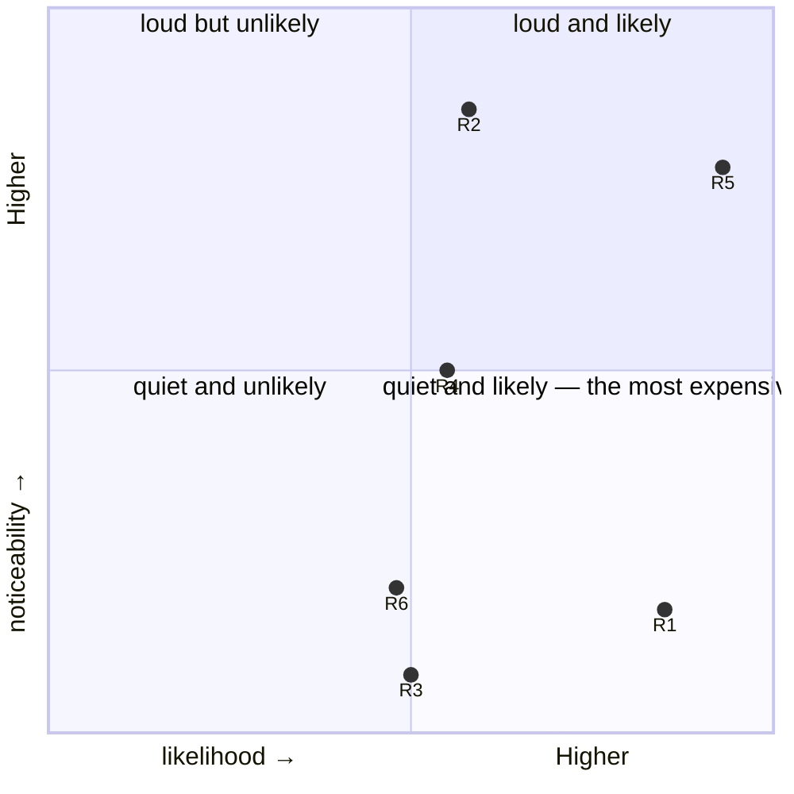

# Engineering Strategy Report — SaaS ERP

**Mode:** existing-system audit (with the launch call as a single decision inside it)
**Subject:** a SaaS ERP for garment manufacturers — private client, anonymised for publication
**Framework:** ESF v0.7 · **Date:** 2026-09-19 · rev. 4
**Stakeholder access:** partial — the backend developer answered after the report was presented to him (presented 2026-08-19, feedback 2026-09-08); the owner, the one person who can act on the central finding, was never interviewed

> **Why this example exists.** A **private client** audited from inside the
> evidence and outside the team, and the first example published
> **anonymised**: the product, the people and the places are renamed, the
> repository names are generic, and the report says so in its own opening
> rather than pretending the redaction is not there. It is the reference
> for four things the Solidus audit cannot show.
>
> First, **an engagement where the code is not the problem**. The machine
> is good — 95.71% line coverage over 6,114 rspec examples, 303 e2e tests,
> ADRs, PRDs and an agent harness — and the audit says so early and then
> keeps going, because two years of that produced not one working day on
> either of the two factories the owner has standing by. The register that
> matters is not the Debt Ledger; it is the one finding only the owner can
> act on.
>
> Second, **evidence without a tracker**. The project has no issue tracker,
> so the working chat is the backlog: the evidence base is the repository,
> the git history, a 27-month Telegram export of 5,735 messages, and a web
> sweep of the competition. 112 tagged claims — 50 `[observed]`, 32
> `[user]`, 22 `[web]`, 3 `[inferred]`, 5 `[assumed]`. The chat is also
> what the first policy converts into a tracker, so the evidence source and
> the remedy are the same object.
>
> Third, **a policy layer written for a project where nobody holds a
> mandate** — and shaped differently from Solidus's for that reason. Six
> proposed rows, and the split is deliberate: the ones that must hold are
> built as CI gates, because a gate does not ask permission, and the ones
> that cannot become gates are weakened to recommendations on purpose. "A
> prescriptive policy that no one will carry out is theater of agreement,
> not strategy."
>
> Fourth, **a pre-registered risk recorded as fired**. R5 ("the owner
> stalls on data entry again") carries `likelihood="materialized: as of
> 2026-09-08 there is still no factory launch"` — the risk register
> updated by events between revisions rather than by argument, with the
> stakeholder exchange that revealed it dated in the timeline. The
> report's closing callout then states the skew it cannot fix: the
> stakeholder-tagged claims come from a proximate observer and the backend
> developer, never from the decision-maker, and it names which conclusions
> one conversation with the owner would most likely overturn.
>
> Below is the report's markdown channel, emitted by the DSL from the same
> source as the web edition — the evidence meter is counted, never authored.

---

*Two years of good engineering and not a single launch. The system can quietly block the shop floor and has no way to say so — which is why the owner of two working factories keeps stepping back.*

> Report · rev. 4 · updated 2026-09-19 · 112 tagged claims · https://vit-panchuk.com/reports/saas-erp/

---

```
Evidence Base — 112 tagged claims
[observed]    ████████████████░░░░░░░░░░░░░░░░░░░░   44%  (50)
[web]         ███████░░░░░░░░░░░░░░░░░░░░░░░░░░░░░   20%  (22)
[stakeholder] ██████████░░░░░░░░░░░░░░░░░░░░░░░░░░   29%  (32)
[inferred]    █░░░░░░░░░░░░░░░░░░░░░░░░░░░░░░░░░░░    3%  ( 3)
[assumed]     █░░░░░░░░░░░░░░░░░░░░░░░░░░░░░░░░░░░    4%  ( 5)
```

---
Two years of development, two pairs of hands, 95.71% test coverage, and not a
single day of real work at either of the two factories the owner has standing by.

The problem is not the quality of the engineering. The quality here is high, and
the audit measured it. The problem is that getting into the system costs more
than the owner is willing to pay, getting out of it has never once worked with
real people, and the team learns about a failure only when someone writes in Telegram.

The goal is wider than a launch: both of the owner's factories, then productizing
the system and selling it as SaaS to outside clients `[user]`. Seen
that way, the cost of loading data stops being a one-off obstacle and becomes the
unit economics of every new client.

What was examined, and when: the `main` repository as of 2026-08-12, the Telegram
export for 2024-05-13 → 2026-08-10 (5,735 messages), and a web review on
2026-08-13. The tests were run and coverage measured on 2026-08-13 against a
separate database. There was no access to GitHub Actions or to the mobile app's
repository; where that changes a conclusion, the report says so. One piece of
testimony from inside the team was added later. On 2026-08-19 the author
presented the report to the BE developer, and on 2026-09-08 asked him for
feedback `[user]`. What that conversation changed is recorded in the
Decision Log, in [K14](#k14).

Every claim in the report carries a provenance mark. This keeps a confidently
worded guess from passing itself off as a finding, and the meter above counts
these marks rather than eyeballing them. Behind the marks is a working graph,
kept since the first hour of the audit: 71 claim nodes with a source reference,
each backed by a file with the evidence that holds it up.

Almost half of the claims rest on what was read in the code, the git history and
the chat export, and another fifth on web sources. For questions of fact that is
a solid base. The weak spot is elsewhere: the audit did not interview the owner
of the factories, the main actor in this story. Stakeholder words here have two
sources. Most come from the author of the audit, who is close to the project but
not a member of the team. The rest, dated 2026-09-08, come from the BE developer,
to whom the report was presented on 2026-08-19.

> **WHAT THIS REPORT DID NOT SEE**
> The mobile app lives in a separate repository, Mobile/, which is not on the audit machine. It is the system's third client, and it carries the main product promise. This report makes no claim about its code; where its state matters, there is an open question [Q8](#what-we-dont-know). Nor was the GitHub Actions run history read. Only the workflow definitions were read, so this report does not testify to how the runs finished.

## Start Here

This section exists so the rest of the report can be read without prior
knowledge of the project. If you already know the material, go straight to
[Policies & Operations](#policies--operations).

### What SaaS ERP is

It is an **ERP for garment manufacturing**: a system that carries an item from
order to shipment and calculates the seamstresses' piece-rate pay. Not a web
shop, not bookkeeping: it runs the shop floor.

Technically it is a monorepo of four parts `[observed]`:

- **Rails 8.1 API** — 138 models, 86 controllers, 442 migrations. It holds all of
  the domain logic.
- **`frontend/`** — the first web interface, built on antd. Retired in July 2026;
  it stays in git as reference material.
- **`frontend_v2/`** — the second web interface, React 19 + an in-house design
  system. The main line of work since February 2026. `[observed]`
- **`docs/`** — a documentation site on Next.js with PRDs, user stories and ADRs. `[observed]`

Plus a **mobile app on React Native** in a separate repository, and that is the
one that carries the product's promise.

### The product promise

The author of the audit `[user]` put it this way: a worker on the shop floor has a mobile app,
walks up to a printed document with a QR code, scans it, and gets the list of operations she has to do today.

This is not decoration. It is what the factory pays for: real-time management
instead of after-the-fact bookkeeping.

### The cast

- **The owner** — not from IT, but with the domain expertise of a production
  technologist: dictates the data model, thinks in 1C concepts, lists the
  canonical documents of garment manufacturing from memory
  `[observed]`. Has **two operating garment factories** to start from `[user]`.
- **The FE developer** — frontend. 2,553 commits (79% of all). `[observed]` Built
  both web interfaces, the mobile app, CI, the documentation, the ADRs, the
  e2e suite and the agent harness. In practice commits to the backend more than
  the backend developer does.
- **The BE developer** — backend in Ruby. 692 commits
  `[observed]`. Owns the Heroku infrastructure `[user]`.
- **The author of the audit** — does not work on the project: has no commits,
  does not write in the working channel `[observed]`. The author set
  the direction of the research, proposed hypotheses and corrected conclusions
  as the work went on.

This distinction matters for how the report reads. Everything marked as
stakeholder words was said by the author of the audit, who is close to the
project but not inside it. The thesis about onboarding friction, the frame "this
is a factory, therefore clockwork reliability" and the phrase "no adult" belong
to the author. They are a view from outside: not a position documented in the
project, and not the team's assessment of itself.

### How to read the marks

|  |  |
| --- | --- |
| `[observed]` | Seen directly in the system — code, a command run, git history, a test run. |
| `[web]` | Verified in an external source — a competitor's site, industry literature. |
| `[user]` | Stated by a stakeholder. Authoritative for business facts, but revisable. |
| `[inferred]` | Derived from evidence by reasoning. Not a fact. |
| `[assumed]` | Neither checked nor confirmed. Every such claim is listed in the section on unknowns. |

### Register codes

`PL` policies · `S` strategies in force · `RC` root causes · `R` risks ·
`D` debts · `C` credits · `E` easy wins · `B` bets · `K` decisions ·
`P` pre-mortem · `Q` open questions. Every mention of a code carries a
one-line memo, so you never have to look up what it means.

### Timeline

- **2024-05-22** — First commit.
- **2024-11-06** — The owner asks for a launch date to be set. No answer comes, not once in the next 27 months.
- **2024-12-17** — The owner measures the cost of entry themselves: “filling in 1 specification of 18 items took about 30 minutes that is very long”. Asks for auto-search during entry.
- **2025-01-22** — The owner enters the shop-floor equipment for one of the factories: a real attempt at loading data.
- **2025-07-15** — Testing at the factory: a five-bundle scenario cannot close completed work.
- **2025-08** — The only pilot with live workers. The “print → scan → work” loop breaks in five places.
- **2025-12-29** — The FE developer finds a startup grant of up to USD 100k. The condition: a launched version of the product, preferably with revenue.
- **2026-01-06** — The grant meeting is postponed.
- **gap** — The word “grant” does not appear once in the chat over the next seven months.
- **2026-01-25** — “Wiped production.”
- **2026-02-05** — First commit of frontend_v2. The frontend rewrite begins.
- **2026-03** — A wave of refactoring: 70 commits a month, up from 1–9. It lasts five months.
- **2026-06-24** — The fallback path — full CRUD of shift processes on the web — gets full-scale development.
- **2026-07-30** — The FE developer: “I don't have any tasks for now… can I be looking for a job?”
- **2026-08-10** — Last day of the export. The chat is discussing a field label in the materials directory.
- **2026-08-19** — The author of the audit presents the report to the BE developer.
- **2026-09-08** — The author asks the BE developer for feedback on the report. There is still no launch at the factory: the owner is stuck on how to group equipment, and in the maintenance model equipment is tied to its subgroup. Meanwhile the FE developer is rewriting the mobile app, and the BE developer is working on roles.

## Policies & Operations

This is the decided layer: rules that should govern every later decision of
their class when the strategist is not in the room. **Every row below is in the
state “proposed”**: a policy is accepted by the person running the project, not
by the audit.

One condition shapes all six. No one in the project holds a mandate: the owner
has no technical expertise; the BE developer, by his own admission, does not take
on improving the machine or engineering leadership; the FE developer is the best
candidate to lead but lacks deep BE expertise, and he is the one who just asked
about looking for a job [RC2](#rc2). So no policy
here relies on anyone insisting. The ones that must work for certain are built as
CI gates: they do not ask permission. The ones that cannot become gates are
deliberately weakened to a recommendation. A prescriptive policy that no one
will carry out is theater of agreement, not strategy.

**PL1 — The Telegram chat history with the client is converted into an Issue Tracker on GitHub Projects** *(direction · proposed)*
This is the cheapest policy in the set, and it targets the most expensive defect. Everything breaks in one place: the channel that serves as the task board has no state. What is said in it has no owner, no date, and no way to check whether it was done.The three most expensive losses are all of this kind. On 17 December 2024 the owner measured the cost of entry themselves and asked for a specific fix. The first commit of that class is dated 3 June 2026, eighteen months later, and it is not what they asked for. The launch date (November 2024) and the USD 100k grant track (January 2026) dissolved the same way.So the policy starts not with a new rule but with converting what has already been said. The chat holds 5,735 messages over 27 months, and they contain all of the project's unclosed work: the owner's requirements with numbers and examples, complaints about defects, promises of “we'll do it in the next version”. It is a large but mechanical text-parsing job, which is what an agent does well, in one pass. After the conversion the rule enforces itself: if a task is not in the tracker, it does not exist.The second channel into the same tracker is Sentry, filing issues on its own [E4](#e4). It is the second half of the same mechanism rather than an add-on. The chat catches what the owner noticed and bothered to write; Sentry catches what no one noticed, and at a factory that is the most expensive class [R1](#r1): a failure after which the worker simply goes to the supervisor instead of writing in Telegram. Together they cover both sides: the human signal stops dissolving, and a machine signal exists for the first time.
Addresses: [RC1](#rc1) · [D6](#d6) · [R5](#r5) · [R1](#r1) · [D3](#d3)
Relation: refines [S3](#s3)
Operations: Three actions, no meetings. One-off: an agent goes through the chat export and files every unclosed requirement, complaint and promise in GitHub Projects, with the original date and author. Standing: the same pass once a week over new messages, exiting quietly when there is nothing to file. Automatic: the Sentry integration files an issue for every new production error, with no human in the chain.
Executed by: GitHub Projects on the backend repository: a one-off conversion of the history, a weekly agent pass over the chat, a Sentry → GitHub Issues integration
Review: 2026-11-13

**PL2 — The main branch is guarded by green rspec, and every run publishes the coverage metric** *(direction · proposed)*
The project has 6,114 rspec examples and 95.71% line coverage. The BE developer runs them regularly `[user]`, so the suite is not dead: it covers the changes that pass through his hands.The problem is that only the smaller part of the backend passes through his hands. The FE developer has made 1,089 commits to the backend against 588 `[observed]`, and makes them with his own agent, which does not see the BE developer's rules `[user]`. One person's local habit cannot, by definition, cover someone else's commits: the only point they share is main.The seven rspec failures are known to the developers, documented and not fixed. They have not even been marked skip; they just fail `[user]`.The value of this policy is not that it will reveal something. There is nothing to reveal: the team already knows. The value is threefold. First, it extends the existing habit to both pairs of hands instead of one. Second, it makes ignoring failures expensive. A red build that blocks nothing can be tolerated; a gate that blocks the merge cannot. It gets either fixed or deliberately removed, and both options are better than silent tolerance.Third — and this is rarely said out loud — it is part of harness engineering: discipline for agents. When an agent sees a red build, it will try to fix it. To an agent, a CI signal is not a report to put off but a task in front of it while it works. In a project where the FE developer writes backend code with his agent `[user]`, this is not abstract: the green build is the mechanism that keeps work outside someone's specialty within bounds. Without it the agent has no feedback at all, and the only check left is a reviewer with no expertise in this area.On cost: nothing here is built from scratch. CI is already in place and working: three jobs in test.yml (Unit Tests, Lint, E2E Tests) plus a separate workflow for migrations `[observed]`. The third job already does the hardest part: it brings up the backend in docker, waits for the API to be ready and deploys the database. The test suite is written and green on 6,114 examples. What is missing is one job that runs the existing suite on every PR. Of everything this report proposes, it is the cheapest action with the widest reach.
Addresses: [RC3](#rc3) · [D1](#d1)
Relation: replaces [S2](#s2); ratifies [S1](#s1)
Operations: Automation: a job in the existing workflow. SimpleCov in the :test group, a coverage artifact as the job's output, and a threshold below which a merge fails. No one has seen the number yet, so the first step is to make it visible, not to quarantine right away. The seven known failures are split up rather than quarantined wholesale `[observed]`: six in the video subsystem (videos_spec, aws_events_controller_spec) go into quarantine with an issue and a date, and the seventh, users_controller_spec, is not eligible for quarantine because it is a live defect, so it gets fixed.
Executed by: A required GitHub Actions check on main and staging (deterministic rung)
Review: 2026-09-13

**PL3 — A factory pilot starts only in parallel with the existing books, and the existing books are not switched off until the weekly discrepancy drops to zero** *(direction · proposed)*
This is the policy that makes a launch possible, and it is not about software. A factory cannot afford downtime: if the system fails, the line stops, and a seamstress on piece-rate pay does not get paid. As long as a failure halts production, the owner's rational choice is not to launch, and that is what we have seen for two years running. A parallel run breaks that link: the existing books keep counting, the system counts alongside, and a defect becomes a discrepancy in a table rather than a stopped shop floor.“The existing books” here means whatever the factory counts with today, whatever that turns out to be. It is not necessarily paper: it may be Excel, 1C, a supervisor's notebook, a chat on a phone, or any combination of these. The format does not matter to the policy. What matters is that it is not switched off during the pilot and that its numbers can be compared with the system's every day. Industry literature calls this a parallel run with paper, because that is how the practice began `[web]`, but the point is a second, independent counter, not the medium. At Scan ERP, a competitor, this is week 2 of four `[web]`.As a side effect it removes one more risk that is easy to forget: if the factory switches off the old books and the system fails, there is nowhere to restore the data from. The second counter is also a backup.
Addresses: [RC6](#rc6) · [R1](#r1) · [RC4](#rc4)
Relation: fills a void: no strategy in force covers this
Operations: Inspection: a daily reconciliation of two numbers, the units counted by the existing books and the units counted by the system. The day's discrepancy is the pilot's only metric.
Accepted by: the owner (the decision is theirs: it is their production)
Executed by: A pilot start condition, fixed in writing before the first day
Review: 2026-10-13

**PL4 — Until a single shift has been closed at a real factory, at least 70% of development time goes to work that leads to launch** *(allocation · proposed)*
Resource allocation here is not bureaucracy. It is the only way to make not launching more expensive than rewriting. Since March 2026 refactoring commits have risen from 1–9 to 70 a month, and the pace has held for five months. This is excellent work: FSD module boundaries as CI errors, ADRs, a green build at every migration phase. It also began a week after production was wiped, and two months after the grant whose condition was a launch faded out. As long as no number separates “work toward launch” from “work on the code”, this substitution will keep happening unprompted, and every time it will look impeccably justified.
Addresses: [RC2](#rc2) · [RC5](#rc5) · [R4](#r4)
Relation: replaces [S6](#s6)
Operations: Allocation is the most concrete form of priority. The mechanism: one table a week, no meetings.
Accepted by: the owner as the payer
Executed by: A weekly review: which column each developer's work stood in
Review: 2026-10-13

**PL5 — A product promise has a named owner and a verification date; if the verification does not happen on time, the promise is officially withdrawn** *(approval · proposed)*
The promise (the worker scans and gets work) was tested once, in August 2025. It did not work. It was neither publicly fixed nor withdrawn. Instead, a fallback path grew up next to it, in which an administrator enters completed work on the web, and that path got full-scale development in June 2026 and seven e2e specifications. `[observed]` That is how the product quietly changed its nature, from real-time management to after-the-fact bookkeeping, and no decision about it exists. This policy does not require fixing the loop. It requires that someone be responsible for it and that silent withering become impossible.
Addresses: [RC4](#rc4) · [R3](#r3) · [R6](#r6)
Relation: fills the void named by [S7](#s7)
Operations: Approval with an address: one decision, written into the log, with a date. Not a meeting, a line.
Executed by: An entry in the repository's Decision Log; accepted by the owner together with the developers
Review: 2026-10-13

**PL6 — A new rewrite does not begin until its reason, completion criterion and date are written down** *(guidance · proposed)*
This is the only row in the set deliberately weakened to a recommendation, and the reason is simple: there is no one to prescribe it. The v1→v2 migration has a named reason (circular dependencies in v1: 60 domains, 223 edges) `[observed]` and quality gates at every phase, which makes it an exemplary rewrite. What it lacks is an exit criterion and a date after which frontend/ stops receiving features. That is why two web clients have run in parallel for half a year now, and with the mobile app that makes three clients for two pairs of hands.
Addresses: [RC2](#rc2) · [D4](#d4)
Relation: refines [S6](#s6)
Operations: Model-document-share: the weakest mechanism possible, and deliberately so. There is no executor ready to prescribe it.
Executed by: A norm in the root AGENTS.md; an entry in the Decision Log
Review: 2027-02-13

> Two of the six policies — [PL2](#pl2) and [PL1](#pl1) — depend on no one's will: one runs as CI gates, the other as a weekly agent pass. That is why they come first. The other four need the owner's decision, and without it they will remain text.

## Business Context: Less Money Than It Seems

The assumption that the owner's budget is unlimited is not supported by the
evidence. There is no direct answer, and it remains an open question [Q4](#what-we-dont-know), but the traces are sufficient.

Payment is planned in advance (“I plan to make the 1,750 c.u. payment by 5 March”), there is
a quantity called “earned but not paid out” (the BE developer accidentally overwrote the formula
that computes it in the shared Google spreadsheet), and arrears are real enough
that clearing them gets its own announcement: “No arrears outstanding”
`[observed]`. The amounts fluctuate: UAH 85,386 for one month to one
developer in August 2025 (≈USD 2,000), 1,750 c.u. in February 2025, 500 c.u. in
June 2026. Receipts arrive in pairs roughly monthly, with a gap of almost
five months between April and September 2025.

This reading has a stated limitation: the receipts in the chat are an incomplete record,
payments could have gone around the channel, and the spreadsheet with the real account is not available to the audit.
So the conclusion is `[inferred]`, not fact.

But the rough arithmetic deserves attention: ≈USD 2,000 × 2 developers × 27 months gives
about USD 100k already spent. That roughly equals the grant the
FE developer found in December 2025, whose condition was “to already have at least some launched
basic version of the product (ideally with revenue)”. So the external money that could
double the project's resources sits behind the same door as the launch.

One cost ahead appears in no spreadsheet: reaching external customers
will require marketing. The audit's author estimates it at no less than USD 50k
`[assumed]`. This is an order-of-magnitude estimate, not a calculation, but it shows the
scale: before the product reaches the market, at least another half of what has already been
invested must go in.

> A startup grant of up to USD 100k requires a launched version of the product, preferably with revenue. The thread lived for a week in December 2025 and died after a meeting was rescheduled. Over the following seven months the word “grant” does not appear in the export once.

## Product: A Promise Tested Once

The promise is this: a worker walks up to a printed route sheet,
scans the QR code and gets her list of operations for the day `[user]`.

The implementation matches. QR codes appear on the two documents that belong to
the batch, the route sheet and the cutting card, each with a `{ id, type }` payload on
a 100 × 50 mm label together with the code, product, color, size and planned
quantity `[observed]`. The specification has no QR and should not: it is
a product template, not a job for a specific batch.

So intent and code agree here. What diverges is what happens after
the scan.

The loop was tested once, in August 2025, on real workers. It
broke in five independent places.

> **Owner** · 2025-08-19
> "For some reason it scans kind of badly"

> **Owner** · 2025-08-19
> "Even though it's printed on a 600 dpi printer"

> **FE developer** · 2025-08-20
> "by the way, the code might scan badly because there's no top margin on the label"

> **FE developer** · 2025-08-20
> "the fact that they pressed “start, scan” didn't create a process for them in their shift, so there's nothing to join"

The last line is the promise failing at the moment of its only test: a person scanned and got no work.

The remaining three: after a label is generated, the print sequence breaks; during
scanning, part of the previous menu stays on screen; the QR carries a binding to
a location, so a route sheet created in one department would not
open in a shift of that same department. Server-side validation of the equipment-to-department
binding arrived on 2026-07-23, eleven months after the
owner wrote about it.

One more condition, which the owner named back in March 2025: the loop requires two
scans (the equipment and the document) plus an open shift in the right
department. “Scanning the same thing every time isn't practical.”

> In May 2025 the developer designed a “fallback function so the admin could manually enter data about completed processes”. In June 2026 it got full CRUD for shift processes on the web and seven e2e specs. The mobile half of the loop, the half that carries the promise, has not been tested on people since August 2025.

## Organization: No Adult in the Room

The phrase belongs to the author of the audit `[user]`, not to the factory
owner or to anyone on the team. It is an outside assessment: someone looking at the
project from outside sees no one in it who holds the engineering direction. That
person is absent from the table below, which lists only the three people who divide the roles between them.

The roles, set against what the project needs:

| role | can do | cannot do |
| --- | --- | --- |
| Owner | domain truth, priorities, money, access to two factories | technical strategy — no expertise |
| BE developer | backend domain, Heroku infrastructure | does not take on improving the machine or engineering leadership |
| FE developer | CI, ADRs, PRDs, harness, e2e, and in practice the backend too | no deep BE expertise; on 2026-07-30 asks whether he should look for a job |

Three things follow from this, and all three are structural, not personal.

The ceiling on prescription is low. No one both holds a mandate and is willing
to apply consequences. So a prescriptive policy that relies on human
persistence fails the enforceability test by definition. That is why
[PL2](#pl2) takes the form of gates that don't ask
permission.

The infrastructure and the will to improve it are in different hands. Heroku belongs to
the BE developer; by his own admission, continuous improvement of the machine is not his
area. Any policy that requires changes to deployment or CI must either move
to the FE developer **together with the access**, or not be carried out.

The knowledge gap runs one way and is total. The BE developer does not see
the entire engineering superstructure: how CI is set up, the ADRs, the PRDs, the suite of 303
e2e tests, the 426-line harness `[user]`. Nothing is hidden in the other
direction: the FE developer has committed to the backend 1,089 times and does so with his own
agent. So almost all of the project's engineering assets were created by one person and are known only to him, and he is the same person who has just asked about looking for a job.

## Engineering: High Quality With No Gates at All

The most important thing to say about this code: it is good. This is not a project with
a low culture that needs rescuing. It is a project with a high culture whose
results are connected to nothing.

- **95.71%** — backend coverage from rspec, 6,114 examples
- **79.05%** — backend coverage from e2e, 303 tests
- **80.72%** — frontend coverage from e2e
- **0** — of these had ever been measured before this audit

Coverage was measured with instrumentation the project never had:
`simplecov` is not in the `Gemfile`, no coverage artifact is generated, Codecov is not
connected. So no one on the team has seen any of these figures; they
were all measured here for the first time. The audit author's starting thesis, that coverage
is not *recorded*, is correct.

The two suites were measured separately. Rspec: 6,114 examples, 95.71% of lines and 82.12%
of branches. E2e, measured in a single run on 2026-08-14 (303 passed): backend 79.05% of lines
(7,193 / 9,099) and 45.56% of branches, frontend 80.72% of lines (21,634 / 26,800)
`[observed]`.

They have to be read together. Browser tests covering 79% of backend lines is a lot:
303 tests drive real domain scenarios, not smoke checks. The gap in
branches (45.56% against 82.12%) shows a healthy division of labor: e2e takes the happy
paths, the unit specs take the error branches. So the backend is covered from
two independent sides.

One clarification changes where the problem lives. **E2e does
run in CI**: `test.yml` has an `E2E Tests` job that brings up the backend via
`docker compose`, waits for the API to be ready, sets up the database and runs Playwright
`[observed]`. So the backend is checked in CI, but from the browser, on
happy paths, with 45.56% branch coverage.

What does not run in CI is **rspec**: the suite of 6,114 examples that holds
82.12% of branches never runs at all. The problem is not that the tests aren't connected.
The suite that is worst at catching faulty branches is connected, and the one
that catches them best is silent.

Getting to this figure produced a finding of its own. Two attempts failed, and each exposed
a separate defect:

1. Bootsnap is incompatible with coverage instrumentation: all 308 files fail
   at load.
2. rspec does not start in the project's own test stack: the `api` service holds
   the same database that `DatabaseCleaner` cleans in `before(:suite)`, and they
   block each other.

The first measurement after the workaround gave 47.94%, and it was false: not a single example
ran, and the number reflected code executed while Rails was loading. The branch
metric gave it away: 0.36%.

### Observability

There is none. Checked `Gemfile`, `package.json` and `frontend_v2/package.json`:
no Sentry, Bugsnag, Rollbar, Honeybadger, AppSignal, Datadog or New Relic
`[observed]`, which the client confirmed `[user]`.

What exists: `/up` (the app came up); logs to stdout, tagged with `request_id` but not
aggregated (Logplex keeps a buffer of \~1,500 lines for up to a week, so without a drain
they disappear `[web]`); and a script that
uploads source maps to S3 **with no error receiver**: groundwork for decoding
stack traces that are sent nowhere.

### The Mechanism That Stops a Shop Floor

This is the engineering section's most important finding, and it becomes visible only
once you read the code as a factory's system. `ProcessItem` validates on creation:

```ruby
# app/models/process_item.rb

```

In plain terms: an unfinished process holds a reservation for its entire planned quantity. There are two ways to release it: finish the process or
delete it. Deletion is gated by the `processes:delete` permission, so it is available
to an administrator, not to a seamstress. There is no timeout and no automatic release.

There is no idempotency on creation either. A double scan (what
a person does when the first scan produces no visible reaction, and what
happened in August 2025) creates a second process and takes the reservation a second time.

Both scenarios have already happened: “A worker started 2 processes for
execution at the same time” (2025-05-23) and, in July 2025, finished work that could not be
closed: “it showed all five bundles of 50 and wouldn't let us close the work”.

> A quantity reservation with no expiry stops the next person on the operation. Observability is zero. For a factory, time to detection equals downtime, and the detection mechanism today is the owner writing in Telegram.

## Strategy Already in Force

Before proposing a strategy, the report documents the one that already governs decisions,
whether it is written down or not. Here there is one, and it is consistent.

| # | The rule, as if it had been written down | Written? | Working? |
| --- | --- | --- | --- |
| S1 | Quality is ensured locally and voluntarily, not by gates. Evidence `[observed]`: 6,114 examples, 95.71% coverage, and not a single job that runs them. | not written down anywhere | the suite is excellent, protects no one |
| S2 | A known test failure is the normal state. Evidence `[observed]`: seven rspec failures are known to the developers, documented and tolerated to this day. | shadow — held by the machine, not a document | works as a norm and destroys the signal |
| S3 | The task board is Telegram. Evidence `[observed]`: 5,735 messages, no tracker; the launch date, the grant and the measured complaint all dissolved the same way. | not written down anywhere | no — the channel has no state |
| S4 | Architectural discipline is set by the frontend. Evidence `[observed]`: FSD boundaries as CI errors, two ADRs, a 426-line harness, pinned skills. | ratified in frontend_v2/CLAUDE.md and the CI gates | yes — the project's best-working strategy |
| S5 | Backend context lives in the private memory of the developer's agent. Evidence `[user]`: there is no root CLAUDE.md or AGENTS.md; across the whole repository there are two harness artifacts, both frontend. | not written down anywhere | no — knowledge does not accumulate |
| S6 | When adoption stalls, we rewrite. Evidence `[observed]`: v1→v2 since February 2026, a wave of 70/44/35 commits a month, a rework of the materials model in July 2026. Since September 2026 the mobile app is being rewritten, and there has still never been a launch at a factory `[user]`. | not written down anywhere, but prescriptive in practice | produces quality, does not produce a launch |
| S7 | No one holds the product promise. Evidence `[observed]`: the loop failed in August 2025 and has not been tested since, the fallback path grew up alongside it, and there is no written trace of a decision about this `[assumed]`. | by default — through the absence of a decision | no |

The rows assess one another. [S4](#s4) —
the project's healthiest strategy — exists because one person took it on;
[S5](#s5) is its mirror image, an
absence on the other side of the same codebase. And [S2](#s2) is what makes [S1](#s1)
useless: an excellent test suite that nothing runs protects no one.

## Root Causes

> Getting into the system costs more than getting out of it; failure is silent and dangerous at the same time; the owner's complaint has nowhere to go; a known defect costs nothing to ignore; the promise is neither tested nor withdrawn; no one is responsible for the engineering machine and the sequencing of work. Rewriting code cures none of the six; all six are cured by decisions about where the signal goes and who reads it.

**RC1 — The owner's complaint has nowhere to go**

A Telegram channel with no state plays the role of the task board `[observed]`: what is said in it
has no owner, no date and no way to verify it was done. Three identical cases:
the launch date (November 2024), never answered; the measured
cost of entry (December 2024), a reaction eighteen months later, and not the one
asked for; the USD 100k grant (December 2025), a thread that lived for a week.

Ensures: every signal about cost or failure dissolves in the chat and comes back, if at all, as a repeated complaint

**RC2 — No one is responsible for the engineering machine or the sequencing of work**

The owner has no technical expertise; the BE developer, by his own admission, does not take on
leadership or improving the machine; the FE developer has the ability but no mandate, and no deep BE expertise
either. When no one outside sets the agenda, each engineer does what
he is good at. Both are good at engineering. So the project produces
engineering.

Ensures: priority is set by the implementer's taste, and no one makes the launch decision

**RC3 — The signal exists, but it costs nothing**

rspec does not run in CI at all; seven rspec failures are known, documented and
not even marked as `skip`; coverage is not recorded. Security and
dependency-hygiene gates are absent entirely: no brakeman, no bundler-audit, no
Dependabot `[observed]`.

The point is not that the breakage is invisible. It **is seen**: the developers knew about
the failures, named them and left them `[user]`. The point is that
ignoring it costs nothing. A red build that blocks nothing is a
notification, not a constraint, and a notification can be endured.

Ensures: a known defect can live for months as an acceptable state, because ignoring it is free

**RC4 — The promise is neither tested nor withdrawn**

The “print → scan → work” loop was tested once, in August 2025, and it
failed. It was neither fixed publicly nor withdrawn. Instead the fallback path, where an administrator enters data on the web, got
full development and seven e2e specs. The product moved from real-time control to after-the-fact
record-keeping, and the available materials contain no trace of a decision about this
`[assumed]`. The audit saw only the chat and the repository; the team meets
in an office, so the decision could have been made verbally and never written down. The only solid
fact is that there is no written trace.

Ensures: the product's key value claim stays untested indefinitely, and the product quietly changes its nature

**RC5 — Getting into the system costs more than getting out of it**

Reaching the first cut requires creating fourteen entities in a row. This
chain is written down in the project's own code, in `cutPrereqs.ts`. `[observed]` The owner
measured filling in one specification of 18 line items at 30 minutes. There is no bulk-loading mechanism at all: no gem for CSV or XLSX, no import
route, no seed data other than three developer logins. `[observed]`

In September 2026 the barrier showed up in a second, subtler form. The launch stalled not on
how many minutes a specification takes but on a decision about how to group
equipment `[user]`. The BE developer tells the owner not to
worry, because the grouping can always be changed. But in the maintenance model
equipment is bound to its subgroup `[user]`, so regrouping
affects maintenance too. An owner who stalls on this decision is being accurate,
not capricious: the system makes grouping expensive to change
`[inferred]`. Hence the missing onboarding requirement: the first
load must allow a draft structure that can be reworked without
consequences.

Ensures: every adoption attempt dies before it delivers a benefit

**RC6 — Failure is silent and dangerous at the same time**

An unfinished process holds a quantity reservation with no expiry and blocks
the next person on the operation; there is no idempotency on creation. There is no error
tracking anywhere. At a factory, time to detection equals downtime.

Ensures: a factory can come to a halt without any signal, so refusing to launch is rational behavior for the owner

## Risk Register

Ranked by harm × likelihood × noticeability × cost of recovery. Low
noticeability **raises** the priority: a silent failure is more dangerous than
a loud one of the same size.

This pair of coordinates gets its own picture, because it explains the order
below. Horizontal: how likely the risk is. Vertical: whether you will notice it
without someone coming to tell you. The dangerous quadrant is the **bottom
right**, not the top: what will happen and stay silent.

**Six risks: likelihood versus noticeability**



*Positions are estimated from each risk's description in the register below, not measured.*

**R1 — The line stops, and nobody finds out**

If it happens: An unfinished process blocks an operation for the next worker, or a double scan eats the reservation. The line stops.
Likelihood: high in the first week of real work: both scenarios already happened in 2025
Would you notice? close to zero: there is no error tracking, Heroku logs sit in a ~1,500-line buffer with no search, and the only reliable signal channel is the owner writing in Telegram
Cost: high: shop-floor downtime and unpaid piece-rate work; after this, trust costs more to win back than it did to build
What would change my mind: an alert fired on an artificially blocked process and was noticed before anyone reported it

**R2 — The sole knowledge holder, also the only leadership candidate, leaves**

If it happens: The FE developer, who built the CI, the ADRs, the PRD, the e2e suite, the harness, both frontends and the mobile app, leaves the project.
Likelihood: reduced but not removed: the project is full-time work for the FE developer, and the 2026-07-30 question about looking for a job came from a lack of tasks; since September 2026 he has been rewriting the mobile app. The workload came from a new rework, not from an agreement, so the risk returns once the rework is finished
Would you notice? high: it has already been said out loud, a rare case of a loud risk
Cost: critical: almost the entire engineering superstructure is known only to him, and the BE developer does not even know part of it exists
What would change my mind: a written agreement on workload and term, or context and access handed over into the repository

**R3 — The scan loop still does not work, and this surfaces only after onboarding**

If it happens: The data is loaded, the factory is set up, and it turns out that some or all of the five August failures are still alive.
Likelihood: unknown, and dangerous for that reason: the audit has no access to the mobile app repository
Would you notice? zero until the first day on the shop floor
Cost: high: a wasted onboarding and a second loss of the owner's trust after a two-year pause
What would change my mind: a run of the loop with two workers in a real shift, with zero failures

**R4 — The money runs out before launch**

If it happens: The owner stops funding, or funding drops below the level at which the two developers stay on the project.
Likelihood: medium: the amounts fluctuate, there is a five-month gap in payments, and an amount is outstanding
Would you notice? medium: the receipts are visible, but the real accounting is kept in a spreadsheet the audit cannot access
Cost: high: without the FE developer the project loses both the machine and the mobile app
What would change my mind: a direct answer from the owner: how many months they are prepared to fund, and what happens after that

**R5 — The owner stalls on data entry again**

If it happens: The pilot is scheduled, but filling in the reference data again runs into 30 minutes per specification, and the attempt fades out, as in 2024 and 2026.
Likelihood: materialized: as of 2026-09-08 there is still no factory launch; the owner stalled on how to group the equipment, and there is still no loading mechanism either
Would you notice? high: it shows as days of silence in the channel
Cost: medium: a lost cycle, but the data partly remains
What would change my mind: one product fully loaded in under an hour of the owner's total involvement

**R6 — The mobile app contains defects unknown to the audit**

If it happens: The system's third client, the one that carries the promise, has not had a single line read.
Likelihood: unknown
Would you notice? low
Cost: unknown, and the unknown itself is the cost
What would change my mind: an audit of the Mobile repository with the same discipline applied here

## Debt Ledger

A risk may happen; a debt is already being paid, every cycle.

**D1 — rspec outside CI** *(organizational and technical)*
6,114 examples and 95.71% coverage protect no merge at all. `[observed]` Cost per cycle: every backend change goes into main unchecked, and the FE developer, who commits to the backend most, does so with his own agent and without these gates.

**D3 — Zero observability** *(technical)*
There is no error tracking at all. Heroku does provide logs, but only as a buffer: Logplex keeps about 1,500 lines for at most a week, with no search and no retention, until a drain or an add-on is connected `[web]`. The audit could not check whether one is connected in this project, because it had no access to Heroku `[assumed]`. There are no alerts. Cost per cycle: every defect costs as much time as passes before a person complains, and after launch that time will be downtime.

**D4 — Two client surfaces for two pairs of hands** *(strategic)*
Web v2 and the mobile app. frontend/ no longer counts: it was decommissioned in July 2026 `[observed]`. Cost per cycle: every domain change is multiplied across two surfaces, and the mobile one has neither CI gates nor an audit.

**D8 — Zero security gates and zero dependency hygiene** *(technical)*
No brakeman, no bundler-audit, no Dependabot or Renovate `[observed]`.What the backend does have in CI: an E2E Tests job that brings it up in docker and runs 303 browser scenarios, and a separate workflow that watches migration numbers `[observed]`. So this is not a void.But the check is one-sided, and what is missing should be said plainly. All 9,099 lines of Ruby, where the domain logic, payroll and multi-tenancy live, are seen in CI only through the browser's eyes: 45.56% of branches, happy paths, no static analysis. The suite that holds 82.12% of branches does not run in CI; nobody checks gems for known vulnerabilities; nothing reports outdated dependencies. Cost per cycle: every gem update and every change to an error branch goes through unchecked.

**D5 — Backend context exists only in an agent's private memory** *(knowledge)*
There is no root AGENTS.md or CLAUDE.md. `[observed]` The consequence is already visible: the FE developer writes backend code with his own agent, which does not have the BE developer's rules, and the BE developer does not know that the e2e suite, the ADRs and the PRD exist. Cost per cycle: every decision one of them makes is invisible to the other.

**D6 — Telegram serves as the task board** *(organizational)*
5,735 messages with no state, owners or dates `[observed]`. Cost per cycle: any signal from the factory owner can get lost, and the three most expensive ones already have.

**D7 — A quantity reservation with no expiry** *(technical)*
An unfinished process blocks an operation, and only an administrator can unblock it. `[observed]` The cost per cycle is zero while there are no real users, and it jumps on launch day. That is why this debt should be closed before launch, not after.

## Credit Ledger

Credits that pay back in every later cycle. A credit counts as
confirmed only once it has been reused, so projected
entries are marked separately.

**C1 — The backend test suite: 6,114 examples, 95.71% of lines, 82.12% of branches** *(works, but covers only half of the changes)*
This is not a dormant credit: the BE developer runs the suite regularly `[user]`. So the changes he writes are checked, and 95.71% coverage does its job every day.The hole is in the suite's reach, not in the suite. Two people change the backend, not one, and the FE developer makes more commits to it: 1,089 against 588 `[observed]`, with his own agent, which does not have the BE developer's rules `[user]`. Half of the domain changes bypass the habit that protects the other half.This hole is cheaper to close than any other in the report, because there is almost nothing to build: CI is already in place and working, with three jobs plus a separate workflow for migrations, and one of those jobs already brings the backend up in docker for e2e `[observed]`. What is missing is one job that runs what is already written on every PR [PL2](#pl2). Not a tool, not a suite, not a culture — a job.

**C2 — 303 e2e tests in 110 files, with fixture infrastructure** *(confirmed — the suite passes in full)*
The suite is alive and maintained; its last commit is from 2026-08-09 `[observed]`. Run in full, it passes entirely: 303 passed, 0 failed in 10 minutes `[observed]`. It also gives 79.05% backend coverage and 80.72% frontend coverage [C8](#c8).One condition remains unmet, and it is not technical: the workflow fix sits in the working tree, not in commits. Until it is merged, the suite still does not run to completion in CI.

**C3 — e2e fixtures as a reference set for agentic onboarding** *(confirmed — the most valuable credit for B3)*
6,474 lines of fixtures create the entire domain through the public API, and cutPrereqs.ts records a chain of fourteen entities leading up to the first cut `[observed]`.Their value is not that they can be run on real data — they cannot [K1](#k1). It is that they are a reference set: a known-correct, executable and maintained example of how each entity must be created, in what order and with which fields.For an agent this is the most valuable kind of input. It gives three things at once: a model to follow instead of guessing across 138 models; an oracle to check its own result against; and protection against rot, because the fixtures break together with the API and so resist silent drift.That is why [B3](#b3) is a task of weeks, not months: the research part is already done and written down as code.

**C4 — The system already produces a product's full tech card** *(confirmed — this is the system's output, not its input)*
The PDF tech card that the owner sent to the chat as an “example of a specification” is an export from the system itself, not a factory document `[user]`. It proves that the output side works: for one product the system produces a tech card of 21 operations with rates, times, norms and cost, grouped by workshop `[observed]`. And at the time of the export, at least one product was fully entered into it `[inferred]`.What it does not prove is that the owner's data is ready. The workshop names match the reference data word for word because they are the same reference data. The audit has not once seen what the factory's source data looks like; this is an open question [Q6](#what-we-dont-know).

**C8 — e2e gives 79% backend coverage and 81% frontend coverage** *(confirmed)*
Measured on 2026-08-14 in a single run: backend 79.05% of lines (7,193 / 9,099) and 45.56% of branches, frontend 80.72% of lines (21,634 / 26,800) `[observed]`. For e2e this is high: 303 browser tests drive real domain scenarios, not smoke checks. The branch gap against rspec (45.56% versus 82.12%) shows a healthy split: e2e covers the happy paths, unit specs cover the error branches.

**C5 — Documentation: PRD, user stories, data models, two ADRs** *(confirmed)*
A Next.js site, maintained (updated 2026-07-25). `[observed]` It is `[observed]` about intent and design, not evidence of behavior, but as a carrier of knowledge it works.

**C6 — The frontend's agent harness** *(confirmed)*
426 lines of CLAUDE.md with rules explained by their reasons, pinned skills, and FSD boundaries as CI errors. The best-working engineering construct in the project, and a ready model for a root AGENTS.md [E8](#e8).

**C7 — The owner as a domain oracle** *(confirmed)*
Dictates the model at the level of a specification, thinks in 1C terms, and answers specific questions willingly and precisely. This is a rare credit: most ERP projects die from the absence of such a person.

## Easy Wins

Small, fast, safe things that feed the machine. They **do not compete** with the
bets for attention and take no slot in the quarterly selection; they should be
run as a single batch.

| # | Win | Feeds the machine | Agent-day | Status |
| --- | --- | --- | --- | --- |
| E2 | An rspec job in the existing workflow, plus quarantine of the seven known failures with an issue. Executes [PL2](#pl2). | verification: tests in the pipeline | 0.5 | — |
| E3 | Record coverage from both suites, not just rspec: SimpleCov in the :test group gives 95.71% from unit tests and 79.05% from e2e (the same SimpleCov in the Puma process), and vite-plugin-istanbul plus nyc give 80.72% of the frontend. A CI artifact and Codecov make [C1](#c1) and [C8](#c8) visible to the team for the first time; today nobody has seen any of these numbers. | verification: coverage floor | 0.5 | — |
| E4 | Sentry in the backend and in both frontends. Source maps are already uploaded; only the receiver is missing. Set it up with the Sentry → GitHub Issues integration from the start, because that is what makes [PL1](#pl1) complete: the machine signal lands in the same tracker as the human one. Closes half of [D3](#d3). | observability: error tracking | 0.5 | — |
| E5 | Connect a log drain on Heroku. The logs currently live in Logplex: a buffer of ~1,500 lines kept for at most a week, with no search `[web]`. A drain forwards every line to an external service that stores it and makes it searchable, so investigating a failure on the shop floor stops meaning “reproduce it again.” | observability: structured logs | 0.2 | — |
| E6 | A separate database for rspec in the test stack. It removes the deadlock that keeps the suite from starting normally. | verification: fast feedback | 0.2 | — |
| E7 | A top margin on the QR label. The developer named this as the cause of poor scanning in August 2025. | release safety: print quality | 0.1 | — |
| E8 | A root AGENTS.md for the backend modeled on frontend_v2/CLAUDE.md: rules, commands, pitfalls, a domain map. Closes [D5](#d5). | agent harness: context routing | 1.0 | — |
| E10 | brakeman and bundler-audit as gems, plus two jobs in the existing workflow. Closes half of [D8](#d8). | static gates: security scanners | 0.3 | — |
| E11 | .github/dependabot.yml for two ecosystems (bundler and npm). The second half of [D8](#d8). | dependency hygiene: automatic updates | 0.2 | — |
| E9 | A script to dump and restore the production database, with verification. It is a prerequisite for any pilot on real data. | release safety: verified backups | 0.5 | — |

Ten entries, ≈4 agent-days in total. Each closes a debt named in the report,
and none needs a decision from the owner. Number E1 stays empty: that
win was withdrawn, and numbers are not reused, so older references do not
shift.

## Strategic Bets

The bets are assessed against the accepted answer to the open question
[Q4](#what-we-dont-know): we assume the
runway is **limited and short**. This position is inferred from the available traces, not
from a statement; if the owner answers otherwise, the order must be recalculated.

| # | Bet | Verdict | Addresses | Cost |
| --- | --- | --- | --- | --- |
| B1 | Make failure visible and safe: error tracking, a timeout on the reservation of an unfinished process, idempotent process creation, an alert on a blocked operation. [R1](#r1) · [RC6](#rc6) · [D3](#d3) · [D7](#d7) | Do | [R1](#r1) · [RC6](#rc6) · [D3](#d3) · [D7](#d7) | ≈1 week |
| B2 | One product, one workshop, in parallel with the existing books. Load the product from whatever source the owner actually has ([Q6](#what-we-dont-know)), by hand or with an agent. The readiness criterion already exists: the system must produce a tech card that matches the paper one [C4](#c4). Then run the full cycle through to a closed shift and calculated pay, reconciling against the existing books every day. [RC4](#rc4) · [RC5](#rc5) · [R3](#r3) · [R5](#r5) | Do | [RC4](#rc4) · [RC5](#rc5) · [R3](#r3) · [R5](#r5) | ≈6 weeks, 2 of them on the shop floor |
| B4 | Appoint an owner of the engineering machine: one person responsible for CI, deploys, observability and the sequencing of work, with the access that makes this possible. There is one candidate. [RC2](#rc2) · [R2](#r2) · [D5](#d5) | Do | [RC2](#rc2) · [R2](#r2) · [D5](#d5) | one conversation + access |
| B3 | Agentic onboarding as a repeatable mechanism: a skill that reads the owner's source data (in whatever format Q6 establishes) and fills a factory through the API, idempotently and with a dry run. It learns from the e2e fixtures as a reference set [C3](#c3) and is checked against them. [RC5](#rc5) · [C3](#c3) | Wait for B2 | [RC5](#rc5) · [C3](#c3) | ≈2 weeks after |
| B5 | The mobile app: either audit it with the same discipline, or officially recognize web mode as primary and withdraw the promise. [R6](#r6) · [RC4](#rc4) | Decide | [R6](#r6) · [RC4](#rc4) | ≈3 days for the audit |
| B7 | A one-off QA consultation on the existing e2e suite: is the methodology right, and which critical paths are missing? Not a hire, but an outside look at what is already written. [C2](#c2) · [R3](#r3) · [RC4](#rc4) | Buy once | [C2](#c2) · [R3](#r3) · [RC4](#rc4) | a few hours of consulting |
| B6 | The v1→v2 migration was completed without this report: the v1 build was removed from the pipeline on 2026-07-10, and the directory itself was added to .slugignore on 2026-07-22. | Done | [D4](#d4) | — |

### Selection: three bets for the quarter

We do [B1](#b1),
[B2](#b2) and
[B4](#b4).

Why the rest wait:

[B3](#b3) waits, and this is the main change
of order relative to the original hypothesis. The audit's author set onboarding itself as the direction, and the evidence supports it more strongly than expected: the owner
measured 30 minutes per specification personally and asked for a fix unprompted. But cheap entry
into a system that can silently block work and cannot report it only
gets you faster to an unprotected point of failure. Safety first, then the cost of
entry. Minimal onboarding does not wait, though: it goes inside
[B2](#b2) as the loading of one
product. It becomes a mechanism after the loop has proven that it works, and is then
scaled to the product range rather than built blind.

[B7](#b7) needs a word on
why it is one-off rather than a hire. There is no tester on the project: the owner is not
one, and the developers even less so `[user]`. Under other conditions the recommendation would be
obvious: bring on QA for at least a few hours a week. Here it should
wait for now, and not only because of money:

- the budget is already limited [R4](#r4);
- automated test coverage is high on both sides
  ([C1](#c1), [C8](#c8)),
  so the machine already catches the cheapest class of defects;
- and most important, **there is no infrastructure for QA to work in**. Without an issue tracker
  a tester has nowhere to put findings and nowhere to see the state of a feature or a bug
  [D6](#d6). Hiring a tester into a
  project without a tracker means starting a fourth stream of messages in the same
  chat.

So a one-off consultation is the useful form: an experienced QA looks at the existing
303 tests and says two things that are invisible from the inside — whether the methodology is right and
which critical paths are missing. e2e suites written by developers regularly
contain fundamental gaps, obvious to any tester and invisible to their
authors. This fits the budget, needs no tracker and gives the most per hour
spent. After [PL1](#pl1)
the question of a permanent QA should be reopened: by then the infrastructure will exist.

**[B5](#b5)** waits
for the result of [B2](#b2): the pilot will show whether
the loop is alive, and learning that on the shop floor is cheaper than learning it from the code.

[B6](#b6) comes off the list: the team did
it on its own and did it right. The migration had a named reason, quality gates at
every phase and an explicit production cutover.

Easy wins do not take part in this selection; they run in parallel as a batch.

### The broadest objection to the main bet

There is a strong counterargument against [B1](#b1), and it deserves
naming: this is engineering work again, and the project's illness is
that it substitutes engineering for launch. A week on observability and
timeouts looks just like those eighteen months when a refactoring appeared
in place of auto-search. The risk that [B1](#b1) grows and swallows the quarter is real.

Why the bet still stays first: it is bounded by a date, not by scope. It exists
only as a prerequisite for [B2](#b2), and
the pilot is scheduled to start alongside it, not after it finishes. If
the pilot has not started a week later, the bet has failed, however
much code was written. That is its falsifier.

The second objection is stronger. Perhaps the parallel books remove risk [R1](#r1) on their own, and
then [B1](#b1) is not needed before the pilot. That is partly true: they do
make failure non-fatal. But they do not make it visible. Without error tracking
the team learns about a defect from the owner the next day, and on a two-week
pilot the fix cycle will eat half the window.

## Investment Priorities

|  | Now (weeks) | Next quarter | Horizon 2 |
| --- | --- | --- | --- |
| **Safety and the machine** | Easy Wins E2‑E11 (≈4 days) · B1 — failure is visible and safe · B4 — an owner for the machine | — | — |
| **Launch** | Pilot date | B2 — pilot on one product (6 weeks) | Second factory · First external client |
| **Cost of entry** | — | B3 — agentic onboarding | Onboarding as part of the product |
| **Clients** | — | B5 — decision on mobile | — |
| **Money** | — | — | Self-signup and billing · Grant track |

The sequence matters more than the contents: **make failure safe → prove the
loop on people → make entry cheap → scale.** Each step makes the next one
possible, and none makes sense ahead of the one before it.

## Evolution Strategy

Two capabilities the strategy rests on belong on the maturity axis,
because the "build or wait" choice depends on how they drift.

**Data extraction from documents**: from `custom` to `product` and on to
`commodity`, fast `[web]`. The market already offers ready-made solutions
(OneSchema, Unstract, LlamaIndex's Spreadsheet Agent). The conclusion for
[B3](#b3): **do not build a parser**. The only part
that stays custom is "map it onto the SaaS ERP model", and it will stay custom,
because the schema here is the product's own.

**Observability**: `commodity` for a long time. Building anything of our own here
would be the classic "Build on a commodity" mistake, so [E4](#e4) is a purchase, not development.

**Time standards for sewing operations** (GSD and similar): `product`, licensed
`[web]`. This project does not need them: the standards are already in
the owner's head, and for one product they are already in the system. This is a rare case where an internal asset
is worth more than the market one.

### The market: the niche is taken, and more firmly than it seemed

Since the goal is to sell to external clients, here is the market this product
is entering. Below is a web survey from 2026-08-14 `[web]`. It is not
commissioned market research: the figures come from public sources and the vendors'
own sites, so some of them are marketing rather than a measured result.

#### Global players built for the same job

The closest competitor does what SaaS ERP promises. **Scan ERP**
targets small and mid-sized CMT factories (20–500 operators) and is built
around batches, operations, piece-rate pay and QR scanning. The price is public and
low: **$5 per machine per month or $0.001 per tracked unit, whichever is
cheaper**, with no per-user fee and unlimited operators;
implementation takes two weeks `[web]`. For a 50-machine factory that is
about $250 a month.

Behind it stands a wider field: **WFX Cloud ERP** (mid-market, price on request only),
**Kladana** (from $5 a month, with a free plan), **Datatex**,
**MRPeasy**, the open-source **ERPNext**, and at the top **Infor CloudSuite Fashion** and
**NetSuite** configured for cut-make-trim. For comparison, implementing
SAP S/4HANA or Oracle in this industry costs from $50k and takes 6–12 months
`[web]`.

The market is growing: apparel design and manufacturing software is valued at $2.95 billion in
2026 with a CAGR of about 11%, and the apparel management segment at $2.25 billion in
2025, forecast to reach $4.36 billion by 2034 `[web]`.

#### The Ukrainian context: who already holds this niche

A local industry solution exists, it is mature, and the niche is not empty. **Shveika 8**
covers the full cycle from tech card to sale, with a technologist's workstation, three
modes of pricing operations, cutting orders, hand-off to the shop floor and distribution among
seamstresses: the domain core of SaaS ERP. The vendor claims
**more than 550 Ukrainian enterprises** among its users `[web]`.

Two clarifications should have come earlier, because they remove two imagined
advantages of SaaS ERP.

**First: shop-floor scanning is already there.** The product page says so directly:
“barcoding of technological operations is in the ready-made solution and is most often used
in production facilities where the completion of an operation is recorded at the moment the
operation is performed” `[web]`. This is the same loop SaaS ERP promises with its mobile
app: the worker records an operation as it is performed. So the mobile
loop [R3](#r3) is not a
differentiator. It is an expected feature, shipped by the competitor and
unconfirmed in SaaS ERP.

**Second: their onboarding is productized and paid.** It is called
“Prymirka” (“fitting”) and looks like this: **2 months, 10 hours of training across 6–7 remote
recorded sessions, UAH 11,000**, with an empty database on the client's server,
the accounting scheme built together with the client, and an end-to-end example on the client's own
data. The fee is credited toward the purchase: in full from 10 workstations,
half for 3 to 9 `[web]`.

The product itself costs UAH 13,500, but Shveika 8 is sold **only
together with “BAS Small Business”** at UAH 15,600, a total of **UAH 29,100 per
workstation** `[web]`.

#### What BAS is and why the ban is weaker than one would like

BAS is a set of configurations on the **BAF (Business Automation
Framework)** platform of the Polish company NetHelp, which appeared in 2018 and is described
as “an approximation of the 1C platform for the Ukrainian market”. Systems that ran on
1C:Enterprise moved en masse to BAF after 2021 and took the BAS name
`[web]`. BAS was built as an exit ramp from 1C, and that is why
moving there is cheap: the same paradigm, the same integrators, the same accountant's
habits, ready-made tools for transferring reference data and balances.

Then the exit ramp fell under the ban too. The chronology: NSDC sanctions against
BAS products back in 2020; April 2023, sanctions against 1C for ten years, until
2033; 18 July 2025, bill No. 13505 banning hostile software
products, with fines of up to 2% of annual turnover; **on 9 January 2026 the State Special Communications Service
published a list of banned software**, and by the end of the month it held about
27 BAF-based products, including BAS ERP and BAS Accounting CORP. The grounds:
“technological kinship” with 1C `[web]`.

**The boundary has to be drawn precisely here, because whether there is a window at all depends on it.**
The ban applies to **the state sector and critical infrastructure**, not to every
private enterprise. A private sewing factory does not fall under it.
Bill No. 13505, which would extend fines more widely, is registered but **not
adopted** `[web]`. So today no legal compulsion pushes
a factory off Shveika 8; there is only a reputational and regulatory backdrop.

One more twist works against us. Migration from 1C goes smoothly on
standard configurations and breaks on customized and industry-specific ones
`[web]`. Shveika 8 is one of those. A factory
on it is held there not only by habit but by the cost of leaving, **and this lock
keeps it from switching anywhere at all, SaaS ERP included**. Stickiness works for
whoever is already inside.

#### The state of the industry

It is shrinking, but reorienting. Employment in light industry
fell from 133 thousand in 2019 to 91 thousand in 2025; since 2022, 128 enterprises
have relocated to Zakarpattia; manufacturers complain of rising prices for
electricity, fuel and raw materials. At the same time the industry association describes its
strategy as “becoming Europe's atelier”: a move into contract manufacturing for
European brands `[web]`.

> Shveika 8 claims more than 550 Ukrainian enterprises, ships barcoding of technological operations in the ready-made solution, and sells a productized paid onboarding, “Prymirka” (2 months, UAH 11,000, credited toward the purchase). The mobile loop on the shop floor is not a SaaS ERP differentiator but an expected feature, shipped by the competitor and unconfirmed here.

> The list of banned software from 9 January 2026 applies to the state sector and critical infrastructure; bill No. 13505 with fines has not been adopted. Meanwhile BAF was designed as an approximation of 1C, so moving 1C → BAS is cheaper than moving 1C → SaaS ERP, and most of the migration wave flows there.

#### What follows for the strategy

**The niche is held by implementations, not by a platform.** What keeps the competitor in it is
550 enterprises, a dealer network and shipped functionality, not the
technology underneath. So a change in that technology's status frees
nothing up on its own: the ban does not extend to a private factory, and
even if it did, the cheapest exit for that factory would still be another product
on BAF, not SaaS ERP.

**The market sets the price, and it is low.** $5 per machine per month at Scan ERP and
UAH 29,100 one-off per workstation for Shveika 8 mean that the unit economics of
SaaS ERP have to work at a few hundred dollars per factory per month.

**Now the unexpected part, and the most useful in the whole section.** A competitor that
has worked in this niche for years spends **two months on onboarding and charges
for it**. So the market does not treat long onboarding as a flaw: it treats it as a
service. This directly corrects [RC5](#rc5).
The problem with SaaS ERP is not that onboarding is long; by industry standards it is
normal. The problem is that it has **no defined end, no price
and no fitness check**. “Prymirka” has an empty database, six sessions,
an end-to-end example on the client's data and an end date. SaaS ERP
has none of these four.

This changes the substance of [B3](#b3).
The bet stays, but its goal changes: not “reduce onboarding to zero” but
**make it bounded, measurable and sellable**. The agent cuts
part of the work; it does not abolish the process. Even a shortened process needs
an end-to-end example on the client's data, because that example is the fitness check
and the source of feedback.

**So what do we differ on?** Honestly, not a single differentiator has been verified.
The candidates left after this section are web delivery with no
server installation, against a desktop client on someone else's platform, and
no per-workstation fee. Both are hypotheses about value to a
buyer nobody has asked.

#### Where agentic onboarding should aim

Until now [B3](#b3)
was described as parsing what a factory keeps on hand: Excel, notebooks,
PDF tech cards. This section gives grounds to change the target source, and the change
alters the nature of the bet.

The realistic external client of SaaS ERP is not a factory that has automated
nothing. It is a factory that **already runs on Shveika 8**: there are 550
of them in the niche, they already have structured data, and they already have a reason to look around.
So agentic onboarding should be designed around a “migration from Shveika 8” arc,
not a “parsing paper” arc.

The difference is not cosmetic. It decides whether this work is one-off or
repeatable:

| arc                      | source                                            | how many times one piece of work pays off |
| ------------------------ | ------------------------------------------------- | ----------------------------------------- |
| parsing paper            | Excel, notebooks, PDF — every factory has its own | from scratch every time: the form differs |
| migration from Shveika 8 | one schema, identical across all installations    | map once, then reuse                      |

This is where the agent gives disproportionate value. The 1C/BAF platform's data structures
are notoriously opaque: physical tables have technical names like
`SC327` and `SP330`, service fields are mixed with business ones, and a document
consists of a header and several tabular sections `[web]`. For a person,
writing such an importer is slow and tedious; for an agent it is the kind of task it
does well: explore the schema, build the mapping, show the result on an
end-to-end example. And unlike parsing PDFs, this mapping **is written
once for the whole niche**.

A side effect deserves its own mention: this arc gives SaaS ERP the fitness
check it lacks. A migrated database is someone else's data, someone else's operation
names, someone else's rates. It shows at once where the SaaS ERP model does not match
how the industry keeps its books.

> **WHAT IT TAKES TO START THIS ARC AT ALL**
> One sample Shveika 8 database: a demo, a copy from a friendly factory, or our own installation. Without it the arc stays a plan on paper, because the schema cannot be explored from a description on a website. It is the cheapest action this section proposes, and the one without which nothing else moves.

> **WHAT THIS SURVEY DID NOT ESTABLISH**
> Whether Shveika 8 has a real mobile app, or barcoding runs through a desktop workstation and a scanner; how painful factories find the tie to BAS; whether Scan ERP, Kladana or WFX are present in Ukraine; whether the owner's two factories already use anything; and above all, whether anyone is ready to pay. All of this requires conversations with the market, not searching. Before a positioning decision, these questions are worth more than any technical bet in this report.

### Where this leads: two factories, productization, external clients

The owner's end goal is broader than the launch: **to bring both of their factories onto the system,
productize it and sell it as SaaS to real clients**
`[user]`. This changes the weight of one of the bets, so it should be stated
directly.

**What already exists for this.** Multi-tenancy is working, not just declared: 45 of
114 models carry `multi_tenant`, the tenant is set from `current_user.company`
on every request in `base_controller`, and creating a company triggers
`after_create` hooks that seed default permissions, units of measure and the system material type
“Fabrics” `[observed]`. So data isolation and basic
provisioning of a new client are already written, which is rare for a project that has not yet
launched.

**What is missing.** Self-signup: company creation is gated behind the
`superuser_check` check `[observed]`. Billing, plans and everything else that
makes SaaS a business are absent from the code entirely.

**The main consequence, and it changes the priority.** In the "one own factory" model,
the cost of populating data is a one-off obstacle on the way to launch. In the
SaaS model it becomes **the unit economics of every client**: 30 minutes per specification
multiplies by the product range of every new factory, and either the client pays for it with their
time or the owner with theirs. What now looks like an internal tool,
[B3](#b3), is in this frame part of the product, and
the part that determines how much it costs to connect the next client.

So the sequence from the priorities section does not change; it lengthens:
safe failure → proven loop on one product → cheap entry → **a second
factory as the first test of repeatability** → an external client. The second
factory matters here not for its volume but because it is the first case where onboarding
has to be done **a second time**, and that is where it will show whether onboarding is a mechanism or
manual work done once on enthusiasm.

## Decision Log

**K1 · rev. 1 · superseded**
~~The e2e fixtures are a ready-made onboarding engine that makes the main bet an order of magnitude cheaper~~
The objection from the author of the audit was checked and confirmed: 22 of 26 fixture files import @playwright/test, tenant creation goes through an endpoint gated by if Rails.env.test?, Date.now() is used 60+ times for uniqueness, and there is no mapping layer from a document. These are Playwright worker fixtures, not a standalone mechanism.But narrowing the estimate in the first revision was also wrong, in the opposite direction. "Not an engine" does not mean "of little use." The fixtures are a reference set: a known-correct, executable and maintained example of creating every entity in the right order. For an agent this is the most valuable kind of input — a template, an oracle for self-checking and a guard against rot, all in one [C3](#c3).So the right formulation is not "a third of it is done" but: unusable as a mechanism, most valuable as a reference. That is why [B3](#b3) remains a task of weeks.

**K2 · rev. 1 · superseded**
~~Test coverage is absent, as stated in the initial premises~~
The author of the audit clarified that the premise was about recording coverage, not about its existence. It holds: simplecov is not in the Gemfile, no artifact is generated, and Codecov is not connected. The 95.71% measurement was taken with instrumentation that never existed in the project, so the team has never seen this number. The claim was reworded: a high-quality asset that nobody sees and that is not connected to the gates.

**K3 · rev. 1 · standing**
The order of the bets changed relative to the initial vector: onboarding as a mechanism moved from first position to third, and the minimal load of a single product was folded into the pilot. The reason is [RC6](#rc6): making it cheaper to enter a system that can silently block work brings an unprotected point of failure closer faster than it delivers value.

**K4 · rev. 1 · standing**
The author of the audit set its initial vector: "onboarding friction is the reason for the non-launch." It is his thesis, not a position documented anywhere in the project, and not a conclusion the audit reached on its own.I tried to refute it: if friction is the main thing, why has nobody tried even a manual pilot on a single product? The attempt failed, and the failure is recorded here. On 2024-12-17 the factory owner personally measured 30 minutes for an 18-line specification and asked for a specific fix `[observed]`. So the thesis had a measurement behind it, taken twenty months ago by the person who was supposed to use the system.The distinction worth keeping: the vector was set by the author of the audit and confirmed by the factory owner, and these are two independent sources. With only the first, the thesis would have stayed the hypothesis of someone standing next to the project.

**K5 · rev. 1 · standing**
The risk [R1](#r1) was ranked above onboarding friction after the client named the factory frame: a failure here costs line downtime, not inconvenience. It also changes how the owner's two-year refusal to launch reads: as rational behavior in the absence of a safeguard, not as inertia.

**K6 · rev. 2 · superseded**
~~Two live frontends, and the older one still receives features; bet B6 is to set a date after which frontend v1 receives no features~~
There is one live frontend. .slugignore names frontend/ as decommissioned and explains why: the v1 build was removed from the chain on 2026-07-10, the directory itself was added to .slugignore on 2026-07-22, and there is no index.html in public/, so location / has nothing to serve. My mistake was to take the date of the last commit (2026-06-17, a real feature) as a sign of a live frontend without checking whether it was deployed. Consequences: [D4](#d4) narrowed from three surfaces to two, and bet [B6](#b6) was withdrawn as done before the audit began.This also softens the "warm bath" reading: the team did not just start the migration, it carried it through to the production switchover. The direction of this audit's errors belongs on record. On test coverage, on the existence of CI and now on the completed migration, the error each time favored a harsher assessment than the project deserves.

**K7 · rev. 3 · superseded**
~~Seven rspec failures, all in one cluster, all hitting AWS credentials; these are environment failures, not domain regressions~~
Reproduced in isolation, the failures are real, and only one is environmental (Aws::CloudFront::CookieSigner without a key). The other six are spec–code drift (a spec mocks Video#purge, which the model does not have; it expects title and status fields the blueprint does not return) and one live regression: creating a user does not issue a reset token, because the after_create with the invitation has been commented out since 2026-04-01.Here I erred toward leniency, not severity, unlike the three previous cases. That is why it goes on record: the direction of errors is not a law, and every assessment has to be checked on its own.

**K8 · rev. 3 · superseded**
~~The test suite reported a regression for four months and nobody heard, because rspec does not run in CI~~
The signal was heard. The developers knew about the failures, documented them and did not fix them; the specs are not even marked skip `[user]`. The mechanism is price, not detection: ignoring the failures costs nothing. This shifts the weight from [RC3](#rc3) to [RC1](#rc1) and changes the argument for [PL2](#pl2): the gates are needed as a forcing function, not as a detector. This does not weaken the policy itself.

**K9 · rev. 3 · withdrawn**
~~The QR is not printed on the specification; most likely a legitimate evolution of the design, but the discrepancy is recorded nowhere~~
There is no discrepancy. The promise was about the route sheet from the start `[user]`, and the route sheet does carry the QR. In the first formulation I took the English word specification literally and built a finding on it, where the design and the code agree.The specification has no QR and needs none: it is a product template, not a batch job. The rest of node [RC4](#rc4) is unaffected: the five failures of the loop in August 2025 are observed directly in the export.

**K10 · rev. 3 · standing**
The audit changed the system it describes. On 2026-08-14 the first e2e run against the compose stack failed 28 of 303 specs, all in the cut, floor, production and equipments modules. The cause: Sidekiq in the api container was connecting to localhost:6379, where nothing listens, because Redis is a separate compose service. After the fix: 86 passed on the same modules and 303 passed, 0 failed on the full suite `[observed]`.This leaves one thing unexplained, and it is more honest to name it than to invent an explanation. The .env.test generated in CI does not contain REDIS_URL either `[observed]`, so the configuration there was the same. Yet the e2e job was never red `[user]`. The audit cannot say why the same configuration produced a different result: it has no access to the GitHub Actions run history.The fix sits in compose/compose-test.yml, next to the redis service, not in .env.test. This is deliberate. .env.test is not tracked by git, every developer has their own, and in CI the workflow generates it on each run, so a variable that must always be there is always missing from it. In compose it is set once and applies to every consumer of that file.The sharpest part is that compose-test.yml itself predicts this breakage in a comment ("Without it the request 500s with Redis::CannotConnectError during e2e runs"). The service was added; the variable was not passed through.The fix lives in the working tree, not in commits.

**K11 · rev. 3 · withdrawn**
~~The Gemfile has a duplicate aws-sdk-cloudfront since 2026-05-12; because of it the image does not build, and that is why the e2e job has been red for three months~~
The defect does not exist. It is an artifact of this audit. The author of the audit put forward this hypothesis, and the check confirmed it.The duplicate exists on exactly one ref: local main. On origin/main, origin/staging, local staging and heroku/main there is one line `[observed]`. It appeared in merge 6ab9f44b9 of 2026-08-12, when the BE developer pulled the branch before handing over the repository. The merge diff shows the mechanism verbatim: each side had one declaration, but on different lines (local gem "aws-sdk-cloudfront", "~> 1.126", remote gem 'aws-sdk-cloudfront', '~> 1'). Git merged both without a conflict, because textually they did not overlap.What follows from this:The claim "the image build has been broken for three months" is withdrawn in full. Upstream it builds.My "reproduced the CI failure locally" reproduced a local artifact, not the state of CI. The command was formally the same; the ref was different, and the ref decided it.The local e2e run failed for a different reason: the missing REDIS_URL [K10](#k10).The Gemfile edit was rolled back; only the workflow change remains in the working tree.The lesson is methodological: I checked the contents of the file three times and not once the branch I was looking at. The repository handed over for the audit is not the same as the team's repository, and the difference has to be checked first, not last.

**K12 · rev. 3 · superseded**
~~The client of the audit is the project's BE developer; the “no adult” formulation is accurate partly because the author applies it to himself too~~
These are different people. The author of the audit is not a backend developer and does not work on the project: no commits, no messages in the working channel `[observed]`.Three consequences, and the second matters more than the correction itself:"No adult" is an assessment from outside, not a self-indictment. I wrote twice that the author applies the formulation to himself too, because he is one of the three in the table. He is not in it.Where inner workings are concerned, the user provenance is weaker than I presented it. Claims about the BE developer's habits and his unfamiliarity with CI, ADRs and PRDs are an observer's testimony about another person, not a participant's testimony about himself. For business facts and frames this is enough; for claims about someone else's knowledge and practices it is second-tier, and only the developer himself can confirm them.The onboarding thesis has two independent sources: the outside vector set by the author of the audit, and the factory owner's measurement in December 2024 [RC5](#rc5). The first alone would not have been enough.

**K13 · rev. 3 · superseded**
~~The local competitors’ platform has been banned since January 2026, so a window has opened for SaaS ERP; migration from 1C/BAS is the product wedge~~
The first reading of the market review was too optimistic, and the check took it apart on three counts `[web]`.The ban does not compel. The State Special Communications Service list of 9 January 2026 applies to the public sector and critical infrastructure, not to private enterprise. Bill No. 13505, which adds fines, has been registered but not passed. A private garment factory is not obliged to go anywhere.Migration does not flow toward us. BAF was built as an approximation of the 1C platform, so moving 1C → BAS is cheaper than moving anywhere else: the same paradigm, the same integrators, ready-made transfer tools. Industry configurations also transfer worst of all, so a factory on "Shveika 8" is locked in by the cost of exit, and that lock keeps it from moving to SaaS ERP as much as from moving anywhere else.The niche is occupied by implementations, not by a platform. The competitor claims 550+ enterprises, a dealer network, barcoding of technical operations in the off-the-shelf solution and paid productized onboarding. Two advantages the report attributed to SaaS ERP — the mobile loop on the shop floor and locality — turned out to be standard in the niche.What survived, and in what form: the migration arc itself remains, but as a direction for agentic onboarding, not as market compulsion. "Shveika 8" is the best target because its schema is the same across all installations, so the mapping work is written once per niche, not because anyone is being driven out of it [B3](#b3).

**K14 · rev. 4 · standing**
On 2026-08-19 the author presented the report to the BE developer, and on 2026-09-08 asked him for feedback `[user]`. This is the first testimony from inside the team, and it moved three entries.[R5](#r5) came true. There is still no launch at the factory; the owner stalled on grouping the equipment. [RC5](#rc5) gained a second form: the barrier lies not only in the minutes of data entry but also in a decision that the model makes expensive to change.[S6](#s6) kicked in a second time. After v1→v2 came a rewrite of the mobile app. [PL6](#pl6) had stayed proposed, so nobody checked the condition it sets; the watchlist row has been refined.[R2](#r2) lowered, but not removed. The project is full-time for the FE developer, and the question of looking for work came up because there were no tasks. The tasks came from S6, not from an agreement.One fact refines a term, not a conclusion. The production environment has existed from the very beginning. Its database was rewritten several times, staging was opened on the assumption that the production data was already clean, and after that the database was rewritten twice more `[user]`. So "going to production" here does not mean launch. In this report, launch is a factory running on the system in parallel with its existing books, and that has not happened yet.What the conversation did not change: the audit has still not interviewed the owner. In the part of the conversation that was handed over, the BE developer disputes the wording, not the facts.Two figures in the introduction that had gone stale before this revision were corrected along the way. The "found" share was recorded as "seven tenths" before the market section added 22 web claims; it is now about half. The graph had "45 nodes", a number from the first days of the audit; there are now 71. The sentence "every mark is reconciled with the nodes" was replaced with a verifiable one: there are 108 marks and 71 nodes, so the correspondence between them is not one-to-one, and the report should not claim it is.Two more corrections surfaced during the English translation. The deck line for the strategy inventory said "two strategies, neither written down", but there are seven, and one of them, S4, is ratified in CLAUDE.md and the CI gates. I wrote that line while marking blocks for the deck and did not check it against the block itself. And the "Honesty of this report" callout still said that every stakeholder word came from the author of the audit; since the conversation of 2026-09-08, that is no longer true.

**K15 · rev. 4 · superseded**
~~The owner’s tech card (PDF) is a ready tabular input for onboarding: the data source exists and is already in the team’s hands~~
The PDF tech card is an export from the system itself, not a factory document. The correction came from the author of the audit on 2026-09-19 `[user]`.The mechanism of the error belongs on record, because it is repeatable. The workshop names in the file matched the system's reference list verbatim, and I read that match as a sign that the model fits the factory. But the match was a consequence: the same system generated the document, from the same reference list. A perfect correspondence between an "input" document and the system's own vocabulary should have been a red flag for circular evidence, not a confirmation.Consequences:[C4](#c4) flipped from an input asset to an output one. It proves the system can produce a full tech card, and now serves as the readiness criterion for [B2](#b2).[B2](#b2) no longer has a ready input. The product will have to be loaded from what the owner actually has.[Q6](#what-we-dont-know)has sharpened: the audit has not seen a single sample of the owner's source data. The two-week estimate for [B3](#b3) now rests on a format nobody knows.The idea itself still holds: the factory's real specifications are both input for onboarding and a cheap test of whether the model fits. Only the example it rested on was wrong.

## Pre-mortem

A year later, the plan has not worked. Here is how, from most likely down.

**P1 — The pilot was scheduled, and again the owner did not start**

Early warning: Two weeks of silence in the channel after the start date; the owner's questions drift to new features
Mitigation: The pilot date is set when B1 starts, not after it finishes; the first day of the pilot asks nothing of the owner beyond being present, and a developer or an agent loads the single product

**P2 — The FE developer left in the middle of the pilot** *(The most expensive scenario: with him go CI, the harness, both frontends and the mobile app)*

Early warning: A repeated question about workload or about looking for work; commit pace falling below the usual weekly level
Mitigation: B4 (an owner for the engineering machine) is done first, including access; E8 (a root AGENTS.md) moves context out of private memory into the repository; a written agreement on workload for the duration of the pilot

**P3 — Onboarding was done first, and the loop did not work**

Early warning: Talk of a tech card parser begins before the pilot date is set
Mitigation: The order is fixed in K3 and in PL4 (the 70/30 split): work on onboarding as a mechanism does not start until a shift at a real factory is closed

**P4 — The policies were accepted, and nobody follows them** *(The most likely quiet failure: the project has no adult who will make it happen)*

Early warning: A month after acceptance, not a single policy has been applied even once
Mitigation: Two of the six policies are raised to the deterministic rung and require no willpower; the rest have a named review date, and a policy not applied by the review is declared an expensive experiment rather than extended

**P5 — The money ran out in the middle of the pilot**

Early warning: A missed receipt; the unpaid balance in the spreadsheet grows
Mitigation: Question Q4 (how many months the owner is willing to fund) is put to the owner before the start, not after; the pilot's scope (one product, one workshop, six weeks) is chosen to fit within the shortest plausible runway

## Watchlist

| date | what to check | who |
| --- | --- | --- |
| 2026-09-13 | [PL2](#pl2): whether the gates are switched on and whether they have stopped even one merge | the technical owner ([B4](#b4)) |
| 2026-09-13 | Easy Wins [E2](#e2)–[E11](#e11): what shipped, what overran its day and what resisted | the technical owner |
| 2026-10-13 | [PL3](#pl3) and [PL5](#pl5): whether the pilot started, whether the daily discrepancy is reconciled | the business owner |
| 2026-10-13 | [PL4](#pl4): which column the work actually went into | the business owner |
| 2026-11-13 | [PL1](#pl1): how many complaints became issues and how many of them were closed | the technical owner |
| 2026-11-13 | [C1](#c1) and [C2](#c2): whether they moved from projected to confirmed | the technical owner |
| 2027-02-13 | [PL6](#pl6): the mobile app rewrite began in September 2026; whether its reason, exit criterion and date are written down | the technical owner |

## What We Don't Know

Ordered by impact on decisions: the first question moves the most.

**[Q6](#what-we-dont-know) — in what form and in what volume the owner keeps their data.**
This determines whether [B3](#b3) is two weeks
of work or a product module. The numbers it needs: how many products are in the
active range at each factory, how many operations per product, how many workers
and machines. And the format: are the tech cards Excel, 1C, PDF or paper? The only
sample the audit had turned out to be an export from the system itself `[user]`,
so the audit has no sample of the owner's source data at all. In 27 months **not
a single** Excel file was sent to the chat, so the assumption of "books in Excel"
is still unverified `[assumed]`, and of everything unverified it is
the most expensive.

**[Q8](#what-we-dont-know) — whether the scan loop has been fixed and whether it has been run with people since August
2025.** It moves [R3](#r3) from unknown to
low or high. The audit cannot answer: the mobile app repository is not on the
machine. This is a named boundary of this report, not an omission. The mobile app
has been under rewrite since September 2026 `[user]`, so the answer
will concern the new app, and the loop should be run with people before the
rewrite is declared finished.

**[Q4](#what-we-dont-know) — how many months the owner is willing to fund, and what happens next.**
This answer alone decides whether the recommendation reads as "sequentially
over two quarters" or as "one workshop, one product, six weeks, and no more."

**[Q7](#what-we-dont-know) — whether the startup grant track is alive.** If it is, the launch
gains a date and an amount from outside, and an external falsifier with someone
else's calendar is more reliable than the internal discipline the project lacks.

**Where to ask.** Q6, Q4 and Q7 go directly to the owner, in the same
Telegram group that remains the project's only live channel. Q8 goes to the
FE developer, together with access to the `Mobile/` repository.

> **HONESTY OF THIS REPORT**
> Stakeholder-sourced claims `[user]` in this report have two sources. Most come from the author of the audit, who does not work on the project; the rest, dated 2026-09-08, come from the BE developer, to whom the report was presented on 2026-08-19. The audit did not interview the factory owner, the main actor. This skews the report predictably: what is visible from the backend side comes through more strongly, while the commercial context, the real volume of data and the owner's own explanation of their two stalls come through more weakly. One conversation with them would most likely change [R4](#r4) and [Q6](#what-we-dont-know), and could overturn the conclusion about the order of the bets, if it turned out that the scan loop is already fixed and tested.
