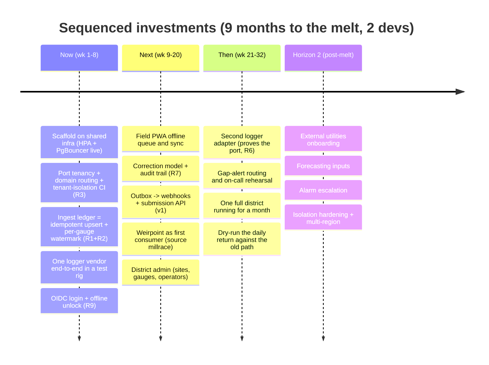
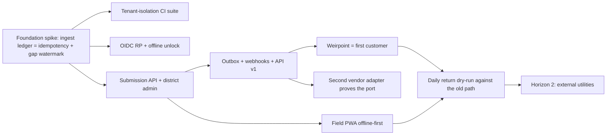

# Worked Example — Greenfield Initiative: an operator telemetry portal ("Millrace")

> **Fully synthetic.** No client, system, vendor or figure in this example is
> real: it is a constructed engagement written to carry the method, and every
> specific in it was invented for that purpose. Use it for shape and rhythm,
> never as a source of facts.

> **Version note:** a greenfield run at **v0.2 report depth** — it predates the
> v0.6 report opening (00 Evidence Base / 01 Start Here) and the v0.7 policy
> layer, neither of which appears here. Calibrate report structure and the
> policy register from the contract and from the two v0.7 examples; calibrate
> *greenfield reasoning* from this one.

> A complete run of the Engineering Strategy Framework in
> **greenfield-initiative** mode — the full multi-section report, because a new
> build with a 9-month horizon against an immovable date warrants it. It shows
> the greenfield rhythm that the audit examples cannot: there is no
> system-under-audit yet, so evidence comes from three places — (a) an
> *adjacent* production codebase whose patterns are reused, (b) web research
> into the domain and third-party vendors, and (c) business answers from the
> user — and the decisive move is discovering that the "greenfield" is really
> the **producer side of an integration contract that already runs in
> production**.
>
> It demonstrates: business-context-first framing; a risk register whose two
> top risks are *low-detectability* and collapse into a single mechanism; a
> foundation-spike roadmap that retires the silent killers before breadth;
> Build / Buy / Wait / Kill; a red-team that concedes and time-boxes a
> fallback; and every visualization (evidence bar, risk heat map, roadmap
> timeline, dependency DAG). Use it to calibrate greenfield depth and to see
> how reuse of an adjacent system counts as first-class evidence.

---

# Engineering Strategy Report — "Millrace" MVP

**An operator-facing telemetry submission platform for a regional water utility**
Rails 8 · PostgreSQL · Managed Kubernetes · React · Helm
Prepared with the Engineering Strategy Framework · Mode: greenfield initiative

---

## 1. Executive Summary

We are not building a greenfield unknown. We are building the **producer side of an
integration contract that already runs in production**: Weirpoint's
`IncomingReadingsController` already ingests `reading.created`, `reading.corrected`
and `gauge.*` webhooks from the incumbent logger SaaS (Hydrolog) and maps them
through adapter services onto a `Reading` model with a `source` enum `[observed]`.
That single fact collapses most of the "ingest pipeline" uncertainty — **Weirpoint
becomes our first customer**, and the submission contract is already specified by
what it consumes.

**Recommendation:** build a **separate, thin Rails 8 service ("Millrace")** that
reuses Weirpoint's proven patterns (District→Site tenancy, domain routing, Pundit,
adapters, transactional outbox) but deploys independently on the existing
cloud/Kubernetes footprint — exactly as the sibling `inspections-portal` app
already does `[observed]`. Separation is load-bearing for two things a shared
codebase cannot give cheaply: **failure isolation from the outage platform during a
flood event**, and **independent autoscaling for melt-season ingest spikes**.

The two risks that govern the first weeks are **silent gaps in a gauge series** and
**duplicate or replayed readings**, both high-impact and *low-detectability* — they
look fine until a regulator return is filed against them. A happy consequence of the
per-gauge sequencing the loggers already emit is that these two collapse into a
single mechanism (see §5).

The 9-month horizon and 2-dev team are adequate **only with hard scope cuts**:
manual and logger submission only, no forecasting, one logger vendor behind an
adapter, OIDC instead of home-grown auth, and a field PWA rather than native apps.

```
Evidence base — 48 claims
[observed] ██████████████████░░░░░░░░░░  46%  (22)   adjacent-repo + infra exploration
[web]      █████░░░░░░░░░░░░░░░░░░░░░░░░  12%  ( 6)   logger vendors + the return format
[user]     █████░░░░░░░░░░░░░░░░░░░░░░░░  15%  ( 7)   business answers + additions
[inferred] ███████████░░░░░░░░░░░░░░░░░░  27%  (13)   design reasoning from evidence
[assumed]  ░░░░░░░░░░░░░░░░░░░░░░░░░░░░░   0%  ( 0)   ← all resolved to [user]
```

---

## 2. Business Context

- **Objective:** internal-first, external-later — run it on our own 40 sites, then
  offer it to neighbouring utilities as a white-label service `[user]`.
- **The date:** the **spring melt**, nine months out. It does not move, and the
  first melt week is the highest-volume, least-forgiving moment of the year `[user]`.
- **Submission:** both **manual entry by a site operator** and **automatic logger
  feeds**; manual entry must work with no signal in the valley `[user]`.
- **Hardware:** **no procurement in MVP** — we integrate the loggers already
  installed, vendor-agnostically `[user]`.
- **Compliance:** the daily **abstraction return** to the national water regulator
  is filed from this data; corrections must be attributable and replayable `[user]`.
- **Auth:** **OpenID Connect** against the utility's existing identity subsystem `[user]`.
- **Scaling:** **HPA from day one** `[user]`.
- **Team:** Senior Ruby BE (also owns infra) + Senior FE `[user]`.

**Market grounding:** the incumbent (Hydrolog) is API-first, white-label, "the
operator owns the data"; its core resources are sites, gauges, readings, corrections
and real-time webhooks `[web]`. Installed loggers in this region speak two wire
formats, both of which carry a **per-gauge monotonic sequence number** and a
device clock that drifts; vendor documentation is explicit that redelivery after a
network outage is expected and consumers must be idempotent `[web]`.

---

## 3. Product Assessment

Stage: **Idea → MVP**, but with an unusually strong starting position. Capabilities
we **inherit as patterns, not rebuild**:

| Capability | Evidence | Reuse |
|---|---|---|
| Two-level tenancy District→Site | internally-forked row-level multi-tenancy gem + middleware chain `[observed]` | Copy pattern |
| Domain routing / district subdomains | `UrlDomain`/`Url`/`UrlRoute` models `[observed]` | Copy pattern |
| Identity / OIDC subsystem | `District#identity_domain_id`, `auth-<slug>` hosts `[observed]` | Consume as IdP |
| Reading + external-source model | `Reading` with `source` enum, `properties` jsonb `[observed]` | Copy pattern |
| Webhook ingestion + HMAC + adapters | `IncomingReadingsController`, `Hydrolog::UpsertReadingService`, `verified_webhook?` `[observed]` | **Invert** into producer |
| Regulator return builder | the daily-return job already renders from `Reading` `[observed]` | Reuse as consumer |
| Deploy target | Managed Kubernetes + managed Postgres + shared ingress; `inspections-portal` coexists `[observed]` | Piggyback |

**Known limitation to respect:** the forked multi-tenancy gem has **untested tenant
isolation** (a standing repo risk). The new app inherits that risk if it copies the
pattern without adding an isolation test suite `[inferred]`.

---

## 4. Organization Assessment

Two seniors, nine months, and the BE engineer is **also** the infra owner. The
dominant *organizational* risk is **surface area vs. capacity**: ingest, submission
API, webhooks, field PWA, district admin and a new Helm/Terraform footprint is a lot
for ~1.5 effective backend people. The mitigant is that roughly 60% of the platform
plumbing (tenancy, routing, deploy, secrets, mail, **OIDC**) is **reuse, not
invention** `[inferred]`.

**Ownership must be explicit:**
- **BE + infra:** domain model, the ingest ledger, logger adapter, outbox and
  webhooks, Helm chart, Terraform, HPA/PgBouncer.
- **FE:** React district admin, the field PWA (offline-first), correction review UI.

There is no third person to absorb an unplanned spike — the plan must protect the
infra-owner's time (see Decision Log falsifier, §11).

---

## 5. Engineering Assessment

**Recommended architecture — a separate Rails 8 service ("Millrace"), patterns
copied from Weirpoint, runtime independent.**

### The ingest ledger — where the two top risks become one

A reading arrives with a gauge id, a device sequence number, a device timestamp and
a value. Three things follow from that, and together they are the whole first spike:

- **Idempotency.** `(gauge_id, sequence)` is unique; a redelivered reading is an
  upsert, never a second row. This retires duplicates by construction rather than
  by vigilance.
- **Gap detection.** Because the sequence is monotonic per gauge, a missing number
  is *visible*: the ledger tracks a watermark per gauge and raises a gap the moment
  the next sequence skips. A gauge that stops reporting and a gauge reporting zero
  stop being indistinguishable — which is the entire R1/R2 collapse.
- **Attributable correction.** A correction is an append, never an overwrite; the
  return builder reads the latest revision and the audit trail keeps the original.

The device clock drifts, so the device timestamp is *data*, never the ordering key.
Ordering is the sequence; arrival time is recorded separately `[web/inferred]`.

### Submission — manual entry is the hard one

Logger feeds are the easy path. The operator standing at a weir with no signal is
the design constraint: the PWA queues submissions locally, signs them with the
operator's key, and replays them with the same idempotency contract the loggers
use — so a queued manual reading and a redelivered logger reading take the same
code path `[inferred]`.

### Authentication — OIDC (Relying Party)

Consume the existing identity subsystem as an IdP rather than building auth. The
IdP sits on the critical path for field login, so the PWA holds an offline unlock
(device-bound PIN, short-lived) that lets an operator record readings with the IdP
unreachable and sync later (R9).

### Infra — piggyback, do not build (HPA from day one)

Shared cluster, managed Postgres, shared ingress, existing secret management. The
melt-season profile is spiky and unlike the outage platform's, which is exactly why
the deployment is separate and the autoscaler is its own.

### Quality attributes driving the design

Correctness of the filed return first; then availability of submission during melt;
then operability by one infra owner. Everything else — throughput, elegance,
breadth of features — is subordinate and stated as such so later trade-offs have a
ranking to appeal to.

---

## 6. Root Causes (problem reframing)

The request reads "build a Hydrolog-like platform," which sounds like a broad
greenfield. The **real** problem is narrower and cheaper: *own the reading-capture
and correction path for sites we already operate, with a contract we already speak,
and keep the option to sell it to neighbours later.* This reframing turns the
"ingest pipeline" from a design unknown into a **conformance target** (Weirpoint's
existing consumer), and turns "multi-tenant SaaS" into "copy a pattern that already
works here."

---

## 7. Risk Register (ranked; low detectability raises rank)

```
                          Risk exposure (prob × impact)
   HIGH │  R4·scope        R2·duplicates    R1·silent-gap(low-detect)
 IMPACT │                  R5·field-PWA     R3·tenant-leak(low-detect)
        │                  R7·return-audit  R9·OIDC-on-path
    LOW │                                   R6·vendor lock-in(mitigated)
        └───────────────────────────────────────────────────────────
             LOW              PROBABILITY                 HIGH
```

- **R1 — A gauge stops reporting and nothing says so** `[inferred]`. Downstream, a
  missing reading and a zero reading are the same shape; the return is filed against
  a series with a hole in it. *Detectability:* **low**. *Falsifier:* a gauge silenced
  in a test rig raises a gap alert inside one reporting interval. **Top technical
  priority** — unified with R2 through the sequence ledger.
- **R2 — Duplicate or replayed readings** `[web/inferred]`. Vendor docs promise
  redelivery after an outage; a retry storm double-counts abstraction volume in a
  filed return. *Detectability:* **low**. *Falsifier:* replaying a full day of
  webhooks twice leaves row counts and the rendered return byte-identical.
- **R3 — Cross-district data leak** `[observed/inferred]`. Inherited from the forked
  multi-tenancy gem with no isolation test. **Critical** for a white-label product.
  *Detectability:* low. *Falsifier:* an isolation suite asserting district-A queries
  never return district-B rows, in CI.
- **R4 — Scope vs. 2-dev capacity** `[user/inferred]`. *Impact:* miss the melt.
  *Detectability:* **high** (slippage is visible) — manageable *if* sequenced.
  *Falsifier:* the foundation slice (R1+R2+R3+R9) lands inside ~8 weeks.
- **R5 — The field PWA fails at the site** `[inferred]`. No signal in the valley plus
  no offline queue equals an operator who writes on paper and types it in a week
  later, which is an **irreversible** loss of attribution. *Falsifier:* the PWA
  records and later syncs a full round with the device in airplane mode.
- **R6 — Logger-vendor lock-in** `[inferred]`. Mitigated by the adapter port —
  proven when the second vendor's adapter drops in without touching domain code.
- **R7 — Return correctness and audit trail** `[user/web]`. A regulator asking "why
  did this number change" must get an answer from the system, not from a person.
  *Falsifier:* every filed figure resolves to a reading revision with an author and
  a timestamp.
- **R9 — OIDC IdP on the field critical path** `[inferred]`. An IdP outage blocks
  operator login at the worst moment. *Falsifier:* an operator completes a round
  with the IdP unreachable.

*(R8 "multi-utility onboarding complexity" is resolved — see §11, Decision Log.)*

---

## 8. Strategic Bets (Build / Buy / Wait / Kill)

- **BUILD** — the Millrace service (domain, ingest ledger, submission API/webhooks,
  field PWA, district admin), the logger adapter port, the tenant-isolation CI suite.
- **BUY / Reuse** — the loggers and their vendor SaaS (never build firmware),
  **OIDC via the existing identity subsystem**, the regulator return builder already
  in Weirpoint, and **all** infra (Kubernetes / managed Postgres / ingress /
  cert-manager / secret management — already running).
- **WAIT** — hydrological forecasting, automated control, alarm escalation policies,
  native mobile apps, external white-label onboarding, cross-utility benchmarking.
- **KILL** — in-house logger firmware; a bespoke streaming broker for the pipeline
  (transactional outbox + HTTP webhooks suffices; do not over-invest in a broker for
  MVP even though one is available `[observed]`); home-grown auth.

---

## 9. Investment Priorities & Sequenced Roadmap

The order matters more than the work. **Prove the silent killers before building breadth.**





**The foundation spike (weeks 1–8) is the whole strategy in miniature.** It is the
smallest slice that retires R1, R2, R3 and R9 — the low-detectability killers —
before any breadth is built, and it runs on the real horizontal-scale topology
(HPA + PgBouncer) so the replay test is honest. If it cannot land in ~8 weeks, that
is the early warning on R4, with time left to cut.

---

## 10. Evolution Strategy (1-yr / 3-yr)

- **1 year:** all 40 internal sites live; the daily return filed from Millrace with
  the old path kept as a shadow for one season; second logger adapter proven; OIDC
  SSO across the utility's applications `[observed]`.
- **3 years:** two or three neighbouring utilities onboarded as districts; the
  correction trail is the product's selling point rather than a compliance chore;
  forecasting consumes the series through the same API outsiders use. The shape to
  protect is that **every consumer, internal or external, reads the same contract** —
  the moment an internal consumer gets a private door, the external product starts
  paying for it.

---

## 11. Decision Log

**Decision A — Separate deployable service, not a Weirpoint module.**
- *Alternatives:* (a) module/engine inside Weirpoint behind a flag; (b) fork Weirpoint.
- *Trade-offs:* separation costs a second Helm/Terraform footprint and some ops for a
  small team; a module reaches the *internal* milestone faster.
- *Risks reduced:* failure isolation during flood events, independent melt-season
  scaling, clean external-tenancy separation.
- *Risks introduced:* ops load on the infra-owning BE (R4).
- *Exit / fallback:* infra reuse (`inspections-portal` precedent `[observed]`) keeps
  the added ops small.
- *Falsifier / review:* **if, by the end of the foundation spike, second-app ops
  burden is consuming a large share of the infra-owner's capacity, collapse the
  internal phase into a Weirpoint module and defer extraction to the external
  phase.** Review at **week 8**.

**Decision B — Manual and logger submission share one idempotency contract.**
- *Context:* `[user]` requires manual entry offline; loggers redeliver by design `[web]`.
- *Trade-offs:* forcing manual entries through a sequence-and-watermark ledger is more
  machinery than a plain form would need.
- *Risks reduced:* two ingest paths with different correctness properties, which is how
  a filed return ends up depending on which path a reading took.
- *Risks introduced:* operators must be given a sequence they cannot see — handled by
  the PWA, never by a human.
- *Exit:* if field testing shows the queue confuses operators, degrade to
  server-assigned sequences for manual entries only, keeping the ledger shape.
- *Review:* after the first field round with real operators.

**Decision C — Manual + one vendor, no forecasting, OIDC, HPA from day one, in MVP.**
- *Falsifier:* an internal district needs forecasting, or a second vendor's loggers
  appear on a site, before month 9 (neither expected `[user]`).

---

## 12. Red-Team of the #1 Recommendation

**Claim under attack:** "Build a separate service; the foundation spike kills the top
risks; Weirpoint is the first customer."

**Strongest counter:** *Do not build a separate app at all.* Weirpoint already has
`District`, `Site`, `Reading`, domain routing, OIDC identity, and already ingests
readings — adding *submission* to Weirpoint is strictly less work than standing up,
deploying and operating a second service with a ~1.5-person backend. "External
utilities later" is speculative; we may pay a real ops tax now for an option we never
exercise.

**Assessment — partially valid; recommendation held, de-risked.** The counter is right
that the *cheapest path to the internal milestone alone* is a Weirpoint module. But two
forces are expensive to retrofit and justify separation: (1) a bad ingest deploy during
a flood event **must not be able to take down the outage platform** and vice versa —
shared-process blast radius is the concern; (2) **melt-season ingest spikes need
independent autoscaling** we do not want coupled to the outage platform's profile (and
HPA-from-day-one makes this concrete). The `inspections-portal` precedent shows a second
app is *cheap* here, not expensive `[observed]`, which defuses the counter's core
premise. **Concession:** the module-in-Weirpoint path is written into the Decision Log
as an explicit, time-boxed fallback with a week-8 falsifier — so if the ops tax proves
real for this team, the strategy bends instead of breaking. The recommendation stands,
de-risked rather than defended.

---

## 13. Missing Information / Watchlist

- **Melt-week peak volume** (readings/minute across 40 sites) — sizes the ledger
  write path, HPA thresholds and the PgBouncer pool; unmeasured today.
- **DB connection exhaustion under HPA** — add PgBouncer (transaction pooling)
  **before** the first melt, not after.
- **Which logger vendor** contractually, and whether its webhook signing supports key
  rotation — decision needed before the ingest spike.
- **Regulator specifics** — retention window, correction SLA, and whether a shadow
  season is acceptable evidence — needs compliance input.
- **OIDC IdP capabilities** — confirm the identity domain exposes standard discovery
  and client registration for a new RP; confirm the offline unlock is acceptable to
  the security owner.

---

## Sources

*(Synthetic. The `[web]` claims in this example stand in for what a real run would
cite: the incumbent vendor's developer documentation and two logger-vendor
integration guides.)*

*Evidence tags: `[observed]` = seen in the adjacent Weirpoint repo or the infra repo ·
`[web]` = vendor and domain research · `[user]` = business answers · `[inferred]` =
design reasoning from the evidence above.*
