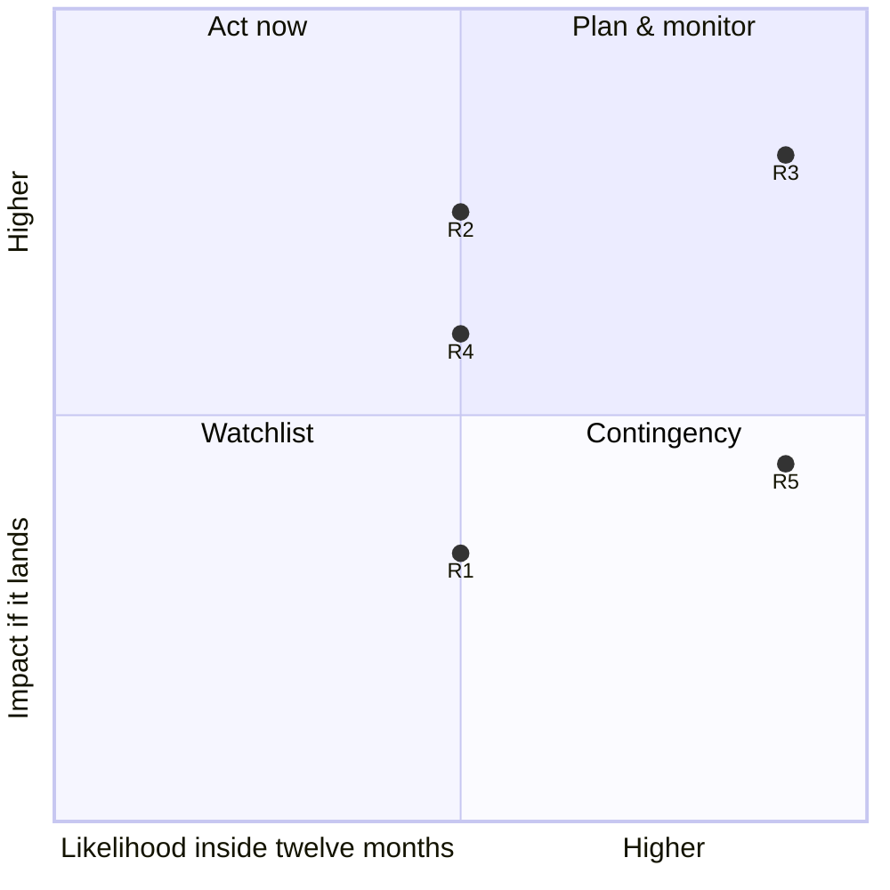

# Engineering Strategy Report — Solidus

**Mode:** existing-system audit
**Subject:** `solidusio/solidus` @ `cdcdfaf3` (2026-07-21), re-verified against the live system 2026-08-08
**Framework:** ESF v0.7 · **Date:** 2026-08-11 · rev. 28
**Stakeholder access:** partial — a courtesy window in the project's Slack (rev 24–25) and a post-publication correction from a second Core Team member (rev 28); see §22

> **Why this example exists.** A public open-source project audited from
> outside: evidence from the repository, git history, public APIs and the
> open web, unanonymised because all of it is public. It began with **zero
> stakeholder access** and ended **partial** — the draft posted to the
> project's Slack drew Core Team answers within the hour, and the exchange
> moved the top risk. Twenty-eight revisions, most driven by a reviewer
> challenging individual claims. For twenty-six of them every correction
> moved the same direction — toward the subject looking better — until
> rev 27 logged the first counterexample: an over-flattering claim
> ("tested against unreleased Rails and Ruby") that died on a date-check
> the report owner ran against the workflow file. Rev 28 then ran the
> dispute rule end to end: the steward itself disputed the "paid its own
> steward" money reading, the widened search proved the misread was
> structural — the public ledger cannot distinguish a fronted payment
> from a received one, because Open Collective hides expense attachments —
> and the finding narrowed to a legibility gap while the purchase-shape
> critique stood untouched. The 43-entry Decision Log is the example's
> centre of gravity.
>
> It is also the reference for the **v0.7 policy layer in the field**: a
> proposed Policy register (PL1–PL5) compiled from a zero-mandate position —
> every row `proposed`, addressed to the owners the governance document
> actually empowers, capped at a volunteer project's enforcement ceiling,
> with operations carried as fields, two-way coverage with named
> deferments, a Decision-Log backtest, the Easy Wins fast lane (E1–E5,
> two former bets drained into it), a Watchlist carrying every review
> date, and the policies-first report opening in place of an executive
> summary.
>
> Below is the report's markdown channel, emitted by the DSL from the same
> source as the web edition — the evidence meter is counted, never authored.

---

*A well-engineered open-source commerce framework that has quietly lost its steward for the second time in ten years — and a competitor that came back from the dead with a business model behind it.*

> Report · rev. 28 · updated 2026-08-11 · 132 tagged claims · https://vit-panchuk.com/reports/solidus/

---

```
Evidence Base — 132 tagged claims
[observed]    ██████████████████░░░░░░░░░░░░░░░░░░   51%  (69)
[web]         ██████████░░░░░░░░░░░░░░░░░░░░░░░░░░   27%  (35)
[stakeholder] ██████░░░░░░░░░░░░░░░░░░░░░░░░░░░░░░   17%  (22)
[inferred]    ██░░░░░░░░░░░░░░░░░░░░░░░░░░░░░░░░░░    5%  ( 6)
[assumed]     ░░░░░░░░░░░░░░░░░░░░░░░░░░░░░░░░░░░░    0%  ( 0)
```

---
A well-engineered open-source commerce framework that has quietly lost its steward for the second time in ten years — and a competitor that came back from the dead with a business model behind it.

Three quarters of this report rests on things read directly out of the repository, the git history and public financial records. That is a strong base for questions of fact. The evidence windows: the original sweep ran 18–25 July 2026, one Core Team member answered questions on 3 August, the load-bearing claims were re-checked against the live system on 8 August, and a second Core Team member corrected the money section's beneficiary reading on 11 August — this revision carries that correction.

## Start Here

This section exists so the rest of the report makes sense without prior knowledge of Solidus. If you already know the project and the players, skip straight to [Policies & Operations](#policies--operations) — the decided layer comes first, and the [timeline](#timeline) right after it carries the story.

### What Solidus actually is

Solidus is not a hosted store you sign up for, like Shopify. It is a **set of Ruby on Rails libraries you install into your own application** — you run the servers, you own the database, you write the customizations. In Ruby these libraries are distributed as "gems," and Solidus ships about eight of them.

The ones that matter for this report:

- `solidus_core` — the commerce domain: orders, products, payments, shipping, taxes.
- `solidus_backend` — the *original* admin interface. Built in the older Rails style with jQuery. Still the one in use.
- `solidus_admin` — the *new* admin interface, started in 2023 to replace the old one. Still unfinished. Much of this report is about why.
- `solidus` — a "meta-gem": a package that installs nothing itself and simply lists which of the others you get by default. **Which gems it names is effectively the project's official position on what is ready.** Watch this one.

> Solidus is not a hosted store: it is a set of Rails libraries you install into your own application — you run the servers, you own the database, you keep every customization.

### Who's involved

- **Nebulab** — Italian e-commerce consultancy, \~27 people. Named in the governance document as the project's Director, a role covering business and organizational direction. Took over stewardship in 2018, bootstrapped the collective's funds, and remains the largest cumulative funder — by their own account they also staffed one to three senior developers full-time on Solidus for multiple years, unpaid `[user]`. Their *engineering* contribution has collapsed to almost nothing since 2024 — a central thread of this report, and one they answered at rev 28: the unpaid staffing became unsustainable.
- **Super Good Software** — Canadian consultancy led by Jared Norman. Now the largest contributor of code and joint-largest funder. Healthy and active.
- **Stembolt** — The agency that created Solidus in 2015 by forking Spree. Acquired by JUUL Labs in 2018 and stopped work. The first steward to walk away.
- **Spree · Vendo** — Spree is the project Solidus was forked from — abandoned in 2015, revived commercially, now the main competitor. Vendo is the company that sells its paid Enterprise Edition.
- **Open Source Collective** — A US non-profit "fiscal host." Solidus is not a legal entity and holds no money of its own; OSC legally holds the donations and pays approved expenses.
- **The merchants** — Mid-market online stores: direct-to-consumer brands, auto parts retailers, book sellers. Most arrived through one of the agencies, and many funded the project directly.

### How to read the notation

Every factual claim carries a tag showing where it came from. This is the core discipline of the framework — it stops confident-sounding guesses from passing as findings.

|  |  |
| --- | --- |
| `[observed]` | Seen directly in the system — code read in the repository, a command run, git history, an API response. |
| `[web]` | Verified against an external source — a vendor's own site, a release listing, press coverage. |
| `[user]` | Stated by a stakeholder — someone from the project answering directly. Authoritative for business facts, but revisable; re-confirmed when load-bearing. |
| `[inferred]` | Reasoned from evidence. Plausible, not established. Do not act on it as fact. |
| `[assumed]` | Neither checked nor verified. Everything tagged this way is listed in [§22](#what-i-could-not-establish). |

This is a living report written against ESF v0.7, an engineering-strategy framework whose rules are cited where they bind; "rev N" means the Nth numbered revision of this document, and the Decision Log records what each one changed. Until rev 24 there was no stakeholder tag anywhere in this report, because no one from the project had spoken. The courtesy window — the draft was posted in the project's Slack before wider publication, inviting correction — changed that: one Core Team member answered there in two replies an hour apart (rev 24 and rev 25), covering two of the three ranked questions this report had posed. A second exchange followed publication: Alberto Vena — Core Team, Nebulab — corrected the money section's beneficiary reading and answered a third ranked question (rev 28). Every stakeholder-tagged claim traces to these two exchanges. Two answer sets are corroboration, not access — the remaining limits are discussed honestly in [§22](#what-i-could-not-establish).

**Item codes.** [PL1…PL5](#policies--operations) are proposed policies — standing rules for the project to accept, amend or reject; this is the layer rev 26 adds. [R1…R5](#risk-register) are risks (things that *might* happen). [D1…D4](#debt-ledger) are debts (costs already being paid every cycle). [S1…S7](#the-strategy-already-in-force) are strategies already in force. [RC1/RC2](#root-causes) are root causes. [F1…F3](#f1) are the admin failure factors. [E1…E5](#easy-wins) are the fast lane: trivial machine improvements that never compete with the difficult decisions. [B2…B10](#bets--for-you-to-set) are proposed bets — B1 was withdrawn along with a strategy row, and B3 and B4 moved to the Easy Wins lane at rev 26; the numbering keeps the gaps so earlier annotations still line up. [C1…C9](#credit-ledger) are credits: investments that pay back every cycle, confirmed or still projected. [P1…P5](#pre-mortem) are pre-mortem entries — ways this report's own plan fails.

## Policies & Operations

> Solidus is technically healthy and strategically adrift. Both are true, and the gap between them is the whole story.

This section replaces the executive summary, because a summary describes and a policy decides. Everything a reader needs to act on is here; every rule links down into the evidence that produced it. The situation in brief: Solidus is technically healthy and strategically adrift — top-decile delivery machinery, one genuinely stalled initiative, a steward whose engineering quietly left, and a competitor that came back with revenue behind it. The project cannot win a fight for new merchants, but it holds one claim nobody can contest: it is the commerce framework you can still own in ten years. The rules below are what that diagnosis implies, written as standing policy rather than one-off advice. Read this register together with its two companions — [§17](#easy-wins) and [§18](#bets--for-you-to-set) — because the three are one foundation: the policies govern what recurs, the fast lane ships the trivial machine improvements without ceremony, and the bets carry the calls that still need an owner's judgment. Accept all three layers and the strategy stands whichever role the project chooses.

- **60% → 0.8%** — Nebulab's share of commits, 2023 → last 12 months
- **$45,760** — Already spent on the admin that never shipped
- **3 yr 3 mo** — Age of the new admin, still version 0.4
- **$133,750** — Cash held · nothing spent in thirteen months

### Who accepts these, and what this report can and cannot mandate

The framework this report runs on (ESF v0.7 — see the notation note in Start Here) requires the mandate question to be answered before policy is proposed, so here it is, plainly. **The author holds no mandate over Solidus.** This is an outside audit; nothing below is accepted, and an outside analyst cannot accept it. Every PL row ships in the `proposed` state, addressed to the people the governance document actually empowers: the **Core Team** for anything touching code and releases, and the **stakeholder vote** for anything touching money `[observed]`.

Solidus is volunteer-delivered: nobody can be assigned a deadline they are not paid to meet, so a policy demanding sustained labour from named volunteers would fail on arrival. What the project *can* enforce, it already enforces well — by machine. Deprecations fail the build; style is linted, not litigated; merges require Core Team review `[observed]`. The rules below respect that ceiling: they are either policy statements that cost nothing to keep (naming a date, publishing a decision), allocation rules for money the collective already governs, or guidance with the enforcement left to existing machinery. None of them asks a volunteer to work.

One more obligation the framework imposes: check whether strategy work already exists before authoring any. It does. The lead maintainer published a coherent strategic position in May 2026 — governance breadth, licensing freedom, a deliberate rejection of the JavaScript-framework path `[web]`. The policies here join that position rather than competing with it; [PL3](#pl3) exists mostly to move it from a consultancy's blog into the project's own artifacts.

### The proposed policy register

**PL1 — Every replacement names the release that removes what it replaces** *(direction · proposed)*
The project engineers migrations well and never schedules them — [RC1](#rc1) is the mechanism behind the largest recurring cost in the ledger, [D1](#d1). Promotions has shipped a complete engine and a 190-line migration guide for two years, and no release anywhere says when the legacy engine goes. This rule closes the gap at the source: a successor ships as parallel opt-in only alongside a named removal release for the incumbent. Rails and Ruby both publish deprecation timelines this way; the statement costs nothing and assigns nobody labour. Its first invocation is [B5](#b5), which has been free to do for two years.
Addresses: [RC1](#rc1), [D1](#d1)
Relation: amends [S3](#s3) by adding the exit criterion it lacks; reinforces [S2](#s2) — a published date is how deprecate-before-removing stays honest
Operations: an exit-criteria line in the release-notes template (the same automation that already generates changelogs); the promotions gem's migrate-now advisory as the model document
Accepted by: Core Team (proposed)
Executed by: release checklist — an exit-criteria line in the release automation
Review: 2027-02-08

**PL2 — Collective money buys named outcomes, not time** *(allocation · proposed)*
Every serious spending year funded a single engagement, and the one that failed — $45,760 for six "Agile Design Sprints" in 2023 — is the one that bought activity instead of an outcome ([F1](#f1)). The rule: a funded engagement names its deliverable, its completion criterion, and who carries the work after the money stops. The funding model itself is already settled and deliberate — independent developers paid from the collective while the maintaining firms stay on client work `[user]` — so this row ratifies a norm the project already holds and writes down the arm's-length standard that currently exists only in Slack and in one maintainer's head. Backtested against the record: the 2020, 2024 and 2025 engagements pass on shape and fail on succession; the 2023 purchase fails outright, and this rule is the difference.
Addresses: [RC1](#rc1), [R3](#r3), [F1](#f1)
Relation: fills a void — no written allocation rule exists; ratifies the unwritten funding norm stated by the Core Team at rev 25
Operations: the existing weekly stakeholder vote as the approval venue; the fiscal host's review as the independent check; the expense description itself carries the outcome and criterion, so inspection happens at approval time with no new machinery
Accepted by: stakeholder vote (proposed)
Executed by: the expense-approval step — an expense that names no outcome is sent back, not approved
Review: 2027-02-08

**PL3 — Decisions are published where adopters can read them** *(guidance · proposed)*
The Core Team holds explicit technical authority and the community meets weekly, yet no decision reaches a public artifact: the roadmap board is a changelog wearing a roadmap's name, and the clearest statement of project strategy lives on a consultancy's marketing blog ([S1](#s1)). A prospective adopter finds a well-kept record that the project had a past and no evidence it has a future. The rule: each Core Team decision lands within a month as a status post or a forward-looking roadmap item. This is publication, not governance — the decisions may already be getting made; nothing about them is visible. The blog has already half-resumed on its own, with one release announcement in May 2026 `[web]`; this rule turns that from an occasional act into a habit.
Addresses: [D2](#d2), [D3](#d3), [R4](#r4)
Relation: ratifies [S1](#s1) by moving the published strategy into the project's own artifacts; reinforces [S5](#s5)
Operations: both channels already exist and are dormant — restarting them costs an hour a month; [E1](#e1) and [E5](#e5) are the first two acts and take minutes
Accepted by: Core Team (proposed)
Executed by: the two existing channels — status posts and forward-looking roadmap items — on a monthly reminder
Review: 2027-02-08

**PL4 — Every parallel initiative gets a quarterly disposition, recorded publicly** *(approval · proposed)*
The admin has been neither shipped nor cancelled for three years inside a governance structure that plainly permits either — authority exists, a venue does not ([S5](#s5), [D2](#d2)). The rule gives the recurring decision an address: once a quarter, each parallel initiative is declared progressing, funded, paused until a named date, or cancelled, and the answer is written where outsiders can read it. The mechanism cannot fail silently, which is the property that matters — a quarter with no disposition list is itself visible. This is the row that would have caught the admin's stall in 2024 instead of letting an architecture that hides abandonment ([R3](#r3)) hide it for two more years.
Addresses: [R3](#r3), [D1](#d1), [RC2](#rc2)
Relation: amends [S5](#s5) — the authority stays exactly where it is; this adds the venue, cadence and record it never had
Operations: piggybacks on the existing weekly meeting, four times a year; the record is a roadmap-board item, which also feeds [PL3](#pl3)
Accepted by: Core Team (proposed)
Executed by: one agenda item per quarter in the existing weekly meeting; the disposition list lives on the roadmap board
Review: 2027-02-08

**PL5 — A departing contributor's in-flight work is adopted or closed within a release cycle** *(guidance · proposed)*
When the 2025 funded developer stopped, seven admin pull requests went stale where they sat, and the project's only rescue so far was one contributor volunteering by hand a year later ([F3](#f3)). That rescue worked — it moved to a fresh pull request on 30 July 2026, with the reviewer's preferred approach adopted `[observed]` — which proves the mechanism and indicts its coverage: one orphan in six found an adopter, by accident. The rule makes the accident routine. When a contributor departs, each of their open drafts gets an explicit adopt-or-close decision within one release cycle. Closing is a legitimate outcome; the only illegitimate one is the current default, indefinite limbo preserved by a compatibility rule that never expires anything.
Addresses: [RC2](#rc2), [F2](#f2), [F3](#f3)
Relation: fills a void, and ratifies the rescue mechanism the community has already demonstrated once
Operations: a saved GitHub search for drafts with no author activity in N months is the whole inspection; the nudge goes only to actual stalled threads, silent otherwise
Accepted by: Core Team (proposed)
Executed by: a stale-draft sweep (a saved search or scheduled action) plus a comment asking the one question: adopt or close?
Review: 2027-02-08

### What the register deliberately does not cover

Two-way coverage is the rule this register is built under: every policy names the findings it addresses, and every top-ranked finding is either addressed or explicitly deferred with a date. Two deferments, stated rather than hidden:

- **[R2](#r2) — concentration.** No policy can conjure a third firm. The register reduces the blast radius ([PL2](#pl2) requires a successor; [PL5](#pl5) handles the wreckage), but the concentration itself has no mechanism worth proposing today. Revisit when the next funded engagement lands, which is the moment a new party could plausibly enter.
- **[R5](#r5) — extension breakage.** A stated property, not a hazard; bounded, with an obvious mitigation whenever someone wants it. Deferred until it bites someone specific.

The register was also backtested against this report's own Decision Log, as the framework requires: [PL2](#pl2) would have reshaped the purchase that decision-log entry 31 dissects; [PL4](#pl4) would have forced the question entries 07 and 34 spent three revisions reconstructing; [PL3](#pl3) is entry 28's correction turned into a standing rule. A policy that would have changed no logged decision is doing no work; these three carry the register.

> **THE ONE CONCLUSION TO TAKE AWAY**
> Solidus cannot win the fight for new merchants — not on features, not on speed, not on funding. It has one uncontested claim left: it is BSD-3 licensed with no commercial entity that could ever relicense it, it has no JavaScript supply chain, it runs on one runtime, and its upgrade discipline is real and machine-enforced. Spree structurally cannot say this, because its Enterprise modules are commercial. Shopify would never want to.
> 
> That points at a role, not a comeback: the commerce framework you can still own in ten years. Serving the merchants who already chose it, rather than chasing the ones who never will. [§15](#who-solidus-can-still-serve)–[§18](#bets--for-you-to-set) work through what that implies, and the policies above are the standing rules that survive whichever role is chosen.

> The policy layer in one line: schedule what you replace, buy outcomes not time, publish decisions, give each initiative a quarterly disposition, adopt or close departed work — five rules, all proposed, none asking a volunteer to work.

## Timeline

The whole story in one pass. The heavy markers are the moments the story hangs off; green is the one genuine bright spot.

- **February 2015** — Solidus is born. Stembolt, an agency, forks Spree 2.4 because it dislikes where Spree is heading. The founding promise is stability, easy upgrades and backwards compatibility `[web]`.
- **September 2015** — Spree is acquired by First Data and development stops entirely. The fork looks prescient; much of the Spree community migrates to Solidus `[web]`.
- **July 2018** — The first steward leaves. Stembolt is acquired by JUUL Labs and stops working on Solidus. Nebulab picks up stewardship `[web]`.
- **2019 onward** — Funding runs through Open Collective. Agencies and merchants sponsor monthly. Sponsors also start cancelling — seven in 2019, seven in 2020, seven in 2021. This attrition never stops `[observed]`.
- **May 2023** — The new admin begins. Work starts on solidus_admin to replace the ageing interface `[observed]`.
- **April–August 2023** — $45,760 is spent on it. Six payments of $6,000 billed through Nebulab for "Agile Design Sprints" — money they state was fronted to third-party designers, none of it retained `[user]` — plus $9,760 for a redesign analysis. 2023 becomes the project's biggest year: 1,810 commits, roughly 60% from Nebulab's people `[observed]`.
- **2024** — Nebulab's engineering collapses. Their lead developer goes from 696 commits to 46. Admin work drops from 618 commits to 205. No announcement is ever made `[observed]`.
- **June 2024** — A second parallel rewrite starts: solidus_promotions, alongside the existing promotions engine. Neither becomes the default `[observed]`.
- **April 2025** — Spree returns commercially. Version 5.0 splits into a free edition and a paid Enterprise Edition backed by Vendo `[web]`.
- **May 2025** — Solidus starts publishing monthly status updates. One person — Eugene Chaikin — is publicly named as the one advancing the new admin. He will write 78% of that year's admin commits `[web]` `[observed]`.
- **5 July 2025** — The last expense is paid. Funded development stops. Money keeps arriving; nothing goes out again `[observed]`.
- **October 2025** — The monthly updates stop. After five issues, the status-post cadence ends. One release announcement follows in May 2026, then silence again `[web]`.
- **April 2026** — Solidus v4.7.0 ships — Ruby 3.2+, Rails 7.2+, with CI already covering Rails 8.1 and Ruby 4.0, each adopted within weeks of its release `[observed]` `[web]`. The engineering discipline is still excellent.
- **June 2026** — solidus_starter_frontend — a storefront maintained as its own repository for years — is renamed and absorbed into the monorepo as storefront/, bringing a 64-file, 5,510-line test suite with it `[observed]`.
- **July 2026** — Spree ships six platform releases in five weeks. Solidus has shipped none since April. The collective's balance sits unspent. Two firms supply 78% of the funding. The new admin is at version 0.4 with its main screens switched off `[observed]`.
- **3 August 2026** — The project answers. The draft posted to the project's Slack draws a Core Team reply within the hour — "not 100% accurate… but it is definitely helpful to see how the public state of the project looks when taken in aggregate" — and the two most valuable unknowns get answers `[user]`.
- **8 August 2026** — Re-verified for this revision: still no outgoing expense — thirteen months now — with $133,750 held; the meta-gem unchanged; the orphaned-PR rescue moved to a fresh pull request on 30 July `[observed]`.

> The arc in one line: forked from Spree in 2015, its creator gone by 2018, its steward's engineering gone by 2024 — and the machine still running on discipline the departed built.

## The Money

Solidus's finances are entirely public, which is unusual and useful — this section rests on records rather than guesses. All figures from the Open Collective API `[observed]`; the balance and the outgoing ledger were re-checked on 8 August 2026 for this revision.

### How the money is structured

Solidus is not a company or a foundation. It has no legal existence. Its money is held by **Open Source Collective**, a US non-profit acting as a "fiscal host": it receives donations, holds the balance, and pays out expenses that the project's administrators approve. This is a common arrangement for open-source projects and provides a genuine external check, since someone outside the project reviews every payment.

**Position — balance re-checked 8 Aug 2026; cumulative totals as of 25 Jul 2026**

| Item | Amount |
| --- | --- |
| Cash held | $133,750 |
| Received in total since 2018 | $329,677 |
| Paid out in total | $154,612 |
| Host and payment-processing fees (residual, computed on the 25 Jul snapshot) `[inferred]` | ~$42,885 · ≈13% |
| Income over the last twelve months | $26,322 |

*A note on that last figure.* Open Collective's public page labels it "estimated annual budget," which sounds like a plan. It is not — it is simply what came in over the previous year. Nobody has budgeted anything.

### Where the money comes from — and who stopped giving

Cumulative totals flatter the picture badly, because they include sponsors who left years ago. The honest number is **active recurring contributions, of which there are nine, totalling $1,931 per month** — a set re-confirmed unchanged on the August 2026 billing cycle `[observed]`:

| Still paying monthly | Amount | Share | Since |
| --- | --- | --- | --- |
| Super Good Software | $750 | 39% | 2019-01 |
| Nebulab | $750 | 39% | 2019-01 |
| 3llideas | $100 | 5% | 2025-11 |
| DevOutsourcing | $100 | 5% | 2024-03 |
| FCP Euro | $100 | 5% | 2020-03 |
| TCW Equipment | $100 | 5% | 2019-10 |
| wemove digital solutions | $20 | 1% | 2019-08 |
| weLaika | $10 | <1% | 2019-10 |
| Karma Creative — formerly a $19,561 cumulative sponsor | $1 | <1% | 2019-05 |

> 78% of all recurring money comes from the two agencies that also maintain the code. Remove them and the entire rest of the world contributes $431 a month to a framework that processes real payments for real stores.
> 
> Karma Creative's decline from major sponsor to a symbolic $1/month is the clearest single illustration of the trend.

Over thirty sponsors have cancelled, including large ones: Engine Commerce ($1,000/month), Modded Euros ($850 across three subscriptions), Firstleaf ($325), Magmalabs ($325) and Deseret Book ($200). Most are merchants rather than agencies — actual stores that stopped paying `[observed]`.

> **AN IMPORTANT TIMING DETAIL**
> Cancellations by year: 2019: 7 · 2020: 7 · 2021: 7 · 2022: 4 · 2023: 5 · 2024: 2 · 2025: 5 · 2026: 2 .
> 
> This is steady attrition since 2019, not a recent collapse — and there is no spike after Spree's commercial relaunch in April 2025. In fact 2024 and 2026 are the two lowest years on record. Whatever is wrong with Solidus, Spree did not cause it. This matters a great deal for [§16](#choose-a-role).

### Where the money went — and when it stopped

The project has paid 67 expenses totalling $154,612. The balance is *not* sitting there because nobody knows how to spend it. The project knows exactly how, and has done so repeatedly.

**Spending by year — and who received the bulk of it**

| Year | Paid out | Expenses | Where it went |
| --- | --- | --- | --- |
| 2019 | $11,768 | 10 | Conference costs — Sean Denny 43%, Cindy Backman 42% |
| 2020 | $35,736 | 24 | Peter Berkenbosch 80% — monthly "Development & Maintenance" |
| 2021 | $0 | 0 | nothing at all |
| 2022 | $500 | 1 | One conference video-editing invoice |
| 2023 | $45,760 | 7 | The admin — billed via Nebulab 79%, Andrea Iurisci 21%. 100% of the year. |
| 2024 | $32,506 | 16 | Logicielle B.V. 100% — 16 development invoices, Aug–Dec |
| 2025 | $16,888 | 6 | "e.c441" 100% — 6 development invoices, Feb–Jul |
| 2026 | $0 | 0 | nothing at all |

**All-time totals by ledger payee — a separate ranking, not a per-year figure. "Payee" is who the collective paid, which is not always who kept the money: see the pass-through note below**

| Payee | All-time | Years active |
| --- | --- | --- |
| Nebulab — fronted to third parties, by their account; $0 retained | $36,419 | 2023 ($36,000, admin) · 2020 ($419) |
| Logicielle B.V. — identity unverified | $32,506 | 2024 only |
| Peter Berkenbosch | $28,650 | 2020 only |
| "e.c441" — anonymized payee | $16,888 | 2025 only |
| Sean Denny — conference | $11,262 | 2019, 2020 |
| Andrea Iurisci | $10,250 | 2023 ($9,760, admin) · 2020 ($490) |
| Cindy Backman, Thomas Sample, Daniel Gayfer, Shana Remigio, Matteo Galliani | $7,183 | 2019, 2022 |
| Total | $143,158 | 64 paid expenses |

> **WHAT THE YEARLY VIEW REVEALS: ONE FUNDED ENGAGEMENT AT A TIME**
> In every year the project spent seriously, essentially all of it went to a single engagement `[observed]`:
> 
> 2020 — a funded maintainer, Peter Berkenbosch, on a monthly retainer (80% of the year)2023 — the admin push, Nebulab plus a designer (100% of the year)2024 — a funded developer, Logicielle B.V. (100% of the year)2025 to July — a funded developer, "e.c441" (100% of the year)
> 
> And between them: 2021 and 2026 are completely dry, 2022 nearly so.
> 
> This changes how July 2025 should be read. It is not the moment a project gave up — it is the third time a funded engagement ended and was not renewed. The project has hired a maintainer three separate times and stopped three separate times. Dry years are part of its normal rhythm.
> 
> Which sharpens the open question in [§22](#what-i-could-not-establish) considerably. The right question is not "why did funding stop?" but "why was this engagement not renewed, when the two previous gaps were eventually filled?" Thirteen months is already longer than the 2021–22 gap that preceded the 2023 admin push.

> **2023 IS THE LINE THAT MATTERS**
> Six payments of $6,000 each to Nebulab, every one labelled "Solidus Admin Dashboard Agile Design Sprint 1–6," plus $9,760 to Andrea Iurisci for an "Admin Panel Redesign Analysis" `[observed]`.
> 
> Corrected at rev 28: the payee is not the beneficiary. Nebulab's account, given directly: they took nothing from the collective — the sprint invoices were money fronted ("anticipated") to third-party design agencies and freelancers who could not bill Solidus through Open Collective, with Nebulab absorbing the operational work and the business risk; every expense was approved by the Core Team and documented with the third parties' invoices, publicly or within the team `[user]`. The public record cannot confirm or refute this, structurally: Open Collective publishes only an expense's amount and description — attachments and invoices are visible to admins alone `[web]`.
> 
> The project already bought the admin rewrite, for roughly $45,760. It never shipped. What the money purchased was six sprints — activity — with no shipped screens, no completion date and no owner named beyond the final sprint. That critique is about the shape of the purchase, and it stands whoever the money ultimately reached. This is the purchase [PL2](#pl2) exists to make impossible.
> 
> On process: two earlier Nebulab claims of $7,320 each were rejected before the six approved sprints were paid. The approval process does exercise scrutiny.

Funded development continued after that — $32,506 to a Dutch company across 16 invoices in late 2024, $16,888 to an anonymized payee across six invoices in the first half of 2025 — then **stopped completely with the expense paid on 5 July 2025**. Thirteen months of income have arrived since, with nothing going out. Re-checked 8 August 2026: the most recent debit in the ledger is still the July 2025 invoice `[observed]`.

> **HOW FIRM IS THE ‘UNSPENT’ CLAIM?**
> Firmer than most figures in this report, because it was challenged and re-checked — twice now. The balance is reported by two independent Open Collective endpoints in exact agreement; it is not derived by subtracting expenses from income, so it does not depend on any arithmetic here.
> 
> A first pass looked only at paid expenses, which would have missed money approved and awaiting payout. Querying every state returned 67 expenses: 64 paid, 3 rejected, and none pending, approved or processing. The most recent expense of any status is from July 2025. So nothing is committed and in flight `[observed]`. The 8 August re-check read the debit ledger again and found the same picture; the one thing it could not read unauthenticated is expenses submitted but not yet approved, a limit noted rather than hidden `[observed]`.
> 
> Two reconciliation gaps remain open and are worth naming. The 64 paid expenses sum to $143,158, against a reported total spend of $154,612 — an $11,453 difference, most plausibly payout fees. And received-minus-spent exceeds the balance by $42,885, or 13% of everything received, consistent with a host fee plus payment processing. Neither is verified `[inferred]`. Also worth noting: 2021 saw zero expenses, so a dry year is not unprecedented.

> **AN IMPORTANT LIMIT ON WHAT ‘IDLE MONEY’ MEANS**
> The $133,750 describes the Open Collective account only. It is not a measure of what is being invested in Solidus.
> 
> Super Good Software contributed roughly 188 commits in the last twelve months, and Nebulab still pays the top sponsorship tier — and by their own account ran one to three senior developers full-time on Solidus for multiple years, taking nothing from the collective for it `[user]`. At any consulting rate, that donated engineering time dwarfs the entire cash balance several times over. The cash is idle; the project's total investment is not.
> 
> The accurate and narrower finding: the pooled, collectively-governed money — the only money the community can direct as a body, through the one mechanism its governance actually defines — has been static for thirteen months while its own stated priorities went unfunded. That remains a real finding. It is not "nobody is investing in Solidus."

### Who can spend it

Seven people are administrators on Open Collective and can approve expenses: tvdeyen, Gregor MacDougall, **Alberto Vena (Nebulab)**, Matteo Latini, Andrea Iurisci, **Alessandro Desantis (Nebulab co-founder)** and **Jared Norman (Super Good)** `[observed]`. At least two are from the organization that stopped contributing code.

> **ON THE OBVIOUS QUESTION**
> Nebulab is both the largest single payee in the ledger ($36,419) and one of the approvers. Until rev 28 this callout read that as a payment to an insider, softened by context. Their account says the premise was wrong: Nebulab retained none of it — the invoices were money fronted to third-party designers and freelancers who could not bill the collective directly, carried at Nebulab's own operational effort and business risk `[user]`. And the context that already made "extraction" the wrong reading has grown: against the $36,419 that passed through them, Nebulab bootstrapped the collective, has contributed $80,750 in cash — the most of any sponsor — still pays the top tier every month, and staffed one to three senior developers full-time on Solidus for multiple years `[observed]` `[user]`. Two of their claims were rejected. An independent fiscal host reviews every payment.
> 
> The defensible finding narrows for the second time, and lands somewhere new: not an insider payment but an insider payee the public record cannot see past. Open Collective publishes only an expense's amount and description; the third-party invoices behind a fronted payment are visible to admins alone `[web]`. A pass-through arrangement and a related-party payment therefore produce identical public ledgers — this report read one as the other, and no outside reader could have done better. That is the exact perception cost the maintainers' own norm exists to avoid, paid in full here for a payment nobody profited from. The cure is disclosure at purchase time: a funded engagement that names its deliverable and its actual doers, per [PL2](#pl2), leaves a ledger-reader nothing to misread.
> 
> A related theory — that the sponsorship was a play for voting power — does not survive the mechanics. Voting weight equals monthly contribution, capped at 1000; Nebulab and Super Good are tied at $750 and neither has spent the extra $250 that would max the cap. Votes govern only how funds are spent and who becomes an advisor; they confer no authority over what code gets merged. And the economics run at least $44k the wrong way on cash alone — before counting years of donated senior-developer time `[observed]` `[user]`.
> 
> At rev 25 the arm's-length standard this finding said was missing turned out to exist as a stated norm: maintainers prefer not to take collective money at all — "I prefer to avoid any perception that those of us maintaining Solidus are profiting directly from the OpenCollective funding" — and funds-to-agencies work is fine "as long as it's transparent and fairly priced," with skilled third parties preferred `[user]`. A norm stated in Slack is not a governance document, so the finding narrows rather than closes: the standard exists in the owner's head and now on the record; it is still written nowhere the next approver would read. [PL2](#pl2) is that paragraph, drafted.

> The money in one line: funded development stopped in July 2025, thirteen months of income have arrived since, and $133,750 sits unspent.

## The Product

What actually exists in the repository, and the pattern connecting the three unfinished rewrites.

**Components at commit cdcdfaf3 · Ruby excludes specs · ERB = view templates**

| Component | Ruby | Specs | ERB | Started | Default? |
| --- | --- | --- | --- | --- | --- |
| solidus_core — the commerce domain | 543 | 312 | 17 | 2015 | yes |
| solidus_admin — new admin | 235 | 93 | 111 | 2023-05 | no |
| solidus_promotions — new promotions | 165 | 113 | 78 | 2024-06 | no |
| solidus_legacy_promotions — old promotions | 101 | 92 | 58 | 2024-01 | yes |
| solidus_backend — old admin | 79 | 87 | 277 | 2015 | yes |
| solidus_api — REST API | 57 | 41 | 0 | 2015 | yes |
| storefront/ — Rails app template | 54 | 64 | 103 | 2026-06 (repo: years) | via generator |
| solidus_sample — seed data | 25 | 1 | 0 | 2015 | yes |

The defaults column was re-checked on 8 August 2026: the meta-gem still names `solidus_api`, `solidus_backend`, `solidus_core`, `solidus_legacy_promotions` and `solidus_sample`, and still omits `solidus_admin` and `solidus_promotions` `[observed]`.

> The ERB column is where the old admin actually lives. solidus_backend has 79 Ruby files and 277 view templates — it is a server-rendered UI, and counting its Ruby files badly understates it. The new admin has 111 templates against the old one's 277, which is an independent measure of how far the port has to go ([§08](#admin-autopsy)).

### Three parallel components — but three different stories

Counted together they suggest a systemic failure to finish. Looked at individually, only one is in trouble.

| Area | Old | New | Age | What it actually is |
| --- | --- | --- | --- | --- |
| Promotions | legacy_promotions | solidus_promotions | 2 yr 2 mo | a managed migration, missing only a date |
| Storefront | solidus_frontend | storefront/ | years, as its own repo | a success — see below |
| Admin | solidus_backend | solidus_admin v0.4 | 3 yr 3 mo | the one genuine stall |

> **PROMOTIONS IS NOT A STALLED REWRITE — IT IS A TEXTBOOK STAGED MIGRATION**
> The gem ships a 190-line migration guide covering installation, migrating existing promotion data, switching store behaviour, syncing legacy order promotions, handling custom storefronts, porting custom rules, and finally removing the legacy gem from the Gemfile `[observed]`.
> 
> Its README states the intent plainly: "It is slated to replace the promotion system in the legacy_promotions gem… While the current version of Solidus still installs the legacy promotion system, we advise a migration at the earliest convenience to avoid having to rush the migration in the future."
> 
> The old engine ships by default on purpose — rule [S2](#s2) requires an opt-in period before a breaking data migration. The architecture change is justified on performance grounds (promotion handling centralized in the order updater).
> 
> The one thing genuinely missing is a date. There is no deprecation timeline anywhere — no "Solidus 5 removes this." The path is fully engineered; the cutover is unscheduled. That is a much smaller and more actionable finding than "a stalled rewrite," and it is precisely the case [PL1](#pl1) generalizes.

> **THE STOREFRONT IS A SUCCESS — AND THE REASON WHY IS INSTRUCTIVE**
> Eleven commits over six weeks, by four people from two organizations including Alberto Vena of Nebulab `[observed]`. It shipped: renamed in, code coverage set up, an extra PayPal spec copied over, README aligned with sibling components, licence and docs cleaned up.
> 
> What arrived with it was not a seven-week-old skeleton. solidus_starter_frontend had been maintained as its own repository for years, and it brought 64 spec files and 5,510 lines of tests — components, controllers, helpers, mailers, request specs including authorization, and 19 system specs covering authentication and caching. Those specs are copied into every generated store, and CI installs a store and runs them end to end on every push `[observed]`.
> 
> It worked because it was not a rewrite. solidus_starter_frontend already existed, already worked, and was already maintained as a separate repository. The June 2026 work absorbed a finished thing into the tent rather than building a new one from zero.
> 
> Contrast with the admin and promotions, both built new from nothing. The lesson the project has already demonstrated to itself: bounded, finishable work with a clear end state gets finished, and cross-organization collaboration still functions when the work has that shape.

The residual cost is real but narrower than earlier stated: two promotion engines account for 205 test files covering the same domain, and every new installation still carries two admins `[observed]`.

### Development volume by year

| item | value |
| --- | --- |
| 2015 | 2,194 |
| 2016 | 2,244 |
| 2017 | 1,980 |
| 2018 | 1,070 |
| 2019 | 883 |
| 2020 | 1,252 |
| 2021 | 817 |
| 2022 | 828 |
| 2023 | 1,810 |
| 2024 | 1,016 |
| 2025 | 685 |
| 2026 ytd | 223 |

The 2023 spike and its collapse is not a general fatigue curve. It is **one organization arriving and leaving** — see [§06](#the-people).

### How Solidus is actually used — and the near-absence of public prior art

For a commerce platform, the most persuasive evidence is a real store. A search of public repositories depending on Solidus returns roughly thirty results `[observed]` — and almost none are production stores:

- **Extensions and tooling** — `boomerdigital/solidus_flexi_variants`, `solidus_pca_address_validation`, `jtapia/solidus_picker`, `Whelton/solidus_editor`, `StemboltHQ/solidus_chimpy`
- **Demos, templates and learning projects** — `mrenoon/solidus-template-store`, `kennyadsl/solidus-searchkick-example`, `ArkieCoder/dockerized-solidus`, bootcamp exercises
- **Agency reference work** — `madetech/market_town` and `order_reporting`, `nebulab/bretelline`, `peterberkenbosch/blogstore`

> There is essentially no public example of a real Solidus store. This is expected — commerce implementations are proprietary — but it has a strategic cost that Spree does not pay: Spree offers a hosted sandbox and a one-command scaffold, so an evaluator can see the thing running in minutes.
> 
> Jared Norman named this himself in How to Fail at Solidus, observing that many Solidus implementations remain invisible to the community `[web]`. A platform whose successes are all private competes at a permanent evidence disadvantage — and the one artefact that would close the gap cheaply, a runnable public demo store, does not exist.

### The extension ecosystem

Solidus keeps optional capabilities in separate repositories. Of the 35 in the official organization, those still worked on in 2026 are payments (Stripe, PayPal), subscriptions, authentication, translations and developer tooling. **Dormant since October 2023: the GraphQL API, webhooks, and the old storefront** `[observed]`. The ecosystem is thinnest exactly where Spree is investing hardest — APIs and headless storefronts.

> The product in one line: three parallel rewrites read as systemic failure to finish, but promotions is a managed migration, the storefront a success — only the admin has stalled.

## The People

Who writes the code, and the handover that never happened. This is the causal centre of the report.

**Contributions over the last twelve months — 493 commits, 27 people**

| Who | Commits | Share |
| --- | --- | --- |
| Super Good Software | ~188 | 38% |
| Martin Meyerhoff — an individual, with no company behind him | 147 | 30% |
| blish.cloud — von Deyen, Karnatz | 74 | 15% |
| Those three combined | ~409 | 83% |
| Nebulab — 60% of commits in 2023 | 4 | 0.8% |

### The withdrawal, year by year

| Person (organization) | 2022 | 2023 | 2024 | 2025 | 2026 |
| --- | --- | --- | --- | --- | --- |
| Elia Schito (Nebulab) | 133 | 696 | 46 | 4 | 0 |
| Alberto Vena (Nebulab) | 70 | 232 | 52 | 12 | 3 |
| Rainer Dema (Nebulab) | — | 168 | 2 | 0 | 0 |
| Super Good Software (all) | 34 | 3 | 140 | 62 | 136 |

Nebulab supplied roughly 1,096 of 1,810 commits in 2023 — about 60% — and roughly 3 of 223 in 2026. **No announcement of this transition was ever made publicly**; extensive searching found nothing `[web]`. This is a change in who writes the code, not necessarily in who steers the project. The two are separate roles, and only one of them is visible from outside.

> **NEBULAB IS STILL ACTIVE — JUST ELSEWHERE**
> They remain a 27-person operating consultancy and still pay the top sponsorship tier. But their services page now lists "Shopify Development" at exactly equal weight with "Solidus Development" `[web]`. A steward that diversified into a competing platform, still funding while its engineers moved on, matches the commit curve precisely.

### Where decisions get made — and where they don't

| Interface | Guaranteed turnaround? | What actually happens |
| --- | --- | --- |
| Pull request → merge | no | 40 open; the oldest date from 2021 and 2022 — but see the note below |
| Joining the Core Team | no | "send a Slack DM to Alberto Vena" — a person, not a process |
| Becoming a partner or advisor | no | "send a Slack DM to Sean Denny" |
| Deciding how to spend funds | partial | a stakeholder vote at a documented weekly meeting |
| Deciding technical direction | authority yes, venue no | Core Team holds final say; no stated cadence, quorum or record |

> **THE DECISION-MAKING GAP IS NARROWER THAN IT FIRST LOOKS — AND HARDER TO SEE FROM OUTSIDE**
> Two things in the governance document are worth quoting exactly, because together they define the gap precisely `[observed]`.
> 
> Technical authority is assigned. "Members of the core team make the final decision as to what goes into the core and any other non-marketing material… hosted in the official Solidus GitHub organizations." So there is a body empowered to decide whether the new admin ships or is cancelled. It is the Core Team, and the power is explicit.
> 
> Recurring meetings exist, and are scoped away from that question. Stakeholders "coordinate with weekly meetings and contribute to Solidus usually in non-technical ways, for instance by choosing what conferences to attend or organize, by identifying marketing opportunities or by deciding how to use the funds in Open Collective." So the one documented standing forum is, by its own description, about conferences, marketing and money.
> 
> What is missing is therefore not authority and not meetings. It is a venue, a cadence and a record for exercising the authority that exists. The Core Team can decide the admin's fate at any time; nothing states when they convene to do so, what constitutes a decision, or where the outcome is written down. [PL4](#pl4) proposes exactly and only that missing piece.

> **OPEN SOURCE, PRIVATE DECISIONS**
> This is where the gap becomes a finding rather than a technicality. Both artefacts that could carry public technical direction carry almost none.
> 
> The public roadmap board holds 76 items — 65 merged pull requests and 7 closed issues, against 3 open forward-looking ones. It records what was done `[observed]`.The blog ran monthly status updates from May to October 2025, went quiet, and has published one release announcement since — for v4.7, in May 2026 `[web]`.
> 
> Whether decisions are being made in Slack or in the weekly meeting, an outside reader cannot tell — and neither can a merchant deciding whether to build on this platform for the next decade. Nothing in this audit establishes that no decisions happen; it establishes that almost none are published.
> 
> That reframes the fix and makes it much cheaper than "create a governance process." The Core Team already has the authority and the community already meets weekly. The missing artefact is a published record, and the project owns two channels purpose-built to carry one. Restarting the status posts as a habit rather than a release-day exception, and filing forward-looking items on the roadmap board, converts an invisible process into a visible one at close to zero cost — which is [PL3](#pl3) in one sentence.
> 
> Limit of this finding: I did not establish whether meeting minutes exist somewhere non-public. The claim here is only that no record is discoverable from outside `[inferred]`.

> **THE OPEN PULL REQUEST PILE IS PARTLY EXTERNAL NOISE — AND IT WAS ACTIVELY HANDLED**
> Do not read all 40 open pull requests as maintainer neglect. In April 2026 Jared Norman posted an announcement explaining a sudden wave of first-time contributions: an online job board had been setting candidates the task of fixing Solidus issues as a screening step `[observed]`.
> 
> His account is worth quoting for what it shows about stewardship: "many were of low quality, having been generated by LLMs or users with no experience with the project… this wasn't something we signed up for or wanted and created undue maintenance burden. I've contacted the job board and had them reach out to the creator of the listing to remove this step." He then went out of his way to encourage genuine newcomers and point them at good first issues.
> 
> That is a maintainer diagnosing an external cause, intervening upstream to stop it at source, and protecting the contributor funnel while doing so. It is evidence of active stewardship, and it cuts against reading the backlog as decay.

> The people in one line: Nebulab supplied roughly 60% of all commits in 2023 and 0.8% over the last twelve months, and no announcement was ever made.

## The Machine

The automated systems that build, test and release the software. Solidus is genuinely strong here — and every gap points the same direction.

| Capability | Present? | Detail |
| --- | --- | --- |
| Tests run on every change | yes | eight separate test jobs |
| Breadth of test matrix | strong | Rails 7.2 / 8.0 / 8.1 × Ruby 3.2 / 3.3 / 3.4 / 4.0, three databases |
| Deprecated code fails the build | yes | SOLIDUS_RAISE_DEPRECATIONS: true — this is what makes the upgrade promise real |
| Code style enforced automatically | yes | standardrb, ERB and JavaScript linting |
| Test coverage measured | yes | six components report to Codecov |
| Releases automated | yes | changelog generated from labels |
| Fixes back-ported to old versions | yes | automated across five maintained lines |
| One-command development setup | yes | Docker Compose, bin/setup |
| Security disclosure policy | strong | HackerOne program, 5-day acknowledgement, three-phase coordinated disclosure |
| Security patch window | yes | 18 months; 4.7, 4.6 and 4.5 currently supported |
| Automated security dependency updates | yes | stated in the security policy; enabled through GitHub rather than a config file |
| Release-account protection | yes | multi-factor authentication required for RubyGems release permissions |
| Review control | yes | two mandatory Core Team reviews before merge |
| Automated routine dependency updates | no | no Dependabot or Renovate config for non-security version bumps — [E2](#e2) |
| Dependency audit step in CI | no | no bundler-audit or brakeman job — but see the disclosure apparatus above; [E3](#e3) |
| AI-agent harness | no | no AGENTS.md, no CLAUDE.md, nothing — re-checked 8 Aug 2026; [E4](#e4) |
| Architecture docs / decision records | no | none; the roadmap repository dormant since May 2023 |
| Review routing | yes | CODEOWNERS routes every path to the core team — see note |
| Contributor templates | yes | pull-request and issue templates, inherited from the organization |

> **SECURITY IS THE BEST-RUN PROCESS IN THE PROJECT**
> The repository has no SECURITY.md, which invites the conclusion that a payments framework is running without a disclosure policy. It is not. The policy lives at organization level and points to a published process that is considerably stronger than most projects this size manage `[observed]` `[web]`:
> 
> A HackerOne vulnerability disclosure program, with reports explicitly routed away from public channels.A stated response commitment — "Your report will be acknowledged as soon as possible and we'll try to get in touch within 5 days" — with updates at least every five business days, and a named escalation path if that lapses.A three-phase coordinated disclosure: assign a handler and audit affected versions; prepare fixes privately via GitHub Security Advisories for every supported release; then publish advisory, mailing-list notice, gem releases and a blog post "within the same business day."18-month security support, currently covering 4.7, 4.6 and 4.5.Two mandatory Core Team reviews before any merge, and multi-factor authentication required for RubyGems release permissions.Automated security dependency updates — stated in the policy, which resolves the one thing the repository could not show.
> 
> There is a track record behind it: five published advisories between 2020 and 2022, severity-rated, one carrying a CVE `[observed]`.
> 
> Two observations worth keeping. First, the supported-versions list is current — it names 4.7, released April 2026 — so this policy is being maintained while the roadmap is not. It is a fair signal of what this project keeps up when it judges the stakes high enough. Second, no advisory has been published since 2022. That is four quiet years, which could mean nothing was found or could mean the process has gone as quiet as the rest; nothing here distinguishes the two `[inferred]`.

> The machine in one line: every change tested against four Ruby–Rails combinations with the newest of each adopted within weeks of release, deprecations failing the build, fixes back-ported automatically — top-decile delivery machinery for a project this size.

> **ON THE SINGLE-LINE CODEOWNERS — NOT A DEFECT**
> .github/CODEOWNERS contains one rule: * @solidusio/core-team `[observed]`. Against a generic checklist that reads as missing granularity. Against this project it is arguably the right configuration.
> 
> Granular ownership earns its keep when there are distinct sub-teams to route between. Solidus has 27 contributors a year and three parties writing 83% of the code ([§06](#the-people)); there is no sub-team structure to route to. Worse, assigning components to named individuals in a project whose defining failure mode is people leaving would convert every departure into a stalled queue — precisely what happened to the admin when its owner stopped contributing.
> 
> The catch-all instead guarantees that every path reaches whoever on the core team is available, and it is the natural mechanism behind the security policy's stated "two mandatory Core Team PR reviews before merging" ([§07](#the-machine)). It is plausibly load-bearing rather than vestigial.
> 
> What I could not verify: branch-protection settings and core-team membership both require organization admin scope, and returned permission errors rather than absences. So the review requirement rests on the published policy `[web]`, not on direct observation of the enforcement.

### The Rails-way edge — where Solidus is a generation behind Rails itself

Solidus's core strategic claim is that it does things the Rails way. That claim is worth auditing against what the Rails way currently *is*.

| Concern | Rails 8 default | Solidus | Verdict |
| --- | --- | --- | --- |
| Front-end interactivity | Hotwire — Turbo + Stimulus | Turbo + Stimulus in the new admin; jQuery in the old one | current where it is new |
| JavaScript delivery | importmap, no Node | importmap, no Node | current |
| Asset pipeline | Propshaft | require "sprockets/railtie" in core; sprockets-rails in the old admin | a generation behind |
| CSS | various; Tailwind well supported | tailwindcss-rails in the new admin, Sass in the old | mixed |

> Rails 8 ships Propshaft as the default asset pipeline; Sprockets is the previous generation `[web]`. Solidus core hard-requires Sprockets `[observed]`, which means every Solidus application is pinned to the legacy pipeline regardless of what the host app would otherwise choose.
> 
> This is the sharpest form of the "Rails way" gap: the differentiator is not "we use Rails," it is "we use Rails as it is done now." On the new admin, Solidus is current. On the foundation every store loads, it is not. And the coupling runs through solidus_core, so it is not something an individual store can opt out of.

#### What the Sprockets pin actually costs — the installer story

This is not an abstract modernization point. It is the direct cause of Solidus's longest-running class of bug reports, and the connection is documented inside the project's own CI.

> The install path is already covered by continuous integration, and thoroughly. solidus_installer.yml runs on every push and pull request to main and it installs the native image library, runs the real installer with real flags, boots the application and asserts the homepage renders, verifies the resolved payment-gem version, and then runs the generated application's own test suite with coverage reporting. A second workflow covers the extension-generator path `[observed]`.

But the composite action that CI calls does something before it runs the installer:

```sh
# prepare_solidus_app/action.yml

```

*The composite action patches the app before the installer runs — a workaround CI carries so the install path stays green.*

> Continuous integration is green on an install path the documentation does not describe. The official guide gives two commands. CI quietly performs three. A developer following the guide hits precisely the bug that CI works around — and the explanation lives in a code comment rather than anywhere a user reads `[observed]`.
> 
> That is the mechanism behind a decade of install issues: [#6327](https://github.com/solidusio/solidus/issues/6327) (installer fails with a Sprockets error), [#5410](https://github.com/solidusio/solidus/issues/5410) (the new admin breaks asset compilation when the host app has Tailwind), [#6516](https://github.com/solidusio/solidus/issues/6516) (open — align the install instructions with the storefront), and [#6035](https://github.com/solidusio/solidus/issues/6035) (open 19 months — the installer may fail silently).
> 
> Two further limits on what CI proves: it installs from the working tree rather than the released gem, and it passes --sample=false, so sample-data loading — which is on by default for real users — is never exercised.

#### Waiting for upstream is not available

|  |  |
| --- | --- |
| The upstream fix — rails/sprockets-rails #546, "Warn instead of raising on missing manifest.js" | open since Feb 2025, unmerged |
| Last sprockets-rails release | v3.5.2, July 2024 |
| Solidus's own dependency line | sprockets-rails != 3.5.0 — a defensive exclusion of a bad release |
| Rails 8 | already replaced it with Propshaft |

The fix Solidus is implicitly waiting on sits unmerged in a gem that has not shipped in two years and has already been superseded upstream `[observed]` `[web]`.

#### How deep does the coupling actually go?

Unevenly — which is what makes a staged migration practical.

| Component | Coupling | Port difficulty |
| --- | --- | --- |
| solidus_core | require "sprockets/railtie", plus one asset ERB file | shallow |
| solidus_admin (new) | none — importmap and tailwindcss-rails | already compatible |
| solidus_backend (old) | 151 Sprockets directives, concatenating vendored jQuery, Backbone, Handlebars, select2, underscore | deep |

The core coupling is smaller than the headline suggests. Its single asset ERB uses ERB for exactly one purpose — interpolating the mount path into `Spree.mountedAt()` — which a meta tag replaces in an afternoon. Note that only two ERB files in the whole tree are asset-pipeline files at all; the rest are view templates responding to AJAX requests, which Propshaft never touches.

> **THE OLD ADMIN IS THE ANCHOR — AND THERE IS A WAY AROUND IT**
> Because the meta-gem still ships solidus_backend, defaulting new installs to Propshaft appears to depend on resolving the admin question first — a dependency on the one decision this project has not made in three years.
> 
> It can be sidestepped. The old admin's JavaScript is legacy and frozen; nobody is writing new Backbone views in 2026. Sprockets is being used to build those assets on every boot when what is actually needed is the built artifact. Compile all.js and all.css once, ship them as static files, and Propshaft simply serves them.
> 
> This decouples the asset-pipeline decision from the admin decision entirely — and it is the same pattern that made the storefront succeed in [§05](#the-product): absorb a finished thing rather than rebuild it.

### The runtime story, which matters more than it looks

Solidus has **no `package.json`, no lockfile, and no npm dependency graph anywhere in the repository** `[observed]`. It uses `importmap-rails`, a tool that exists specifically to avoid needing Node.js, and `tailwindcss-rails`, which ships a standalone binary. There is JavaScript — jQuery in the old admin, Turbo and Stimulus in the new one — but this is the Rails-native style of adding behaviour to server-rendered pages, not a separate application.

Spree, by contrast, carries `package.json`, `pnpm-lock.yaml`, a pnpm workspace, Turborepo and Biome, plus eleven JavaScript packages `[observed]`.

The practical difference for a merchant: **one runtime to operate and no JavaScript supply chain to audit, versus two of each.** This is one of the few genuine and durable advantages Solidus still holds, and [§16](#choose-a-role) builds on it.

## Admin Autopsy

The most expensive initiative in the project's history, examined closely: what state it is actually in, and the three reasons it stopped. Everything here was read directly from the repository.

- **v0.4.0** — Version, after three years and three months
- **switched off** — Order and product editing, by default
- **27 screens** — In the old admin with no replacement at all

First, credit where due: the new admin is *well built*. It is a modern Rails engine using ViewComponent, Turbo, Stimulus and Tailwind, with 132 components and 93 test files. This is not a quality problem.

> **WHY THE ADMIN OUTRANKS EVERYTHING ELSE IN THIS REPORT**
> For a hosted platform the storefront is the product. For a framework it is the opposite. Solidus's storefront ships as an application template — you copy it into your app and change it, and every serious merchant does. Nobody runs the reference storefront unmodified; customizing it is the point.
> 
> The admin is the component merchants use as delivered, every day, to run the business: take a payment, process a refund, edit a variant, adjust stock, handle a return. It is the one part of a commerce framework that has to work out of the box, because it is the one part nobody wants to rebuild.
> 
> That inverts the intuition that the customer-facing surface matters most. A merchant can route around a storefront they dislike by writing their own. They cannot route around a missing returns workflow. Which is why the 27 unported screens are the daily-operations core rather than a long tail, and why [R3](#r3) rather than the competitive risk sits at the top of the register.

### Finding 1 — the two screens a merchant lives in do not work by default

Rails applications declare which web addresses exist in a routes file. Solidus's new admin wraps its most important routes in a condition:

|  |
| --- |
| admin_resources :products, only: [:show, :edit], constraints: -> { SolidusAdmin::Config.enable_alpha_features? && … } |
| admin_resources :orders, except: [:destroy, :index], constraints: -> { SolidusAdmin::Config.enable_alpha_features? } |

And in the configuration file: `preference :enable_alpha_features, :boolean, default: false`.

> Out of the box, the new admin can show a list of orders and a list of products — but cannot open either one. Viewing an order, editing a product: the screens a shop manager spends all day in, behind a switch that is off. What does work by default is the settings area.
> 
> This is also the team's own published verdict that the work is not ready. It has been off for years.

### Finding 2 — most of what exists is partial

The new admin has 32 controllers against the old admin's 50. But the raw count overstates progress. Thirteen of the 32 inherit generic create/read/update/delete behaviour automatically — and all thirteen are low-traffic settings screens (reasons, categories, zones, roles). Of the seventeen hand-written ones, **six can only list and delete, with no way to create or edit**: payment methods, tax rates, shipping methods, stores, option types and taxonomies.

### Finding 3 — 27 screens have no replacement at all

- **The entire returns and refunds workflow** — payments, refunds, reimbursements, return authorizations, return items, customer returns, cancellations
- **Product data beyond the product record** — variants, prices, images, option values, product properties
- **Merchandising** — taxons (the category tree), stock movements
- **The dashboard itself**
- Plus general settings, themes, locales, API keys, search, customer details

What was ported is the configuration long tail. What is missing is the daily operations core. **"64% complete by controller count" badly overstates completeness measured by what a merchant actually does.**

### Finding 4 — the replacement depends on the thing it replaces

> The new admin's package definition declares a hard dependency on solidus_backend — the old admin — and its components link out to old-admin web addresses for adjustments, stock movements and store-credit history `[observed]`.
> 
> The new admin requires the old admin to function. It is an overlay, not a replacement. This is why the default installation still ships the old admin and why every new store gets both. It also means that even at full feature parity, removing the old admin would be a second project, not the finish line of this one.

### Why it stopped — three compounding causes

#### F1 — A definition of "finished" existed, and the money was not wired to it

$45,760 purchased six "Agile Design Sprints" and one "Redesign Analysis." Nothing in that purchase named a shipped screen, a completion date, or an owner beyond the last sprint. (Rev 28 corrected *who was paid* — the sprint money was fronted through Nebulab to third-party designers, none of it retained `[user]` — which changes nothing about *what was purchased*; this finding is about the purchase's shape.)

**What makes this sharper is that a completion checklist already existed.** Issue [#5391](https://github.com/solidusio/solidus/issues/5391), opened September 2023 and still open, sets out the porting plan with an explicit sequencing rationale — *"We want to tackle the easy pages first, so we can slowly improve and augment our UI kit components and then reuse it to migrate more complex pages (e.g. promotions)"* — followed by a task list `[observed]`:

| [#5391](https://github.com/solidusio/solidus/issues/5391) · "low-hanging fruits" | Ticked? | Actual state in the code today |
| --- | --- | --- |
| Settings > Zones | no | full CRUD via ResourcesController — done |
| Settings > Taxes | no | tax categories done; tax rates list-only |
| Settings > Returns & Refunds | no | reason lookups done; the returns workflow absent |
| Settings > Shipping | no | categories done; methods list-only |
| Settings > Payments | no | list-only |
| Settings > Stores | no | list-only |

Note what that checklist is: **the six easiest screens in the application** — and see below for why choosing them first was the mistake. The project did define what finished meant, published it, and then stopped tending the definition. **Not one box has been ticked in three years, including for work that is demonstrably complete** — re-confirmed on 8 August 2026, all six boxes still empty `[observed]`. There was also a public narrative: the Q2 2023 blog post reported that "the new admin experience required some upfront effort; now that the main components have been built, implementing the remaining sections will be easier and faster" `[web]`.

The failure is therefore not an absent gate. It is **a gate that nobody was accountable for closing**, and a purchase that bought sprints rather than the ticks.

#### F2 — Built by one organization, handed to nobody

2023 authorship of the admin: Elia Schito 370, Rainer Dema 132, Marc Busqué 102, Alberto Vena 6 — roughly 98% from Nebulab's orbit. 2024 dispersed across six people as they wound down. **2025 was carried by a single individual, Eugene Chaikin (who commits as chaimann), with 151 of 193 commits.** 2026 has 19 commits across five people and no owner at all `[observed]`.

#### F3 — The last developer's work was abandoned mid-flight

Seven pull requests open for a year invite the reading that finished work is waiting on reviewers. Reading the actual threads — commits, inline review comments and conversation — gives a more specific answer `[observed]`:

| Pull request | Author | State | Last human commit | Review activity |
| --- | --- | --- | --- | --- |
| [#6302](https://github.com/solidusio/solidus/pull/6302) payment methods create/edit | chaimann | draft | 2025-07-04 | none at all |
| [#6298](https://github.com/solidusio/solidus/pull/6298) tax rate create/edit | chaimann | draft | 2025-06-27 | none at all |
| [#6296](https://github.com/solidusio/solidus/pull/6296) product categories | chaimann | draft | 2025-06-17 | none at all |
| [#6236](https://github.com/solidusio/solidus/pull/6236) option types | chaimann | draft | 2025-05-26 | none at all |
| [#6228](https://github.com/solidusio/solidus/pull/6228) store create/edit | chaimann | draft | 2025-06-27 | none at all |
| [#6232](https://github.com/solidusio/solidus/pull/6232) shipping methods | JustShah | draft | 2025-05-07 | 4 inline comments, reviewed by elia and a Copilot bot |
| [#6295](https://github.com/solidusio/solidus/pull/6295) confirmation dialog | chaimann | ready | 2025-06 | adopted by another contributor, July 2026 |

**A caution about timestamps.** GitHub reports several of these drafts as updated within days of this revision, which reads as active work. It is not — the last human commits are from mid-2025. Those timestamps are the base branch moving and mergeability being recomputed.

**Five of the seven are drafts with literally no review activity** — no reviews, no inline comments, no conversation. That is correct behaviour on a draft; nobody reviews work marked not-ready. But it means the blockage on those five is authorship: they were never submitted, and they have sat since their author's last commit in mid-2025.

> **#6295 IS NOT ABANDONED — IT WAS ADOPTED, AND THE ADOPTION IS NOW DELIVERING**
> The one PR marked ready for review has a live thread. After a conflict notice (July 2025) and a technical objection from a maintainer who preferred native Turbo behaviour over a new library dependency (August 2025), a different contributor stepped in `[observed]`:
> 
> > **forkata** · 2026-06-30
> > "I am thinking of taking a stab at getting this PR updated so we can merge it. I wanted to check with you if you are actively working on this…"
> 
> > **tvdeyen** · 2026-07-01
> > "sure, go ahead. I am not actively working on this. Still not happy with a library that we don't need, but also not fighting over it. One last try, though: it is not that hard 😉"
> 
> > **forkata** · 2026-07-06
> > "Sounds great, I'll see if I can remove the dependency and get the same behaviour with native Turbo functionality!"
> 
> That is a healthy community doing something difficult well: a maintainer conceding a design argument rather than blocking on it, and a contributor volunteering to adopt someone else's stalled work while accepting the reviewer's preferred approach. And the promise was kept: on 30 July 2026 forkata opened [#6528](https://github.com/solidusio/solidus/pull/6528) — "Admin confirm modal without external dependency" — the same feature rebuilt the way the reviewer wanted it `[observed]`. The project has a working mechanism for rescuing orphaned work, and it is running right now.
> 
> What it has not done is fire systematically. One of six orphaned pull requests found an adopter, a year after its author stopped. The other five sit untouched. [PL5](#pl5) is this mechanism, made routine.

So the corrected reading: the blockage is authorship rather than review capacity, but "abandoned" overstates it. The work was left in draft and went stale; the project's response mechanism works when someone invokes it by hand, and nobody has invoked it for the rest. Note what these seven cover — payment methods, tax rates, stores, option types, shipping methods — **precisely the six list-only screens from Finding 2.** The plan was coherent; the person carrying it stopped, and only one thread has since been picked up.

*Incidental observation:* a Copilot pull-request reviewer bot left a review on [#6232](https://github.com/solidusio/solidus/pull/6232) in May 2025 `[observed]`. So some agent tooling already sits in the review path, even though nothing supports agent *authoring* ([§07](#the-machine)).

> **WHY NO ALARM EVER SOUNDED**
> The architecture makes stopping halfway completely stable. Because the new admin depends on the old one and switches its own unfinished screens off, a half-built rewrite looks perfectly healthy from outside: tests pass, releases ship, no page 404s, no merchant sees an error. The system is built so that abandonment produces no symptom.

> The most expensive initiative in the project's history stopped without a sound: three years and $45,760 in, the new admin is at version 0.4 — and the architecture makes abandonment produce no symptom.

### What would it actually take to close the gap?

Worth sizing, because "three years and unfinished" implies a bigger remaining job than the code does.

The 132 existing components total **7,716 lines**, covering roughly nineteen working screens. A list-only controller runs 30–36 lines with one or two component files `[observed]`. Extrapolating at the same density, the missing surface is on the order of **8,000–11,000 lines** — meaningful, but not a moonshot.

A second, independent measure agrees. Because both admins are server-rendered, view templates are a fair proxy for screen surface: the old admin carries **277 ERB templates against the new admin's 111** `[observed]`. That puts the port at roughly **40% by template count** — close to the 64% controller count only if you believe every controller is equal, which the findings above say they are not. Two different measures, both landing well short of the raw controller ratio.

| Work | Size | Nature |
| --- | --- | --- |
| Add create/edit to six list-only screens | small | the code largely exists already, in five orphaned draft pull requests |
| Port ~15 straightforward screens (locales, themes, API keys, settings, images, properties) | medium | mechanical, highly delegable, agent-friendly |
| Port the returns and refunds workflow (7 controllers) | large | genuinely complex domain logic, not mechanical |
| Port variants, prices, taxons, stock movements | large | the heart of merchandising; deep interaction with core |
| Judge the order and product screens ready and turn the alpha switch on | judgment | no code — a decision nobody currently has standing to make |
| Remove the dependency on the old admin | separate project | only possible after everything above |

> The honest answer: the remaining work is a few focused months for one person, or considerably less if the mechanical middle band is delegated to agents — but it is gated by two things money cannot buy.
> 
> First, the returns/refunds and merchandising work is real domain engineering, not porting. Second, and larger: someone has to hold this for two or three consecutive quarters. That is precisely the resource the project has been unable to supply since 2024, and it is why [F2](#f2) rather than code volume is the binding constraint.

### The sequencing was inverted, and it is the textbook failure

Will Larson's migration playbook — the standard reference on paying technical debt at scale — sets out three phases `[web]`:

- **Derisk** — "Write a design document and shop it with the teams that you believe will have the hardest time migrating." He warns explicitly against beginning with the easy cases, because doing so "creates a misleading sense of progress."
- **Enable** — build tooling to "programmatically migrate the easy ninety-percent."
- **Finish** — stop the bleeding, generate tracking tickets, and accept that the long tail requires the migration team to "dig into the nooks and crannies themselves."

> Solidus's porting plan states the opposite strategy in its own words. Issue [#5391](https://github.com/solidusio/solidus/issues/5391): "We want to tackle the easy pages first, so we can slowly improve and augment our UI kit components and then reuse it to migrate more complex pages (e.g. promotions)" `[observed]`.
> 
> The predicted failure is exactly the observed one. The easy settings pages were partially ported. Confidence ran ahead of reality — the Q2 2023 post reported that "the main components have been built, implementing the remaining sections will be easier and faster" `[web]`. And the hard core, where the domain complexity actually lives — returns, refunds, reimbursements, variants, prices, taxons — was never started at all.
> 
> Three years on, the project has a half-ported settings surface, an unticked checklist, and no evidence either way about whether its chosen architecture can express the difficult screens. That last part is the real cost of easy-first: after $45,760 and three years, the central technical question is still unanswered.
> 
> At rev 24 the Core Team answered this finding directly: partial concession on sequencing — "there's an argument to be made that we should have started with the hard stuff first, or at least got to it faster" — but a dispute on the stakes: "viability isn't a concern… I don't think anyone is worried that building them isn't possible. As the project is pre-1.0, churn isn't that big of a deal" `[user]`. An insider's confidence is a stakeholder judgment, not a ported returns screen — the question narrows from can it be built to what it will churn, and one hard screen is still the only evidence that settles it for an outside reader.

### Did merchants reject it?

A reasonable theory, and the evidence does not support it. The open issues about the admin are overwhelmingly *requests for missing features* — "introduce taxonomy creation," "add product specifications," "edit product stock quantity," "enable creating option types" — the signature of incomplete, not disliked. Two usability tickets exist. The May 2025 status update was positive about the work `[observed]` `[web]`.

The one genuine point in favour: the alpha switch has been off for years, which is the team's own quality verdict. And private feedback in Slack is invisible to this audit, so **the theory is not fully closed**.

## Spree, Measured

The competitor Solidus forked away from in 2015, which then died, and has now come back with money behind it. Figures from the GitHub API on 25 July 2026, with releases re-checked on 8 August.

One correction of the folk narrative, from the Core Team at rev 24: there never was a founding feud. After the split the projects collaborated directly for a while — especially on security issues that affected both — and the lines broke down later, with strategy shifts and the changeover in who ran this project. "The only real 'drama' is just that they use Solidus projects as case studies on the Spree site" `[user]`. The present tense, from the same voice at rev 25: "very different approaches," disagreement on licensing and technical strategy, and "no beef these days, though. Just different directions" `[user]`.

| Metric | Solidus | Spree |
| --- | --- | --- |
| Commits in the last 52 weeks (GitHub's own series — the git log in [§06](#the-people) counts 493 over the same window; the 5.5× ratio uses one instrument on both sides) | 400 | 2,190 — 5.5× |
| GitHub stars | 5,317 | 15,572 |
| Forks | 1,400 | 5,287 |
| Latest release | v4.7.0 · 15 Apr 2026 | v5.6.1 · 28 Jul 2026 |
| Platform releases in July 2026 | 0 | 6 |
| Cumulative package downloads | 3.22M | 2.85M |

### Feature comparison

| Capability | Solidus v4.7.0 | Spree v5.6 |
| --- | --- | --- |
| REST API | yes | with OpenAPI specification |
| GraphQL | dormant since Oct 2023 | not offered |
| Admin interface | two — old one, plus v0.4 with main screens off | one, with a plugin system |
| Storefront | server-rendered Rails template, 64 spec files, installed by the generator | Next.js 16 / React 19 / TypeScript, separate repo |
| TypeScript SDK | no | three packages |
| Command-line tool | no | boot, generate, migrate, query the API |
| One-command project setup | multi-step manual install | npx create-spree-app — 1,607 downloads last month |
| Hosted trial | no | free sandbox, nothing to install |
| AI-agent harness | none | AGENTS.md, CLAUDE.md, committed agent settings, hooks, skills |
| Published agent skills | no | for "Claude Code, Cursor, Copilot and 60+ other tools" |
| Documentation MCP server | no | yes |
| Sales channels, stock reservations, order routing | no | free edition |
| B2B — price lists, approval workflows | no | paid Enterprise |
| Multi-vendor marketplace | no | paid Enterprise |
| Multi-tenant white-label | no | paid Enterprise |
| No JavaScript supply chain | zero npm dependencies | pnpm, Turborepo, 11 JS packages |
| Cannot be relicensed by anyone | BSD-3 throughout | Enterprise modules are commercial |
| Support | community Slack | community Slack · or paid SLAs, 24/7, dedicated manager |

**Read the last three rows together.** They are the only rows where Solidus wins, and they are not accidents — they are consequences of being what Spree stopped being.

> **WHAT ‘BETTER FUNDED’ ACTUALLY MEANS**
> Spree's free edition includes the storefront, checkout, sales channels, stock reservations, order routing and the APIs. The Enterprise Edition adds three separately licensed commercial modules — marketplace, B2B, multi-tenant — plus a support tier with graded response-time guarantees, long-term support releases and 24/7 monitoring `[web]`. No pricing is published; one third-party estimate puts year-one licence and implementation in the five-to-six figures `[web]`.
> 
> Spree's free edition is a sales funnel for enterprise licences. Solidus's free edition is the entire product, with nothing behind it.
> 
> This is structural, not circumstantial. Spree's open-source work is a marketing and R&D cost carried on an enterprise profit-and-loss; Solidus's is carried on a donation pot taking in about $25k a year. A community-governed collective cannot replicate that model without ceasing to be one `[inferred]`.

> Spree's open source is a marketing cost carried on a real business; Solidus's is carried on a $25k-a-year donation pot.

> **THE HARNESS GAP DESERVES ITS OWN PARAGRAPH**
> Spree publishes AI-agent skills installable in one command, runs a documentation MCP server, and advertises its command-line tool as working "hands-free for AI agents." Internally it carries agent instruction files, committed permissions, hooks and version-locked skills `[observed]` `[web]`. Solidus has none of this — re-confirmed 8 August 2026: the repository root still carries no agent instruction file of any kind `[observed]`.
> 
> This is harness engineering used as product strategy: making the framework legible to AI agents is a distribution channel, because a growing share of new projects starts with a developer asking an agent to build one. Spree is contesting the channel where new stores now get started, and Solidus is not present in it.
> 
> Fair caveat: causation is unproven. Spree also has commercial funding, so the harness may be a symptom of resources rather than a cause of throughput. And one third-party article claims Spree's activity surge is "primarily driven by LLM-generated contributions" `[web]` — if true, that would qualify the 5.5× figure, since volume would not equal value.

> **BUT SPREE DID NOT CAUSE SOLIDUS'S DECLINE**
> Spree relaunched commercially in April 2025. Solidus's sponsor cancellations run 7 · 7 · 7 · 4 · 5 · 2 · 5 · 2 per year from 2019 — with 2024 and 2026 the two lowest years on record. There is no post-relaunch exodus. Nebulab's engineering had already collapsed in 2024, a full year before Spree 5.0 `[observed]`.
> 
> Solidus's decline is endogenous — long-run sponsor attrition, the loss of its steward, and a capacity collapse in mid-2025. Spree's resurgence is a separate, concurrent event. What it changes is not the cause but the options: it forecloses "we will catch up later."

> The competitor in one line: Spree ships five and a half times Solidus's commit volume, six platform releases in July 2026 alone, and its free edition is the sales funnel for a paid enterprise product.

## The Strategy Already in Force

Before proposing new strategy, it is worth writing down the strategy that already governs decisions — whether or not anyone wrote it down. There is always one. Proposals that contradict an unnamed rule get resisted by mechanisms nobody in the room can point to. Every policy in [§02](#policies--operations) names its relation to these rows for exactly that reason.

| # | The rule, as if it had been written down | Written? | Working? |
| --- | --- | --- | --- |
| S1 | Reject the JavaScript-framework direction on purpose. Simplicity, one stack, no fees, distributed governance. | on the lead maintainer's company blog | The project's actual strategy — stated, just not here |
| S2 | Never break an existing store. Deprecate before removing; back-port fixes to old versions. | ratified | Holding — at a cost nobody has priced |
| S3 | Ship replacements alongside the old version as opt-in, with a written migration guide; the old one stays until stores have moved. | in the gems, not the governance | Working — see the promotions migration guide |
| S4 | Core stays lean; capabilities live in separate extensions. | nowhere | Weakening — four official extensions dormant |
| S5 | Merge authority belongs to a self-appointing Core Team. Money buys votes on spending, never on code. | ratified | Yes — the separation is deliberate and healthy |
| S6 | Quality is enforced by machines; style is not argued about. | only in CI config | The best-functioning rule in the project |
| S7 | All delivery is done by humans. | by omission | Untested — no agent harness exists |

### The strategy is written down — just not by the project

> Solidus's technical direction is not unwritten, and it is easy to miss because of where it lives. The lead maintainer published it on 12 May 2026, in a post comparing Solidus and Spree `[web]`. Its stated pillars:
> 
> Governance — "Spree is managed by a single company. Over the last two years, more than 90% of the commits to the project come from that company," against a Solidus core team "made up of representatives from a variety of different companies."Licensing — "Solidus remains completely free. No fees whatsoever. You own your eCommerce stack."Technical direction — the JavaScript-framework path is rejected deliberately: teams find "the increased complexity wasn't worth it," and "digital commerce businesses want simple and efficient solutions, not multiple web stacks."Philosophy — "stability, thoughtfulness, and control."
> 
> This report independently arrived at nearly the same positioning in [§16](#choose-a-role). That convergence is reassuring about the analysis and unflattering about the finding: it was not a discovery. The strategy exists, is articulate, and is hosted on a consultancy's marketing blog rather than in the project's own artifacts.
> 
> That is the actual knowledge-debt finding — sharper and more fixable than "no strategy exists." Moving [S1](#s1) into a governing document costs one afternoon: [E5](#e5) in the fast lane, [PL3](#pl3) as the standing rule.

### What else this table catches

- **[S3](#s3) works better than the unfinished-migration count implies.** The promotions gem ships a 190-line migration guide and an explicit "migrate at your earliest convenience" advisory. The discipline exists; what is missing is a *scheduled removal date*, not the practice. That is the amendment [PL1](#pl1) makes.
- **[S2](#s2) is enforced by a machine, which is exactly right** — a build gate rather than a good intention.
- **[S5](#s5) assigns the authority and stops there.** It gives the Core Team final say over what goes into core, and the stakeholder group a weighted vote over money — then says nothing about when either body convenes on a technical question, what settles it, or where the answer is recorded. The admin has been neither shipped nor cancelled for three years inside a structure that plainly permits either. [PL4](#pl4) adds the missing venue without moving the authority an inch.

### The roadmap records the past and plans nothing

The May 2025 status update promised to "double-down on the existing GitHub project called Roadmap" for transparency. They did keep it alive — it was updated in June 2026. But of its **76 items, 65 are merged pull requests and 7 are closed issues. Exactly three open issues and one open pull request are forward-looking**, and one of those three is a housekeeping item last touched in May 2025 `[observed]`.

> It is a changelog wearing a roadmap's name. Not stale — actively maintained — but it documents what happened rather than stating what will happen. A prospective adopter checking whether Solidus has a future finds a well-kept record that it had a past.
> 
> This is the same failure mode as [S1](#s1): the project does the work and does not state the intent.

## Root Causes

Two mechanisms generate almost every symptom in this report, and they compound each other.

**RC1 — Migrations are engineered but never scheduled**

The project plainly *can* run a migration well. Promotions ships a 190-line guide covering data migration, behaviour switching, custom rules and legacy removal, plus an explicit advisory to migrate now. The storefront was absorbed cleanly in six weeks by four people from two organizations `[observed]`.

Nor is the fault an absence of plans. The admin has a published porting checklist with a sequencing rationale ([#5391](https://github.com/solidusio/solidus/issues/5391), [§08](#admin-autopsy)); promotions has a 190-line migration guide; there are milestones for 4.8 and 5.0. **The artefacts exist and go untended.**

**But "assign an owner and a date" is the wrong prescription for a volunteer project, and it is worth being careful here.** Nobody can be assigned a deadline they are not paid to meet. Unowned, undated work is the *normal* condition of volunteer open source, not a pathology — and treating it as a governance failure misreads the mode the project operates in.

The two stuck migrations need different things, and collapsing them obscures that:

- **Promotions needs a policy statement, not capacity.** The work is already done — a complete engine with 113 spec files and a 190-line migration guide. A removal date for the legacy engine ("Solidus 5.0 drops it") assigns nobody any labour; it is a commitment the project can simply make. Rails and Ruby both publish deprecation timelines this way. **This one is genuinely free and has not been done.**
- **The admin needs paid capacity, and cannot be volunteered into existence.** Twenty-seven missing screens including a returns workflow is not something an unowned checklist produces. It was never going to be, and expecting otherwise is the actual mistake in the record.

> Which points at the real gap: nobody has been paid to do this since July 2025, and there is $133,750 to pay them with.
> 
> The project has funded development four separate times — a maintainer retainer in 2020, the admin push in 2023, contracted developers through 2024 and into 2025 ([§04](#the-money)). Each time the money bought motion. Since the last engagement ended, the balance has grown and nothing has moved on the admin.
> 
> So [RC1](#rc1) is not "no calendar." It is an unfunded initiative sitting next to an unspent budget — and the artefacts look neglected because volunteers were left holding work that needed paying for.

Ensures: A migration can stall indefinitely without anyone noticing

**RC2 — The steward changed in the code but not in the governance**

Nebulab went from \~60% of commits to \~1%, with no public announcement `[observed]` `[web]`. Two symptoms filed separately elsewhere descend from this one fact: the admin rewrite stalled, and its pull requests were orphaned.

At rev 28 the cause stopped being a guess. Nebulab's account: they carried one to three senior developers full-time for multiple years, unpaid, and "we are not able to continue working for free on that in this phase" — with the succession pointed, in their own words, at the collective's funds: that is exactly what they were built for, and it is a matter of finding someone willing to continue the work `[user]`. Not attrition, not a falling-out — the steward's unpaid capacity ran out. Which lands the diagnosis squarely back on [RC1](#rc1)'s conclusion: an unfunded initiative sitting next to an unspent budget, now confirmed from inside.

The fault is not the departure. Sponsors rotating out is normal, and Nebulab remains the largest cumulative funder. The fault is that **the project has a mechanism to transfer money and none to transfer sponsorship of unfinished work.** When a sponsor leaves, their bets are neither reassigned nor cancelled — they are orphaned in a state that rule [S2](#s2) then preserves indefinitely.

**And this is the second occurrence.** Stembolt was acquired in 2018 and walked away too. The 2018 handover succeeded only because a willing successor happened to exist. The custody chain reads Stembolt → Nebulab → nobody `[inferred]`.

> Losing the steward is not a shock this project suffered once; it is its normal condition, and in ten years the governance never grew a mechanism for handling it.

Ensures: That one of the stalled migrations is exactly what happens next

> The two causes compound into a single condition: an unfunded initiative sitting next to an unspent budget.

## Risk Register

Things that might happen, ranked by damage × likelihood × *how likely you'd notice before it bites* × cost to recover. That third factor is easy to miss: a quiet failure outranks a loud one of equal size, because nothing warns you.

**R1 — Routine dependency drift between security releases** *(downgraded)*
Narrower than a repository-only reading suggests. Solidus runs a HackerOne disclosure program, automated security dependency updates, an 18-month patch window across three supported versions, two mandatory reviews before merge, and multi-factor authentication on release accounts ([§07](#the-machine)) `[web]`. The path by which a known vulnerability reaches stores is well defended.What remains is the gap around it: no automated routine version bumps and no bundler-audit step in the build, so ordinary dependency drift accumulates between security events and is caught only when someone looks `[observed]`. The fix is two configuration files — [E2](#e2) and [E3](#e3) in the fast lane.
If it happens: Stale transitive dependencies age quietly; the exposure window before a disclosed issue is noticed widens
Likelihood: Low for disclosed vulnerabilities — that path is covered. Medium for drift
Would you notice? For a disclosed CVE, yes. For gradual drift, no
Cost: Moderate, not critical
What would change my mind: A Renovate or Dependabot version-update config landing, which would close this entirely

**R2 — Two firms are 78% of the money and most of the code** *(hard to detect)*
Code concentration and funding concentration are the same dependency seen from two sides. The largest individual contributor commits from a personal address with no organization behind him. One of the two firms now markets Shopify work at equal weight with Solidus `[observed]` `[web]`. No policy in this report addresses the concentration itself — that deferment is argued in [§02](#policies--operations).
If it happens: Losing either firm removes ~39% of funding and a large share of throughput at once
Likelihood: Medium — this has already happened twice
Would you notice? Not for months. A departure looks exactly like a quiet quarter
Cost: High
What would change my mind: Six consecutive months where no single party exceeds 25% of merged commits

**R3 — The half-built admin becomes a permanent third state** *(hard to detect)*
Three years, version 0.4, 19 commits so far in 2026, both admins in every installation, and the architecture actively hides the problem. Rev 24, from the Core Team: the admin is alive and deliberately paced — real stores run it incomplete today, and work "will resume at pace once we have our new candidate in place" `[user]`. That is exactly the answer [§22](#what-i-could-not-establish) said would move this risk from high to low, and it does — with one reservation: the drop rests on a stated intention, and only the falsifier closes the risk. The next outgoing ledger expense is the observable that confirms the candidate, and as of 8 August 2026 it has not appeared — the ledger's last debit is still July 2025 `[observed]`. At rev 25 the intention gained a second leg: "The Admin is a priority," and the candidate model is deliberate — independent devs funded from the collective while the maintaining firm stays on client work `[user]`. The stated intention stands; at the 8 August re-check, five days after it gained its second leg, the confirming evidence had still not appeared.
If it happens: The primary evaluation surface for new adopters stays broken, and the maintenance bill doubles indefinitely
Likelihood: Lowered at rev 24 — deliberately paced by the Core Team's account; the confirming observable has not fired yet
Would you notice? No. Every signal a maintainer looks at is green
Cost: High and rising as the old admin ages
What would change my mind: Version 1.0 becoming the default — or a recorded decision to cancel it

**R4 — Spree takes the new-project market** *(easy to see coming)*
Measured in [§09](#spree-measured). Note this ranks below [R1](#r1)–[R3](#r3) despite high impact, precisely because it is loud and public — the project will see it happening. What I cannot establish is whether merchants are actually switching: cumulative downloads still favour Solidus, and per-release download rates are distorted by Spree's faster release cadence `[observed]`.

**R5 — The new storefront breaks existing extensions by design**
Its own README states that extensions relying on the old storefront "will not work with this storefront." Impact medium, likelihood certain — a stated property rather than a hazard `[observed]`.

> **IF ONLY THREE CAN BE ADDRESSED**
> [R3](#r3), then [R2](#r2), then [R4](#r4). R3 is the largest live misallocation of capital and attention, and it is invisible from inside. R2 is slow and structural, but it is the mechanism that produced R3, so leaving it guarantees a recurrence. R4 is third because although it is highly visible — which normally lowers priority — the measured gap is now large enough that visibility stops being much comfort.
> 
> [R1](#r1) has moved out of the top three. An earlier ranking placed it first on the strength of a repository-only reading; the published security policy shows the serious paths are covered, and what remains is routine drift worth a configuration file, not a quarter's attention.
> 
> [R5](#r5) waits because it is known, bounded and has an obvious mitigation whenever someone wants it.

**Risk exposure**



## Debt Ledger

Distinct from risks. A risk *might* happen; a debt is a cost already being paid, every single release. Ranked by cost per cycle multiplied by how many future cycles will pay it.

**D1 — Three unfinished rewrites** *(strategic)*
Every change to promotions, admin or storefront behaviour is designed twice, written twice, tested twice and released twice. There is no scheduled end. This is the largest recurring cost in the project — and it is invisible on every dashboard the project has, because both halves are green. [PL1](#pl1) and [PL4](#pl4) are the standing rules that stop the ledger growing a fourth entry of this kind.

**D2 — Governance describes a project that no longer exists** *(organizational)*
Entry to the Core Team runs through one person's private messages; technical authority is assigned but has no published venue, cadence or record; and no decision reaches a public artefact. Paid in every evaluation a prospective adopter makes, and every contributor who cannot find the door.

**D3 — Architectural decisions are never recorded** *(knowledge)*
No architecture document, no decision records, roadmap repository dormant since May 2023. Decisions live in a weekly call and in Slack. Every migration re-derives context that was never written down — and rule [S3](#s3), which governs all three of them, exists only in people's heads.

**D4 — The agent harness, and two small automation gaps** *(technical)*
The substantive item is the absent AI-agent harness. Alongside it sit two minor gaps: routine dependency-update automation and an audit step in the build — both narrower than they first appear, since automated security updates already run and a full disclosure programme sits behind them ([§07](#the-machine)).Priced at what these cost with agent assistance today, all three together are roughly a day of work — the repository already has Docker Compose, a setup script and a one-command test loop, which is most of the prerequisite. Any past decision to defer these was made at pre-agent prices and is now stale. All three now sit in the fast lane as [E2](#e2), [E3](#e3) and [E4](#e4), where they no longer compete with the difficult decisions for attention.

## Credit Ledger

The asset side. What has been built that pays back every cycle — and what was *claimed* as an investment but has not paid back yet. An investment counts as real only once something actually reuses it.

#### Confirmed — reuse has actually happened

**C1 — Test matrix current to the newest Rails and Ruby**
Every pull request runs it; Rails 8.1 and Ruby 4.0 entered the matrix within weeks of their releases.

**C2 — Deprecation build gate**
This is what makes the upgrade promise credible rather than aspirational.

**C3 — Automated back-porting**
Five maintained release lines carried without manual work.

**C4 — Automated code style**
Style debate removed from every review since v4.7.0.

**C5 — Release and changelog automation**
Every release generated from labels.

**C6 — Reproducible development environment**
Used by every contributor — and most of an agent harness already.

**C7 — The storefront**
64 spec files installed into every generated store, exercised end-to-end by CI on every push, and the generator's default frontend.

#### Projected — claimed, not yet realized

**C8 — solidus\_promotions** *(overdue)*
2 years 2 months in. The beneficiary would be the default installation.

**C9 — solidus\_admin** *(past the point of write-off)*
3 years 3 months in, still version 0.4.

> Seven confirmed out of nine booked — but the two unrealized entries are the two largest product investments in the ledger. Every machine improvement paid off. The one product bet that paid off did so by absorbing a finished project; the two built from scratch both stalled.

> **THAT ASYMMETRY HAS AN EXPLANATION, AND IT IS THE KEY TO THE WHOLE REPORT**
> Volunteer effort sustains the parts that automate. It does not sustain the parts that need sustained human attention.
> 
> Continuous integration, linting, back-ports and release automation each need attention once and then run by themselves forever. Finishing an admin, porting 27 screens, shipping a storefront — these need someone to care for four consecutive quarters. Solidus's model works precisely where automation works and fails precisely where it does not.
> 
> This is also why "the community loves it" is entirely compatible with $133,750 nobody spends and 78% of funding from two firms. Affection produced an excellent machine and no successor.

## Who Solidus Can Still Serve

Given everything above, the honest question is not "how does Solidus recover" but "who is left that it can genuinely serve well." Three candidate audiences, tested against the evidence.

#### A new merchant who wants a storefront quickly *(not viable)*

Spree: `npx create-spree-app my-store`, or a hosted sandbox with nothing to install. Five minutes.

Solidus, from its own documentation: create a Rails app, add the gem, hand-write an asset manifest file, run a generator, and possibly hand-build the CSS because "this issue typically occurs when you bundle from a branch." Then arrive in an admin that cannot open an order `[observed]`.

**Not viable without an agency** — which has always been true. Solidus was agency-mediated from birth.

#### A solo developer who likes classic open source *(weakest of the three)*

Tempting, but the evidence points the other way. A solo developer is precisely the person who needs the scaffolder, the CLI, the hosted trial and a working admin — the exact list Solidus lacks.

More decisively, **the project's own largest contributor publicly disclaims this segment.** Jared Norman's *How to Fail at Solidus* (Nov 2024) states that Solidus suits high-volume stores, large catalogs and marketplaces — *not simple small shops* `[web]`. When your leading maintainer says a segment is a mis-fit, it is not your fallback.

#### An established merchant leaving a fee-taking platform *(the real one)*

The only segment where Solidus's remaining advantages are decisive rather than sentimental:

- **BSD-3 with no commercial entity that could ever relicense it.** Spree cannot say this — its Enterprise modules are commercial and its roadmap answers to investors. After Redis, HashiCorp and Terraform, this is a live concern, not a theoretical one.
- **No JavaScript supply chain, one runtime.** Less to operate and less to audit — permanently.
- **Upgrade safety with real teeth** — a build gate and five maintained release lines, not a promise.

The fit: mid-market, heavily customized, existing or hireable Rails capability, long time horizon, **re-platforming away from something and determined never to do it again.**

> Notice what segment three describes: the merchants Solidus already has. Its addressable market is people who look like its current customers. That is not a growth strategy — it is a stewardship strategy, and it is the honest one.

## Choose a Role

The instinctive question is "how does Solidus recover?" On the evidence assembled here, that is the wrong question — the project cannot fund a fight for new merchants. The right question is which role it deliberately chooses. All three below are legitimate; drifting between them is not.

> The conclusion this evidence supports is a role, not a comeback: the commerce framework you can still own in ten years, serving the merchants who already chose it.

#### Role A — Steward the installed base

Declare it openly: no new initiatives. Guarantee upgrade safety, security patches and current Rails/Ruby support. Finish the promotions migration because it is nearly done. **Cancel the new admin and the new storefront.**

*For:* honest, matches a $25k-a-year budget, monetizes the one advantage that is real, and immediately retires the largest recurring cost in the Debt Ledger. *Against:* it is an explicit acceptance of managed decline, and some contributors will leave over it.

#### Role B — Contest the agent channel

The one place a small budget could still buy asymmetry. A single-runtime Rails framework is genuinely easier for an AI agent to work in than a Rails-plus-Next.js-plus-TypeScript monorepo: one dependency graph, one test command, no context switching across a language boundary. The cost is a harness, not a rewrite.

A second-order argument worth stating, because it cuts against the obvious objection: agent *competence* tracks how much of a stack appears in training data, which favours React and Next.js. But agent *reliability* tracks convention density — how few defensible ways there are to do a given thing — and Rails with Turbo and Stimulus is far more opinionated than React. **Corpus size favours Spree; convention density favours Solidus.** These substantially cancel.

*The pitch:* "One codebase, one language, one test command, no JavaScript supply chain to audit. Your agent works in Rails, not across a monorepo boundary." Spree structurally cannot say this — their entire 5.x strategy is the opposite bet.

**Two harnesses, not one.** The project needs one for its own contributors — that half is now a fast-lane item, [E4](#e4), because it costs about a day. The more valuable half is the one *store builders* need for their applications. Solidus already invests seriously in developer tooling for the people who build on it: `solidus_dev_support`, a published GitHub Action for testing extensions, the edge guides. Jared Norman's own advice is "leverage the platform… Solidus ships with great support for testing, CI, CD." **An agent harness is the 2026 member of exactly that family, and it is the one item missing from a set the project already believes in.** The store-builder half is judgment-gated on the role choice, which is why it stays out of the fast lane.

Spree has already shipped the store-builder half — one-command installable skills targeting Claude Code, Cursor and Copilot. The asymmetry Solidus can still claim is not being first; it is that a single-runtime Rails store is a smaller, cleaner thing for an agent to reason about than a Rails-plus-Next.js monorepo.

#### Role C — Converge with Spree

Unpalatable, which is exactly why a strategy document should name it. The fork's founding justification — that Spree was abandoned — died when Spree came back. Both are BSD-3. One of them has funding and a maintained admin.

Nobody inside the project will propose this. That is not a reason to leave it unwritten.

**The three roles, side by side**

| Role | The move | The catch |
| --- | --- | --- |
| A — Steward the installed base | No new initiatives; guarantee upgrades and security; finish promotions; cancel the admin and storefront | An explicit acceptance of managed decline — some contributors will leave |
| B — Contest the agent channel | Ship the missing agent harness; sell "one runtime, one test command" to agent-driven builders | Spree shipped theirs first — a modifier on Role A, not an alternative |
| C — Converge with Spree | Fold back into the project Solidus forked from | Nobody inside will propose it, which is exactly why it must be written down |

> **RED-TEAMING ROLE B, BECAUSE IT IS THE TEMPTING ONE**
> Spree has already published agent skills and a documentation MCP server. Being second to the harness with a twentieth of the money is not obviously winnable, and an agent's familiarity with React may beat an agent's ease of navigating Rails. The asymmetry is thinner than it first appears.
> 
> It remains the cheapest bet on the board — but it is a differentiator, not a rescue. [Role B](#role-b) is a modifier on [Role A](#role-a), not an alternative to it.

### Positioning, if Role A or A+B is chosen

The current public tagline is *"A free, open-source e-commerce platform that gives you complete control over your store."* The "complete control" half is a stronger claim in 2026 than it was in 2015. The "platform" half is currently unearned — a platform whose admin cannot open an order is a construction site with a promise attached.

The commerce framework you can still own in ten years.

That is a stewardship promise rather than a feature promise, and it is the one claim in this entire comparison that Spree structurally cannot make and Shopify would never want to.

## Easy Wins

The fast lane, new at rev 26. These items pass three gates — about a day of agent-assisted work or less, delegable and reversible, and each feeds the delivery machine directly — so they run *alongside* the strategy rather than inside it. They never occupy a cut slot, and the argument over the difficult bets below never cites them. Two former bets moved here: B3 became [E2](#e2) and [E3](#e3); B4's in-repo half became [E4](#e4). An entry that blows its day or turns out to need judgment gets ejected back to the bets table, with whatever resisted named.

| # | Win | Feeds the machine | Agent-day | Status |
| --- | --- | --- | --- | --- |
| E1 | Tick the boxes on [#5391](https://github.com/solidusio/solidus/issues/5391) that the code shows are already done — Settings > Zones has had full CRUD for some time. A checklist nobody updates says the work stopped; the same checklist current says it did not. Re-confirmed still unticked on 8 Aug 2026 `[observed]`. | knowledge | minutes | — |
| E2 | A Renovate or Dependabot config for routine version bumps. Security updates already run; this closes the drift gap that keeps [R1](#r1) on the register. (Formerly bet B3.) | dependency hygiene | an hour | — |
| E3 | A bundler-audit job in CI, so known-vulnerable dependency versions fail the build instead of waiting for someone to look. | static gates | an hour | — |
| E4 | AGENTS.md/CLAUDE.md plus committed agent permissions, on top of the Docker Compose setup, bin/setup and one-command test loop that already exist — most of a harness is already there. First jobs: execute [E2](#e2) and [B5](#b5). (Formerly bet B4's in-repo half; the store-builder half is judgment-gated on Role B and stays with the bets.) | agent harness | ~a day | — |
| E5 | Republish the strategy statement — the four pillars the lead maintainer already wrote in May 2026 — in the project's own README or governance document, so [S1](#s1) stops living on a consultancy's marketing blog. Also the cheapest first act of [PL3](#pl3). | knowledge | an hour | — |

## Bets — for you to set

Scored against [Role A](#role-a)+B, since that is where the evidence points. Deliberately left as a starting position rather than a finished plan — the role choice in [§16](#choose-a-role) is a judgment call, and these should be re-scored against whichever role is actually chosen. The trivial items are gone from this table by design: they live in [§17](#easy-wins) now, so what remains here is only the decisions that need an owner's judgment.

| # | Bet | Verdict | Addresses | Cost |
| --- | --- | --- | --- | --- |
| B2 | Restart funded development — buying an outcome, not sprints | Do | [R3](#r3), [D1](#d1) | one meeting agenda item |
| B5 | Name the release that removes legacy promotions — a policy statement, not labour; the first invocation of [PL1](#pl1) | Do | [D1](#d1), [RC1](#rc1) | free |
| B6 | Decide the admin — by manufacturing the evidence, not deliberating without it | Decide | [R3](#r3), [D1](#d1) | one hard screen |
| B7 | Match Spree's React storefront | Kill | [R4](#r4) | — |
| B8 | GraphQL / headless surface | Wait | [R4](#r4) | — |
| B9 | Dual asset-pipeline support, with an agent-executed migration | Do | [R1](#r1)-adjacent, [D3](#d3), [D4](#d4), onboarding | see template |
| B10 | Publish technical decisions — restart the status posts, file forward-looking roadmap items; the one-time act behind [PL3](#pl3) | Do | [D2](#d2), [D3](#d3), [S1](#s1), [R4](#r4) | an hour a month |

> **B10 — THE CHEAPEST BET ON THE BOARD**
> The Core Team already holds technical authority. The stakeholder group already meets weekly. The project already owns two channels built to carry public direction — a roadmap board and a blog. Nothing needs to be created; two dormant things need restarting. The blog has even stirred on its own: one release announcement in May 2026, then quiet again `[web]`.
> 
> What it fixes: a prospective adopter evaluating Solidus today finds a roadmap of completed work and a blog that speaks once or twice a year, and cannot tell whether the platform has a future. That is not a governance problem — the decisions may well be getting made. It is a publication problem, and it costs an hour a month.
> 
> It also resolves the [S1](#s1) finding cheaply. The project's clearest statement of strategy currently lives on a consultancy's marketing blog; the same words on the project's own blog make it the project's position rather than one firm's opinion.
> 
> Do it as: a short monthly post naming decisions taken and deferred, plus forward-looking items on the roadmap board — which currently has three, one of them untouched since May 2025. The five-minute opener is [E1](#e1).

### Decision Template — B9, dual asset-pipeline support

The most concrete bet on the board, and the only one that pays into five separate findings at once. Written up in full because it is ready to be accepted or rejected as stated.

**Decision**

**Support both asset pipelines in Solidus.** New installations default to Propshaft and may opt out to Sprockets. Existing stores keep Sprockets and opt in to Propshaft when ready. Ship an **agent skill that performs the migration** on a customer's store and verifies it by booting the app and running the suite.

**Context**

Rails 8 defaults to Propshaft. Solidus core hard-requires Sprockets, whose maintaining gem has not shipped since July 2024 and whose relevant fix has been unmerged for 18 months. That pin is the documented cause of the project's longest-running bug class, and CI currently stays green only by performing an undocumented workaround step ([§07](#the-machine)).

**Why this shape**

It matches the strategy already in force. Rule [S2](#s2) forbids breaking existing stores; rule [S3](#s3) ships replacements as opt-in alongside the incumbent. This is the promotions pattern applied to the asset pipeline — **a bet that contradicts no strategy-in-force and therefore meets no unnamed resistance.**

**Alternatives**

**(a) Wait for upstream** — unavailable; the fix is unmerged in a dormant gem. **(b) Hard cutover to Propshaft** — violates [S2](#s2) and breaks every existing store's asset setup. **(c) Stay on Sprockets** — the status quo; costs the Rails-currency claim, the onboarding path, and eventually forces an emergency migration when Rails drops support. **(d) Migrate only when the new admin lands** — couples this to the one decision that has resisted resolution for three years.

**The gate, and how it is cleared**

The old admin carries 151 Sprockets directives and cannot run on Propshaft as written, so defaulting new installs to Propshaft appears to depend on retiring it. **Sidestep: precompile the old admin's frozen assets once and ship them as static files.** Propshaft serves static assets fine. This decouples [B9](#b9) from the admin question entirely, and reuses the pattern that made the storefront succeed.

**Risks reduced**

Closes the failure class behind issues [#6327](https://github.com/solidusio/solidus/issues/6327), [#5410](https://github.com/solidusio/solidus/issues/5410) and [#6516](https://github.com/solidusio/solidus/issues/6516). Removes a dependency on an unmaintained gem from a payments framework. Ends the divergence between the tested install path and the documented one. Closes the Rails-generation gap in [§07](#the-machine).

**Risks introduced**

**The serious one: a fourth dual-support burden** in a project whose largest recurring cost ([D1](#d1)) is already paying for everything twice. Both pipelines need CI coverage, doubling that matrix. Secondary: precompiled admin assets become a build artifact someone must remember to regenerate if the legacy admin is ever touched.

**The condition that makes it acceptable**

**It ships with a deprecation date or it does not ship.** Root cause [RC1](#rc1) is that this project engineers migrations well and never schedules them. Name the major version that removes Sprockets support, put it in the gem README beside the promotions advisory, and add it to the roadmap board as a forward-looking item. This is [PL1](#pl1) applied at birth rather than retrofitted.

**Cost**

Core: shallow — one conditional require and one ERB removal. New admin: already compatible. Old admin: a one-time asset precompilation. The agent skill: the mechanical, well-specified class of work the framework prices in agent wall-clock rather than developer-days.

**Credit produced**

**The agent skill is the reusable asset, not the pipeline change.** Its named first reuse is the promotions migration — which has had an excellent 190-line guide for two years and has moved approximately nobody. A guide is advisory; a skill is executable. If the skill shape works here, it is the delivery mechanism for every future opt-in migration this project ships.

**Refinement**

The narrowest useful slice: the agent skill migrates one reference store to Propshaft and proves it by booting the app and running the generated suite — before any default changes. The rollout needs no separate formal test beyond that, because the change is opt-in and reversible: the opt-in period itself is the test of the stricter future version, the flipped default. If the skill cannot migrate the reference store cleanly, the bet stops there, having cost one store's worth of work.

**Accepted by**

Core Team, who hold explicit final say over what goes into core. The authority is unambiguous; what is undefined is when they convene on it and where the decision is recorded ([§06](#the-people)) — so this bet should be accepted somewhere publicly visible, which is itself the point of [PL3](#pl3).

**Executed by**

A deterministic check — the strongest kind of enforcement, ahead of written norms and reminders: CI runs the documented install path, from released gems, on both pipelines. Documentation drift then fails the build rather than reaching a user.

**Success criteria — controllable**

Dual support merged · new installs default to Propshaft · the `manifest.js` workaround deleted from both CI and the docs · [#6516](https://github.com/solidusio/solidus/issues/6516) closed · the agent skill migrates a reference store to green · a deprecation version named in writing.

**Signals to report but not gate on**

How many existing stores actually migrate. That depends on their appetite, not on the project's execution.

**Exit strategy**

If dual support proves too costly to carry, the fallback is Sprockets-only plus a documented, agent-assisted escape hatch for stores that want Propshaft — losing the default but keeping the migration path.

**Falsifier**

The skill ships and, twelve months later, migrated stores are as rare as promotions migrations are today. That would prove the constraint was never the *difficulty* of migrating but the absence of a *reason* to — which would put the whole "keep the Rails-way edge" thesis in question, not the tooling.

**Review date**

2027-01-25, or the first major release after merge, whichever comes first.

> **RED-TEAM OF B9**
> The honest case against: this is a developer-experience bet in a report that concluded the viable audience is existing merchants who onboarded years ago ([§15](#who-solidus-can-still-serve)). Those merchants do not care which asset pipeline their agency uses.
> 
> The case survives, but on narrower grounds than "onboarding." Its real value is removing an unmaintained dependency from a payments framework, restoring the coherence of the Rails-currency claim that [§16](#choose-a-role)'s positioning rests on, and proving the agent-skill delivery mechanism on a small, verifiable migration before betting the promotions cutover on it. Framed as onboarding, it is a nice-to-have. Framed as de-risking a dead dependency and rehearsing a delivery mechanism, it is the strongest item in this table.

### B6 — how to make a three-year-old decision answerable

"Fund it or cancel it" is a judgment nobody has been able to make, and asking again will not help. The way out is to run the cheapest possible step that produces the missing evidence — which is also, not coincidentally, the first phase of the standard migration playbook the project skipped. In the framework's terms, B6 *is* the refinement slice for the admin: the narrowest, deepest test that tells you whether the strategy's mechanics work before anyone commits to a rollout.

#### Step 1 — Derisk — port the hardest screen first, by hand

**Not Zones. The returns and refunds workflow, or variants and prices.** These are where the domain complexity lives and the only place that answers the question three years of settings pages did not: *can this architecture express the difficult screens at all?*

This is the step Larson puts first and Solidus put last. Done by someone senior, it costs one screen and settles the entire funding question — because if the ViewComponent and Turbo patterns handle a returns flow cleanly, the rest is mechanical; and if they do not, no amount of funding fixes it and the correct answer is to park the admin.

**Pay for it.** This is not volunteer work and should not be waiting on someone's evenings — it is the highest-value engineering question in the project, and the collective holds $133,750 that has bought exactly this kind of work four times before ([§04](#the-money)). One funded screen is the cheapest possible use of that balance, and unlike the 2023 round it buys an *answer* rather than a sprint count.

#### Step 2 — Enable — encode the pattern as an agent skill

Solidus is unusually well-placed for this. **132 existing components already establish the house style**, and the five orphaned draft pull requests are worked examples of precisely the CRUD-completion pattern a skill would need to learn ([§08](#admin-autopsy)). The teaching material is written; nobody has compiled it.

**There is also a proven manual precedent to automate.** A contributor adopted one stalled admin PR, agreed the reviewer's preferred approach, and delivered the rebuild as a fresh pull request on 30 July 2026 ([§08](#admin-autopsy)). That is exactly the loop — pick up orphaned work, conform it to house style, land it — repeated five more times. The community demonstrated the process by hand; a skill is that process made repeatable.

This is also where [B9](#b9)'s agent-skill machinery pays a second time — the same delivery mechanism, applied to a second migration.

#### Step 3 — Mass-migrate the mechanical band

The \~15 straightforward screens — locales, themes, API keys, settings, images, properties — plus create/edit on the six list-only controllers. This is the "delegable, parallelizable, well-specified" class the framework prices in **agent wall-clock under fan-out, not developer-days**. Pre-agent estimates for this band are stale by roughly an order of magnitude.

#### Step 4 — Finish — the nooks and crannies

Hand-complete the residue, tick [#5391](https://github.com/solidusio/solidus/issues/5391)'s boxes as they land, flip the alpha flag once orders and products are judged ready, and treat removing the `solidus_backend` dependency as its own subsequent project.

> **WHAT MAKES THIS THE RIGHT SHAPE**
> It converts a decision nobody can make into an experiment anybody can run. One hard screen tells you whether the remaining port is a few agent-weeks or a rewrite wearing a port's clothing. Either answer is actionable; the current state — three years of not knowing — is the only outcome that is not.
> 
> Falsifier for the whole plan: step 1 is done and the returns workflow cannot be expressed cleanly in the new admin's patterns. That would mean the architecture, not the funding or the ownership, is the binding constraint — and the correct response becomes cancelling the admin rather than resourcing it. That is a result worth $45,760 of hindsight and one screen of foresight.

### The sequencing argument

[B6](#b6) and [B10](#b10) are judgment calls that cost almost nothing and unblock everything downstream. No amount of tooling substitutes for them, and AI assistance does not compress them — they are decisions, not tasks. Everything after them is delegable work whose pre-agent cost estimates are stale by an order of magnitude, and the truly trivial items have already been moved out of the argument entirely, into [§17](#easy-wins).

**Sequencing the decisions first and the tasks second is the whole point.** A plan whose milestones are task completions would hide the fact that this project stalls at decisions, not at code.

> **B2, STATED PRECISELY**
> This is not "hold a vote to spend the unused balance." The funding mechanism is well used — 67 expenses, $154,612, and $45,760 aimed at this exact problem in 2023.
> 
> The bet is not whether to spend but how to shape the purchase. Fund a named migration reaching default status — not sprints, not hours, not design phases. Name an owner who remains after the money stops. Set a target release. [PL2](#pl2) is this bet generalized into the standing rule.
> 
> And note the falsifier is already half-observed: money was allocated in 2023 and the migration still did not ship. Money alone is demonstrably insufficient here. What remains untested is money tied to a completion criterion. If a second, outcome-shaped round also fails, the constraint is attention and authority, not funding — and the right answer becomes cancelling the admin rather than funding it.

### Sequence

|  | Now — weeks | Next quarter | Horizon 2 |
| --- | --- | --- | --- |
| **Bets** | B6 · port one hard admin screen · B10 · publish decisions again | E1–E5 · drain the fast lane · PL1–PL5 · accept, amend or reject the register | B5 · name the release that drops legacy promotions · Role A or A+B declared publicly |

> The moves in one line: none of the first steps is expensive — publish the decisions being made, name the release that removes legacy promotions, and fund outcomes rather than sprints.

## Pre-Mortem

Not how the *system* fails — how this *plan* fails. Imagine it is a year from now and nothing changed. Why?

**P1 — The hard screen gets deferred for an easy one** *(most likely)*
Step 1 of [B6](#b6) asks someone senior to spend real time on the returns workflow with no guarantee of a shippable result. The path of least resistance is to port another settings page instead — which is exactly the decision that produced the current situation, and it will feel like progress again.
Early warning: The first screen attempted is one already on the #5391 checklist
Mitigation: Name the screen before starting, in public, and treat “we learned it does not work” as a successful outcome rather than a failed sprint

**P2 — Nobody puts the funding decision on an agenda**
Proposing it implies criticizing the status quo of people you see every week.
Early warning: Two stakeholder meetings pass with no agenda item
Mitigation: Send it as a one-page multiple-choice ballot over the three migrations — easier to table than an argument

**P3 — The harness gets built and nobody uses it**
Merge authority sits with a small group who have established workflows. A harness nobody adopts is a rounding error that looks like progress.
Early warning: No pull request references it within two release cycles
Mitigation: Scope it narrowly to E2 and B5. If those land, it paid for itself regardless of wider adoption

**P4 — The funded migration is chosen by money, not readiness**
Contribution-weighted voting could select the admin — largest, most stalled, most expensive — over promotions, which has the smallest remaining gap and full test coverage.
Early warning: A single-choice ballot
Mitigation: Multiple choice, producing a ranked list

**P5 — The diagnosis is wrong and the constraint is attention, not money** *(partly observed already)*
This one is not hypothetical: $45,760 was allocated in 2023 and the admin still is not the default three years later. The experiment ran once and failed.What survives is narrower — money without a completion criterion does not ship a migration here. Money with one is untested.
Early warning: A second, outcome-shaped funding round also fails to ship
Mitigation: If money tied to a completion criterion fails too, cancel the admin

> **AND ONE FOR THE NEW LAYER: THE REGISTER GETS POLITELY FILED**
> The policy register is the part of this report most likely to die of courtesy. Five proposed rules arriving from outside, none urgent on any given day, all easy to thank and shelve — the same dynamic as [P2](#p2), applied to paper instead of money. The early warning: two quarters pass and no PL row has been accepted, amended or rejected. The mitigation is built into the rows themselves: each one is small enough to decide in a single meeting, and [PL4](#pl4) can be trialled once without accepting anything — run one disposition pass and see whether it was worth an agenda item.

## Decision Log

What this report decided, and — more usefully — what it got wrong and corrected. Struck-through entries were superseded by later evidence.

**01 · standing**
Treat this as an existing-system audit, with single-decision depth on the admin question. (Accepted)

**02 · superseded**
~~Open with agent-harness engineering, on the grounds that no deliberate strategy exists.~~
A deliberate strategy does exist — compatibility, merge authority and machine-enforced quality are all real, enforced rules. The harness was demoted below the two judgment calls and re-scoped as their executor

**03 · withdrawn**
~~Report “no security policy for a payments framework” as a risk.~~
The policy exists at organization level and was found by widening the search

**04 · standing**
File the governance/reality mismatch as a debt, not a risk. (Accepted — it is already true, so it is a cost being paid, not an event that might occur)

**05 · superseded**
~~Frame the $132,180 balance as capital nobody has a mechanism to spend.~~
67 expenses totalling $154,612 say the mechanism works and was already aimed at this problem. The bet became "shape the purchase," not "make the purchase"

**06 · superseded**
~~Cite “$26,322 annual budget” and “$287,359 raised” from the rendered donation page.~~
Corrected against the API — $329,677 received, $154,612 spent, and the "budget" figure is simply trailing-twelve-month income

**07 · superseded**
~~The stalled 2025 admin work is finished and blocked at review; reviewer capacity is the bottleneck.~~
Wrong. Six of seven pull requests are drafts never submitted for review, and all but one carry conflicts. The bottleneck is authorship. Diagnosis moved from "no venue" to "the people left"

**08 · superseded**
~~Report the new admin as “64% complete by controller count.”~~
Misleading — order and product editing are switched off, six controllers are list-only, and the 27 missing screens are the daily-operations core

**09 · superseded**
~~Describe Solidus as paying polyglot costs, citing 246 JavaScript files.~~
Wrong measure. There is no package.json, no lockfile and no npm graph. jQuery and Hotwire are the Rails-native style, not a second runtime. The single-runtime advantage is real and is now load-bearing in [§16](#choose-a-role)

**10 · superseded**
~~“Thirty-plus sponsors have cancelled, so the base rate is not hypothetical.”~~
Count correct, implication wrong — it reads as a recent exodus. It is six years of steady attrition, and 2024 and 2026 are the lowest years on record

**11 · standing**
Reject the theory that Nebulab's sponsorship was a play for voting power. (The two top sponsors are tied under a cap neither has maxed, votes confer no code authority, and the economics run $44k negative. Marketing position is the better explanation)

**12 · standing**
Decline to characterize the Nebulab payments as extraction. (Net contribution is +$44,331, two claims were rejected, and an independent host reviews payments. The defensible finding was stated as an insider payment with no completion criterion — reconfirmed and strengthened at rev 28, entry 42: by Nebulab's account they retained nothing at all, and the "insider payment" half of the residual finding fell)

**13 · standing**
Reject "Spree caused the decline." (Cancellations are steady from 2019 with no post-relaunch spike. This reinforces killing [B7](#b7) — matching a competitor that is not the cause is the losing move)

**14 · standing**
Decline to claim new merchants are choosing Spree over Solidus. (Not measurable from public data. The capability gap is proven; the adoption claim is not)

**15 · standing**
Reframe the report from "how to recover" to "choose a role." (Accepted — the evidence does not support a recovery thesis, and presenting one would be the more comfortable answer rather than the true one)

**16 · superseded**
~~“Three unfinished rewrites” as a systemic pattern, generating root cause RC1.~~
Over-generalized from one case. Promotions ships a 190-line migration guide and a migrate-now advisory; the storefront was absorbed successfully in six weeks. Only the admin stalled. [RC1](#rc1) narrowed from "no completion gate" to "no calendar"

**17 · superseded**
~~Treat the project's technical direction as unwritten and derive it.~~
It is written — the lead maintainer published it on 12 May 2026. This report independently reconstructed nearly the same position, which validates the analysis and demotes the finding. The real debt is that the strategy lives on a consultancy blog rather than in the project's own artifacts

**18 · withdrawn**
~~Treat the governance document's description of Nebulab's role as a finding at all (the governance-title strategy row, its bet, and its pre-mortem entry).~~
Vector removed entirely. "Director" covers business and organizational direction, which this audit has no visibility into; inferring anything about governance from a commit count was thin and uncharitable. Nebulab may well remain the project's principal steering figure regardless of who writes the code. The engineering handover finding ([RC2](#rc2), [F2](#f2)) stands on its own evidence and is unaffected

**19 · superseded**
~~Read the 40 open pull requests as evidence of review neglect.~~
Partly external. A job board was setting candidates Solidus issues as a screening task; the maintainer diagnosed it and intervened with the job board to stop it at source. That is active stewardship, not decay

**35 · superseded**
~~RC1: “the gates were built; nobody is accountable for closing them, and no calendar says when.”~~
Wrong prescription for the mode. Unowned, undated work is the normal condition of volunteer open source — nobody can be assigned a deadline they are not paid to meet. Split into two: promotions needs only a policy statement (name the release that drops the legacy engine — free, and the work is already done), while the admin needs paid capacity and was never going to arrive by volunteer effort. Restated as: an unfunded initiative sitting next to an unspent budget. [B5](#b5) reframed from "make it the default" to "name the removal release"

**34 · superseded**
~~All seven stalled admin PRs characterized from API metadata: “the author never returned,” “reviewers engaged wherever they were asked.”~~
Metadata was misleading; the threads say more. Five chaimann drafts have zero review activity of any kind. [#6232](https://github.com/solidusio/solidus/pull/6232) is by a different author and was properly reviewed. And [#6295](https://github.com/solidusio/solidus/pull/6295) was adopted by another contributor on 2026-06-30 — three weeks before this audit — with the maintainer conceding a design argument rather than blocking. "Abandoned" overstates it: the project's rescue mechanism works and fired once, but not systematically. Also: reported "updated today" timestamps on two drafts are base-branch recomputation, not human activity. And a Copilot reviewer bot is already in the review path

**33 · superseded**
~~“Differentiated code ownership ✗ — CODEOWNERS is a single catch-all line.”~~
Wrong twice. The file exists and works, so marking it absent was incorrect; and granular ownership would be the wrong design here — with three parties writing 83% of the code and departures as the defining failure mode, naming individual owners converts every exit into a stalled queue. The catch-all is plausibly the mechanism behind the policy's mandatory core-team reviews. Listed because CODEOWNERS sits on a standing checklist, not because evidence suggested a problem. Resolved in passing: pull-request and issue templates do exist, inherited from the organization — closing a [§22](#what-i-could-not-establish) open item

**32 · standing**
Diagnose the admin's sequencing against Larson's migration playbook, and rewrite [B6](#b6) as an experiment. (The playbook is Derisk → Enable → Finish, and it warns that starting with easy cases "creates a misleading sense of progress." Issue [#5391](https://github.com/solidusio/solidus/issues/5391) states the inverse strategy verbatim ("tackle the easy pages first"), and the predicted failure is the observed one: half-ported settings, unticked checklist, hard core never started. [B6](#b6) becomes "port one hard screen by hand" — which manufactures the evidence the funding decision has lacked for three years. Attribution check: the three-phase playbook is Larson's, verified against the primary source; the "agents excel at this work class" claim is not his — it is this framework's own estimation discipline, and is cited as such)

**31 · superseded**
~~The $45,760 admin purchase shows “the project's missing completion gate appearing in a purchase order rather than in code” — no definition of finished existed.~~
A definition existed. Issue [#5391](https://github.com/solidusio/solidus/issues/5391) (open since Sept 2023) publishes the porting checklist with an explicit sequencing rationale, and a Q2 2023 blog post narrated the plan. But not one of its six boxes has been ticked in three years — including Settings > Zones, which the code shows as fully ported. Corrected to: the gates were built and nobody is accountable for closing them. Also found: milestones exist, and the 5.0 milestone holds zero issues

**30 · superseded**
~~R1, ranked first: “no automated dependency updating and no vulnerability audit step — a vulnerable dependency reaches every store, and you would learn from a downstream report.”~~
Wrong, and it was the top-ranked risk. The published security policy shows a HackerOne disclosure program, automated security dependency updates, an 18-month patch window over three versions, two mandatory reviews before merge, MFA on release accounts, and a three-phase coordinated disclosure — with five advisories published 2020–2022. [R1](#r1) downgraded to routine version drift and dropped out of the top three; the register now cuts to [R3](#r3), [R2](#r2), R4. Assessing security from repository files alone missed a process documented one redirect away

**29 · superseded**
~~Component table “Ruby files” figures: 855 / 328 / 278 / 193 / 166 / 98.~~
Every one double-counted. The count included *_spec.rb, so the Ruby and Test columns overlapped entirely — old figure = new Ruby + Specs in every row. Recounted excluding specs: 543 / 235 / 165 / 101 / 79 / 57. Adding an ERB column surfaced what the Ruby count was hiding: the old admin is 79 Ruby files and 277 view templates, giving a second, independent measure of the admin port at ~40% by template count

**28 · superseded**
~~“The governance document defines no mechanism whatsoever for deciding technical direction, so no forum has the standing to decide the admin's fate.”~~
Overstated. The document assigns the Core Team "final decision as to what goes into the core," and stakeholders do hold documented weekly meetings — though those are explicitly scoped to "non-technical ways… conferences… marketing… funds." Corrected to: authority is assigned and meetings exist; what is absent is a venue, cadence and published record for technical decisions. Reframes the fix from creating governance to publishing it, and adds bet [B10](#b10)

**27 · superseded**
~~The new storefront has zero tests.~~
Wrong, and it inverted the finding. It holds 64 spec files and 5,510 lines, in templates/spec/ — because a Rails application template copies its specs into the generated app. The check looked for storefront/spec and found nothing. CI runs the suite end-to-end in a generated store on every push. The storefront moves from projected to confirmed credit, and "7 weeks old" becomes "years old, seven weeks in this repo"

**26 · superseded**
~~Present spending as one table combining year-by-year totals with all-time recipient totals.~~
Misleading — reading across a row produced false statements ("2020 · Logicielle B.V." implied a payment that happened in 2024). Split into two tables. The corrected per-year view exposed the finding the broken one hid: each active year funded essentially one engagement, and July 2025 is the third such engagement to end, not a project giving up. Also corrected: Logicielle sent 16 invoices, not 22

**24 · standing**
Re-verify the $132,180 balance under challenge. (Survived, and strengthened. Two independent endpoints agree exactly; querying all expense states (not just paid) confirms nothing is pending or approved. Two reconciliation gaps are now stated openly rather than glossed)

**25 · superseded**
~~“$132,180 sitting idle” as a characterization of the project's investment.~~
Softened. That figure covers the Open Collective account only. Donated engineering time from the two agencies dwarfs it. The finding narrows to: the collectively-governed money has been static for 12.5 months while stated priorities went unfunded

**21 · superseded**
~~Recommend adding CI that verifies the installation path.~~
Wrong — it already exists and is stronger. The installer workflow boots the generated app, asserts the homepage renders, and runs its test suite; a second workflow covers the extension generator. Third time in this audit a "missing capability" finding died on contact. The prior on this project has been calibrated too low, consistently

**22 · standing**
Locate the real gap: CI is green on an undocumented install path. (The composite action writes manifest.js before running the installer, working around an unmerged upstream Sprockets bug. Documented path ≠ tested path, which explains a decade of install issues. Became bet [B9](#b9))

**23 · superseded**
~~Count 12 ERB asset files as Propshaft blockers.~~
Ten of the twelve are view templates responding to AJAX requests, which Propshaft never touches. Only two are asset ERBs, and one uses ERB for a single route helper

**20 · standing**
Add the Rails-generation gap as a distinct finding. (Rails 8 defaults to Propshaft; solidus_core hard-requires Sprockets. The differentiator is not "we use Rails" but "we use Rails as it is done now" — and on the foundation every store loads, Solidus is a generation behind)

**36 · standing**
Record the courtesy-window answers; stakeholders "none reached" → "partial". (The draft posted to the project's Slack drew a Core Team reply within the hour: §22's questions 1 and 5 answered, [R3](#r3) lowered per its own pre-registered rule, the easy-first finding qualified — viability disputed, sequencing partly conceded. The general caveat "not 100% accurate" strikes nothing by itself: no specific claim was named, and the next specific dispute widens the search on that claim. One answer set is corroboration, not access — the unanswered follow-ups stay in §22)

**37 · standing**
Record the follow-up answers. (Same thread, second Core Team reply, ~an hour later: the admin is a priority, and the funding model is deliberate — independent devs funded from the collective so maintainers avoid the perception of profiting from it; funds-to-agencies work is fine when transparent and fairly priced; Solidus–Spree relations are "no beef these days, just different directions." Consequences compiled into [R3](#r3), the related-party callout — the missing arm's-length standard exists as a stated norm, written nowhere an approver would read — and §22 item 3, where the external-payee pattern is now explained while the identities stay open)

**38 · superseded**
~~“The last blog post — October 2025. Nine months of public silence follow.”~~
A post exists that the original sweep missed: "Solidus Status Update – Solidus v4.7," published 5 May 2026, announcing the v4.7.0 release. Found during the rev-26 re-verification, confirmed by fetching the post itself. What survives is narrower: the monthly cadence did stop after October 2025, and the blog now speaks only on releases — one post in the last ten months. The correction moves in the subject's favour, like every prior correction in this log

**39 · standing**
Record the rev-26 re-verification (evidence window 8 Aug 2026). ([R3](#r3)'s pre-registered observable has not fired: five days after "a new candidate is in the works" was stated, the ledger's last debit is still July 2025, and the balance has grown to $133,750. The recurring-sponsor set is unchanged at nine, $1,931/month. The meta-gem, the unticked checklist, and the absent agent harness were each re-confirmed. The one genuinely new fact favours the project: forkata delivered the promised adoption of the stalled confirmation-dialog work as a fresh PR without the disputed dependency, #6528, on 30 July. Spree shipped v5.6.1 on 28 July)

**41 · superseded**
~~“Tested against Rails 8.1 and Ruby 4.0 before either is released” — the test matrix covers versions that don’t exist yet.~~
Wrong on the dates, and the reader who owns this report caught it against the workflow file itself. Rails 8.1 was released 22 October 2025 and Ruby 4.0 in December 2025; Solidus added them to CI on 23 and 29 January 2026 — one to three months after release, not before. The matrix rows themselves were always real; the "unreleased" framing was a plausibility slip in the original sweep (version numbers that sounded like the future, never date-checked) and it survived twenty-six revisions. Corrected everywhere to what the evidence supports: the newest Rails and Ruby, adopted within weeks of release — still top-decile currency, one notch less extraordinary. Also notable: this is the first correction in the log that moves against the subject-looks-better direction the previous forty entries established

**42 · superseded**
~~Read the 2023 ledger as a $45,760 related-party payment to an insider — “Nebulab is the largest single recipient of project money” — approved with no arm's-length standard.~~
The payee was not the beneficiary. Alberto Vena — Core Team, Nebulab — responded after publication: the sprint invoices were money Nebulab fronted ("anticipated") to third-party design agencies and freelancers who could not bill the collective directly, with Nebulab carrying the operational effort and business risk; every expense was Core-Team-approved and documented with the third parties' invoices; Nebulab retained $0. The widened search the dispute triggered found the misreading was structural rather than careless: Open Collective publishes only an expense's amount and description — attachments are admin-only — so a pass-through and a related-party payment produce identical public ledgers. The finding narrows to a legibility gap (an insider payee the public record cannot see past), and the purchase-shape critique ([F1](#f1), [PL2](#pl2)) stands untouched. Direction note: entry 41 was the first correction against the subject; this one resumes the flattering direction — and, like most of the first twenty-six, it is a capability the project kept somewhere public records do not reach

**43 · standing**
Record the second stakeholder exchange (rev 28). (Alberto Vena's reply answered §22 item 2 — the wind-down mechanism was unpaid capacity running out, one to three senior developers full-time for multiple years, not attrition or a falling-out — and corroborated [RC1](#rc1)'s "unfunded initiative sitting next to an unspent budget" from inside: the collective's funds exist, in his words, exactly so someone willing can continue the admin work. The donated-time claim in [§04](#the-money) strengthened from inference to statement. The money correction itself is entry 42)

**40 · standing**
Restructure to framework v0.7 (this revision). (The Executive Summary is replaced by Policies & Operations — five standing rules, PL1–PL5, all in the proposed state because an outside auditor cannot accept policy for a project it does not own. The Easy Wins lane is added, and two former bets drain into it: B3 became E2 and E3, B4's in-repo half became E4; the ids stay retired. A Watchlist section now carries every review date. B9 gains a Refinement field; B6 was already the admin's refinement slice and is now named as such. No finding changed as a result of the restructure — the corrections in this revision all came from the re-verification, logged separately in entries 38 and 39 above)

## Watchlist

Every date this report is waiting on, in one place — because a review date nobody is scheduled to see is no review date.

| Item | What fires it | When | Watched by |
| --- | --- | --- | --- |
| The next outgoing Open Collective expense — the observable that confirms the funded candidate [R3](#r3) now rests on; doubly load-bearing since rev 28: Nebulab states the admin work now waits on exactly this — someone willing, paid from these funds | Any debit in the public ledger | overdue — "in the works" was stated 3 Aug 2026; nothing has appeared | this report, at each revision |
| [#6528](https://github.com/solidusio/solidus/pull/6528) merging — the rescue mechanism completing its first full cycle | Merge or close | next release cycle | this report, at each revision |
| [C8](#c8) — the promotions credit, projected and overdue | A named removal release ([B5](#b5), [PL1](#pl1)) | write off if still unscheduled at the next major release | proposed: Core Team |
| [C9](#c9) — the admin credit, past the write-off point | A disposition under [PL4](#pl4), or the [B6](#b6) experiment | first quarterly pass | proposed: Core Team |
| [B9](#b9) review | Review date | 2027-01-25, or the first major release after merge | proposed: Core Team |
| The policy register — accepted, amended or rejected | Any PL row changing state; two quarters of silence is the pre-mortem's warning sign | 2027-02-08 | this report, at each revision |
| Whether Spree's commit volume is human or generated ([§22](#what-i-could-not-establish) item 7) | Any public analysis of Spree's contribution mix | open | this report, at each revision |

## What I Could Not Establish

Everything here is unverified. It should not be acted on as fact — and most of it would be resolved by a single conversation.

1. **Why the 2025 engagement was not renewed.** The most valuable unknown in the report. The project has funded a developer three separate times (2020, 2024, 2025) and stopped three separate times, with completely dry years in between. So the question is not "why did funding stop" — stopping is normal here — but **why this gap has run thirteen months when previous ones were eventually filled.** Budget caution, a contractor moving on, a deliberate pause, or simply nobody proposing the next engagement all produce an identical ledger and imply opposite responses. **Answered at rev 24:** "No candidate. We have a new candidate in the works right now, but don't have anything to share other than that we are working on it" `[user]`. A staffing gap, not a decision to stop — and "in the works" is forward-looking: the next outgoing ledger expense is the observable that confirms it. As of 8 August it has not appeared.
2. **Why Nebulab wound down.** The pattern is unambiguous; the cause is not. A business decision, a deliberate handover, or attrition all produce this curve. **Answered at rev 28:** the unpaid full-time staffing — one to three senior developers for multiple years — became unsustainable: "we are not able to continue working for free on that in this phase," with the succession explicitly pointed at the collective's funds: "it's a matter of finding someone… willing to continue the work" `[user]`. The mechanism is no longer a guess; the business context behind it remains theirs to tell.
3. **Who "Logicielle B.V." and "e.c441" are.** Together they received $49,394 — nearly a third of all money ever disbursed — across 2024 and 2025. Identity is not resolvable from public records, and it determines whether that spending bought continuity or one-off work. **Context at rev 25:** external payees are the *stated preference*, not an anomaly — the collective deliberately funds independent devs with Solidus experience so maintainers stay clear of the money `[user]`. The identities stay open; the pattern no longer does.
4. **Whether the balance is reserved against something.** No policy documents it, but a reason may exist in meeting minutes.
5. **Whether the Core Team considers the new admin alive.** Inferred entirely from commit decay. A maintainer might say it is intentionally paced. *This single answer moves [R3](#r3) from high to low.* **Answered at rev 24:** alive and deliberately paced — real stores use the incomplete admin in production today, a usage signal invisible to this audit's commit-decay reading `[user]`. R3 moves down as pre-registered; the reservation lives on the risk row itself.
6. **Branch-protection settings and core-team membership.** Both need organization admin scope and returned permission errors rather than absences, so the security policy's "two mandatory Core Team reviews" rests on the published statement rather than on observed enforcement. The same limit applies to whether vulnerability scanning is switched on through GitHub's interface.
7. **Whether Spree's commit volume reflects human or generated work.** One unverified third-party claim says the latter. It is the most consequential open question about the [§09](#spree-measured) comparison.

> **WHERE TO ASK — THESE CHANNELS ARE PUBLIC AND LIVE**
> Slack — http://slack.solidus.io redirects to a working shared invite. This is where the weekly stakeholder meetings, the support channel and the private partner channel live.Security list — groups.google.com/forum/#!forum/solidus-securityGitHub Discussions — including a "New Admin UI Ux" category this audit could not read through the API.

> **NO PUBLIC ACCOUNT OF THIS DECLINE EXISTS**
> Targeted searches for reporting on Solidus stalling, being abandoned, or losing ground to Spree returned nothing — re-run on 8 August 2026 with the same result `[web]`. What exists instead is a layer of agency comparison articles, several dated 2026, still describing Solidus as showing "more consistent development" than Spree — the opposite of what the repositories show.
> 
> The public narrative has not caught up with the data, and the people best placed to write it are the two firms whose business depends on the platform.

> **THE STRUCTURAL LIMIT OF THIS ENTIRE REPORT**
> Until rev 24, no one from the project had spoken. Business objectives, priorities, and the judgment of which risks are worth acting on were all reconstructed from public records rather than stated by anyone — and the ranking still prunes against an inferred objective (that Solidus exists to enable its funding agencies' client work), an inference that is load-bearing for the entire prioritization. If it is wrong, the ranking changes — and so does the policy register, which is compiled from that same diagnosis.
> 
> The courtesy window narrowed the limit without removing it. One Core Team member — Jared Norman, Super Good — answered in the project's Slack, and his verdict on the report doubles as its epistemic status: "Being based on publicly available information, it's not 100% accurate and I don't necessarily agree with all of the assessments here, but it is definitely helpful to see how the public state of the project looks when taken in aggregate" `[user]`. At the time no specific claim was disputed, so nothing was struck; the contract's rule — the next specific dispute widens the search on that claim — fired at rev 28, when Alberto Vena (Core Team, Nebulab) disputed the money section's beneficiary reading. The widened search found the limit was structural, not a sloppy read: Open Collective publishes only an expense's amount and description, so the public ledger cannot distinguish a fronted payment from a received one `[web]` — decision-log entry 42 carries the correction. The earlier blog-silence correction is the same lesson from the other side: the claim a stakeholder could have named, a re-check found first.
> 
> The clearest illustration is decision-log entry 07: I read "open for a year" as "waiting for review" and built a diagnosis on it. One maintainer would have answered that in a sentence. Every revision of this report before rev 24 was inference standing in for a conversation nobody had had. Rev 24 was the first exception — and its first three answers each moved something.
> 
> Nothing here asks to be believed: every factual claim in this report carries a tag saying how it was arrived at, and the tags are counted by the build, never authored.
