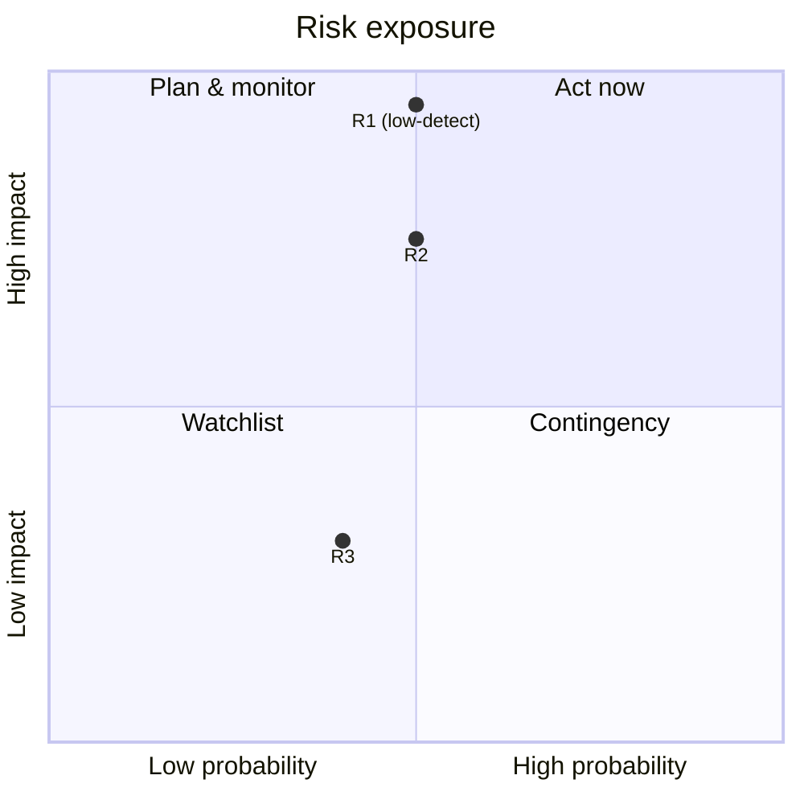
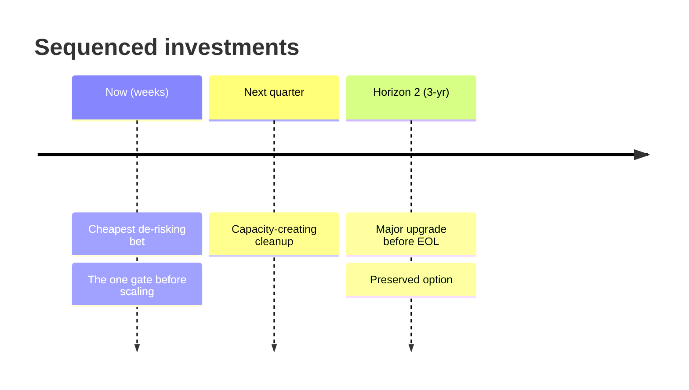
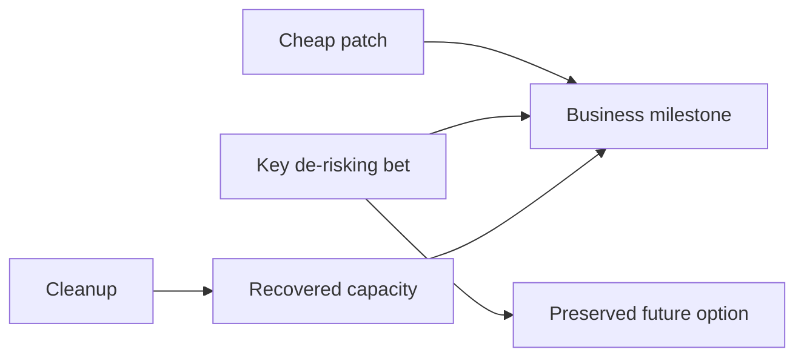

# Engineering Strategy Framework — v0.7

> Single source of truth: this file. Ancestry and prior-art audit:
> [LINEAGE.md](LINEAGE.md).
> The typed vocabulary the report pipeline compiles this contract
> into — constructs, graph, channels: [DSL.md](DSL.md). That vocabulary
> ships as the `esf-dsl` package; `esf dict` prints it, and *Tooling —
> the `esf` CLI* below is the preflight to run before an engagement.
> The repository-side playbook this contract delegates to when the
> audited system is a repo, and how its findings route into these
> registers: [HARNESS-ENGINEERING.md](HARNESS-ENGINEERING.md).

# How to Run This (Operating Contract)

Read this before producing anything. These are execution rules, not
reference material. The sections below are what to think about; this is
how to think.

**Pick the mode first — expecting a combination.** The three modes
below are report shapes, not silos; real engagements usually compose
them. Name the **primary** mode (it sets the report skeleton), then
import the disciplines of any secondary mode the situation calls for.
Composition adds obligations and never removes them: when composed
modes disagree, the strictest gate wins.

-   **Greenfield initiative** → full playbook + full Report Structure.
-   **Existing-system audit** → lead with the Risk Register and the
    Observed Strategy Inventory (document the strategies already in
    force before proposing new ones); gather system evidence first
    (see below). **The system includes its
    in-flight changes:** sweep open PRs and recent branches, not just
    the trunk — on an active project the answer to "does X exist?" is
    often three-valued (merged / in an open PR / nowhere), and every
    completion or risk judgment must say which layer it comes from.
    Ask the user for Business/Budget
    facts; skip those sections if they can't be supplied. The "system"
    need not be code — it can be a team, a business, a product line, or
    even a person/career; the evidence sources shift (repo/metrics →
    contracts, market research, a profile export, stakeholder answers)
    but the discipline is identical.
-   **Single decision** → Decision Template only. Scale depth to
    reversibility × cost: a reversible, cheap call gets a paragraph, not
    a report.

Common compositions, from the field:

-   **Greenfield × audit** — most "greenfields" are one side of a
    contract already in production: greenfield skeleton for the
    report, audit-grade evidence from the adjacent/consuming system
    (`examples/greenfield-telemetry-portal.md`).
-   **Mid-flight initiative** — an initiative already running: the
    full playbook and Report Structure, with the audit's evidence
    discipline — including the three-valued merged / in-open-PR /
    nowhere check — and maintained as a living report. No worked
    example ships for this composition; take its evidence rules from
    the audit examples and its maintenance discipline from Report
    Maintenance below.
-   **Audit × single decision** — an audit surfaces one urgent call:
    the report carries a full-depth Decision Template for it, citing
    the audit's evidence rather than re-gathering it. Conversely, a
    "single decision" that can't be answered without looking at the
    system imports the audit's evidence gate, scaled to the decision
    (`examples/client-audit-saas-erp.md` — an audit whose launch call
    is carried as the decision inside it).

Tie-break for the primary mode: what must the user *accept* at the
end? A prioritized plan for a system that exists → audit. A plan for
something that doesn't exist yet → greenfield. One call → single
decision.

**Evidence before reasoning (hard gate).** Do not write a risk, root
cause, or recommendation that isn't anchored to a specific observed
fact — code you read, a command you ran, a metric, a git signal, a
stakeholder answer. If you have not looked at the real system yet, go
look. A confident report built from assumptions is the primary failure
mode of this framework.

**Documentation cuts two ways: as-is vs to-be.** A document describing
the *current* state (reference docs, a README of what exists, generated
API docs) counts as weak observation — tag it `[observed/doc]`, and
re-verify in the system when the claim is load-bearing, since docs
drift. A document describing *intent* (ADRs, refactor plans, roadmaps,
anything marked "Proposed" or written in future tense) is `[assumed]`
about behavior until proven by other sources — reading a plan is not
observing the system. Classify each doc before citing it, and treat the
delta between stated plan and implemented behavior as a finding in its
own right: planned capabilities are routinely half-built, stubbed, or
quietly deferred.

**Fill gaps actively --- don't assume.** When a fact is missing, get it:

-   **Ask the user** (AskUserQuestion) for what only they know ---
    business objectives, success metrics, constraints, priorities, team,
    budget, which risks they'll actually act on. This is Phase 0 and the
    cut step; tag what they tell you `[user]`. **Ask for the mandate at
    the start of the engagement** — who will own the strategy's
    policies and what they can actually enforce (Phase 0 --- Mandate &
    Enforcement): it sets the Phase 5 stance ceiling, and discovering
    it at rollout is the expensive end.
-   **Search the web** (WebSearch / WebFetch) for external facts ---
    version maturity and EOL, known CVEs, vendor docs, business/organization
    general info, public Git repos, benchmarks, prior art. Anything you'd otherwise
    state from memory and tag `[assumed]`, verify instead and tag `[web]`.
    **When you compare against or characterize prior art — a book, a rival
    framework, a competitor — verify it against the primary source; do not
    pattern-complete from memory. A plausible-but-fabricated comparison is
    a common and costly failure.**

Rule of thumb: business/product/org gaps (except the general wiki-style knowledge) → ask the user;
technical/external gaps and public business knowledge → search. Never let an `[assumed]` claim survive
when a question or a search would resolve it.

**Verify cheap load-bearing negatives.** A negative claim that anchors a
finding ("zero published", "no tests", "never shipped") must not ride a
`[user]` or `[assumed]` tag through the whole sweep when one search or
one command would make it `[observed]` or `[web]`. Spend the check —
negatives are exactly the claims a stakeholder states from memory and
nobody re-verifies.

**Absence claims need a second location.** Before reporting a capability
absent, check at least one non-canonical location, and ask what the
capability is *for* rather than whether its usual artefact is present.
Security policies live in org-level repos; CI that boots the generated
app substitutes for an "installer test"; specs live inside app
templates; a catch-all CODEOWNERS is the correct design for a project
with no sub-teams. A checklist of artefact names read as a presence
test is how an audit reports strong capabilities as gaps.

**Quote the primary exchange.** When a load-bearing claim
characterizes a conversation — a PR thread, a mailing-list argument, a
meeting record — quote the actual exchange verbatim with dates rather
than summarizing its metadata. Metadata misleads: "open for a year"
reads as neglect until the thread shows the work was adopted by a new
contributor three weeks ago.

**Tag every claim `[observed]`, `[web]`, `[user]`, `[inferred]`, or
`[assumed]`.** `[observed]` = seen in the system itself (code, commands,
metrics, git); `[web]` = verified against an external source (vendor
docs, CVE database, release notes); `[user]` = stated by a stakeholder
(authoritative for business facts, but revisable and occasionally wrong —
re-confirm if it's load-bearing); `[inferred]` = reasoned from evidence;
`[assumed]` = neither checked nor verified. A compound tag (e.g.
`[observed/inferred]`) or a trailing qualifier (e.g. `[inferred;
optimistic]`) is fine when a claim is part fact, part judgment. Anything
that is not `[observed]`, `[web]`, or `[user]` also belongs in Missing
Information. Never act on an `[inferred]` or `[assumed]` claim as if it
were established. These five tags are the whole vocabulary — do not mint
new ones. Public statements by the subject's own people (maintainer
posts, relayed community chat) are `[web]`; qualify as `[web/community]`
when the distinction matters — stronger than generic web for questions
of intent, weaker than `[user]` because never answerable-in-dialogue.

**A zero-`[user]` report is biased low — say so.** Artefact-only
evidence systematically undercounts the subject's capabilities: the
things people keep in non-canonical places, the context behind
apparent gaps, the work that never left chat. (Field data: in one
stakeholder-free audit, all ten corrections under adversarial review
moved the same direction — every one made the subject look better.)
When `[user]` is 0%, listing it in Missing Information is not enough:
the report must state that its findings are biased low and name the
specific conclusions a single stakeholder conversation would most
likely overturn. `[web/community]` material is the closest available
substitute evidence — weight it accordingly.

**Rank, then cut.** Rank risks by impact × probability × detectability ×
cost of failure — low detectability *raises* priority: a silent failure
you wouldn't catch until it bites outranks a loud one of equal impact.
Then force the sequence: "If the team can act on only 3 this quarter,
which 3, and why do the rest wait?" A list that doesn't prune is not a
strategy. When a revision changes the cut, name the demotion where the
cut is argued — what moved out of the top set, and why. Easy wins ride
a separate lane (Phase 4's Easy Wins register) precisely so they never
compete for — or count against — a cut slot: the cut is argued over
difficult decisions only.

**Red-team your own conclusion.** Before finalizing, argue the strongest
case that your #1 recommendation is wrong or mis-prioritized. Then keep
it, revise it, or demote it — but show the challenge. Do not converge on
the agreeable answer without testing it. And when "does it work"
decomposes into distinct senses with different odds — the mechanism
functions, the occasion succeeds, adoption follows — give the verdict
**per sense**, each with its own strongest counter-argument: one
blended judgment averages unrelated numbers and hides where the bet
is actually fragile.

**When a stakeholder disputes an `[observed]` claim, widen the search —
don't defend or fold.** Treat the dispute as a signal your verification
was too narrow. Escalate scope: dynamic/indirect access patterns,
type-level reasoning (what *can't* be called), in-flight PRs and
branches, published-package consumers, other repos in the org. Then
report the outcome either way — a claim that survives escalation usually
gains crucial nuance (e.g. "works in-process, not across restarts"), and
a claim that dies gets corrected with the same rigor that produced it.
Name the residual limits of the widened search.

**Check the tooling before the engagement, not at delivery.** The report
language has a command line, `esf`, and running its preflight costs one
line at the top of a session — see *Tooling — the `esf` CLI*. A missing
or stale CLI is found either now, when it costs an install, or at the
end, when a construct the report already uses turns out not to
serialize.

------------------------------------------------------------------------

# Reference --- Drivers, Tactics, Heuristics

## Quality Attributes (Architecture Drivers)

For every recommendation, explicitly evaluate the following attributes.

  Attribute          Questions
  ------------------ ---------------------------------------------------
  Business Agility   Does this make future business changes cheaper?
  Modifiability      How expensive will the next feature be?
  Evolvability       Can the architecture survive new requirements?
  Reliability        How does the system fail?
  Availability       What happens during outages?
  Performance        Where are latency and throughput bottlenecks?
  Scalability        Which resource becomes the bottleneck first?
  Security           What is the blast radius of compromise?
  Observability      Can we detect and diagnose failures quickly?
  Deployability      Can we ship frequently with confidence?
  Testability        Can important behavior be verified automatically?
  Cost Efficiency    What are build and operating costs?
  Portability        How difficult is migration?
  Operability        Can the team realistically run it?

------------------------------------------------------------------------

## Architecture Tactics

Never recommend patterns directly.

Start from the risk, then select tactics.

### Reduce Vendor Lock-in

-   Adapter pattern
-   Ports & Adapters
-   Stable internal interfaces
-   Data ownership

### Improve Reliability

-   Idempotency
-   Retry
-   Checkpointing
-   Circuit breaker
-   At-least-once processing
-   Dead-letter queues

### Improve Evolvability

-   Policy engines
-   Plugin architecture
-   Provider-agnostic abstractions
-   Event contracts

### Reduce Delivery Risk

-   MVP slices
-   Feature flags
-   Parallel implementation
-   Incremental migration
-   Strangler pattern

### Reduce Operational Risk

-   Observability first
-   Health checks
-   Rollback strategy
-   Operational runbooks

### Reduce Product Risk

-   Small experiments
-   Workflow before autonomy
-   Human-in-the-loop
-   Measure before scaling

### Improve the Delivery Machine (standing easy wins)

The one tactic class that auto-passes the credit-confirmed-by-reuse
test: every future cycle flows through the machine, so reuse is
guaranteed. Agentic AI has collapsed their cost — standard migrations
that once justified a quarter of hesitation are now about a day of
agent-assisted work. Two rules follow:

-   **Re-price deferred machine improvements at agent-era cost.** Any
    "we should someday" deferred at pre-agent prices is a stale
    decision; the Debt Ledger lists it at today's cost.
-   **The overrun is the finding.** A standard upgrade that exceeds
    ~a day of agent-assisted work is diagnostic — the machine is
    resisting improvement, and *why* belongs in the Debt Ledger.
-   **Route the wins to the fast lane.** A catalog gap that passes the
    fast/easy/feeds-the-machine gate goes to Phase 4's **Easy Wins**
    register, not the Strategic Bets table — so it ships without
    competing with the difficult decisions.

**The harness is first among the easy wins.** In agent-executed
delivery the agent harness — context routing (AGENTS.md/CLAUDE.md),
one-command setup and dev loop, committed permissions, purpose-built
feedback tooling — is the machine's control surface: every
agent-executed task in every future cycle flows through it, **and the
agent that would build every other catalog item below is itself
governed by it**, so harness investment raises the return on all
other machine improvements. That double compounding gives it the
shortest payback in the catalog — typically a few cycles. Audit
consequence: an existing-system audit always assesses the harness
explicitly, and a missing harness sits at the top of the Debt Ledger,
priced at agent-era cost.

**Audit the harness with its own discipline.** When the audited
system is a repository, run the harness assessment as a
harness-engineering audit against Lopopolo's twelve theses —
compressed: hold the worker constant per adoption cycle; surface the
private process-data iceberg; give one agent the whole job; route
context just-in-time (terse root map, nested guides, task-sized
working set); make tools legible and operable; make the repository
teach the agent; maximize autonomy inside explicit authority; prove
outcomes at the user's boundary, not just green unit tests; promote
recurring feedback to its earliest durable owner; preserve coherence
and own lifetime risk; run settled maintenance as repository-owned
loops; optimize per unit of scarce human attention.
([HARNESS-ENGINEERING.md](HARNESS-ENGINEERING.md) is the playbook in
full: the theses at length, the survey inventory, the three buckets,
the easy wins in leverage order, the ARCHITECTURE.md discipline and the
bucket→register routing below.) The audit's three-bucket report routes into this
framework's registers, not into a parallel one: **already works** →
Credit Ledger entries confirmed by use, and ratified/shadow rows for
the Observed Strategy Inventory; **easy wins** → the Phase 4 Easy
Wins lane, verbatim; **requires effort** → Strategic Bets or the Debt
Ledger, priced at agent-era cost.

Standing catalog (sweep it during any audit; a missing item is drag —
but the entries name *capabilities*, not artefacts: apply the
absence-claim rule from the Operating Contract before booking a gap,
because the usual artefact missing from the canonical place is not the
capability missing):

-   Pipeline: CI on every push, one-command deploy, deploy previews,
    rollback
-   Verification: test suite to a meaningful coverage bar (~80%+),
    flaky-test quarantine, fast feedback (parallelization, caching)
-   Static gates: linters + formatters, type checking, security
    scanners, schema/API contract checks
-   Dependency hygiene: automated update PRs (Dependabot/Renovate),
    audit tooling, EOL tracking
-   Agent harness: just-in-time context routing (a terse root map —
    AGENTS.md/CLAUDE.md — with nested guides and skills/runbooks),
    legible tools, reproducible one-command setup, seed data, an
    agent-runnable dev loop, a committed permission allowlist
    (autonomy inside explicit authority), proof at the user's
    boundary (harness engineering)
-   Observability: error tracking, structured logs, health checks,
    alerting
-   Release safety: feature-flag infrastructure, reversible
    migrations, tested backups/restore
-   Knowledge: ADRs, runbooks, onboarding guide, ARCHITECTURE.md
-   Collaboration: PR templates, CODEOWNERS, pre-commit hooks

------------------------------------------------------------------------

## Guiding Principles (Decision Heuristics)

The preferred thinking model — one consolidated list.

### 1. Challenge the problem statement.

Maybe the requested solution solves the wrong problem.

### 2. Find the root cause.

Treat symptoms as evidence, not problems.

### 3. Optimize for probability of success.

Technical elegance is secondary.

### 4. Sequence investments.

The order of work is often more important than the work itself.

### 5. Preserve optionality when it is cheap.

Adapters, boundaries and modularity are investments, not goals.

### 6. Delay irreversible decisions.

Commit only when sufficient information exists.

### 7. Build classes of solutions.

Prefer frameworks, policies and reusable capabilities over one-off
implementations.

### 8. Reduce uncertainty with the smallest useful experiment.

Every iteration should maximize learning.

### 9. Turn unknowns into explicit assumptions.

Every recommendation should state what must be true for it to succeed.

### 10. Create owners, not dependencies.

Assign strategic ownership, not merely implementation tasks.

### 11. Think in horizons.

Balance today's delivery with 1-year and 3-year evolution.

### 12. Technology is a tool.

Never optimize technology before validating business value.

### 13. Prefer deterministic systems over unnecessary complexity.

Stochastic or clever machinery must earn its place; boring and
predictable wins by default.

### 14. Think in investments, not tasks.

Every piece of work should state what it buys — risk reduced, option
preserved, credit produced.

### 15. Every recommendation must be measurable and revisitable.

If nothing could show it was wrong, it is an opinion, not a
recommendation.

------------------------------------------------------------------------

## Engineering Strategy Questions

Before finalizing any recommendation, answer:

-   Is this solving the right business problem?
-   Which risk does this recommendation reduce?
-   Which new risks does it introduce?
-   What assumptions does it rely on?
-   What future options does it preserve?
-   What irreversible decision does it make?
-   Is there a cheaper experiment?
-   Does this become a reusable capability?
-   Who owns it after delivery?
-   How will we know this recommendation was correct?

------------------------------------------------------------------------

# The Playbook

> Designed for humans and AI agents alike — a cognitive framework, not
> a checklist.

------------------------------------------------------------------------

# Core Philosophy

The goal is **not** to design the "best architecture".

The goal is to:

-   Understand the business objective.
-   Identify the biggest sources of uncertainty.
-   Reduce the most important risks.
-   Preserve optionality where it is inexpensive.
-   Invest engineering effort in the correct order.
-   Build systems that evolve gracefully.
-   Transfer ownership to the team.
-   Continuously validate assumptions and adjust the strategy.
-   Improve, each cycle, the system that produces the product — not
    only the product.

Strategy does not increase engineering effort; it increases the
**return** on engineering effort. Because delivery is iterative,
removed friction and better decisions compound across cycles — the
effect is invisible in any single iteration and decisive over dozens.
This is kaizen applied one level up: continuous improvement of the
delivery machine itself, not just of the work passing through it.

Strategy has two audiences with different verbs: it is **accepted by
humans** (judgment, trade-offs, accountability) and **executed —
increasingly — by agents** that never attended the all-hands. The old
transmission chain from strategy to execution ran on culture and
osmosis; an agent's only channel is explicit context. A strategy only
humans can read no longer governs the work.

------------------------------------------------------------------------

# Phase 0 --- Understand

## Business

Questions

-   What is the real business objective?
-   What metrics define success?
-   What happens if this initiative fails?
-   What is the investment horizon?
-   What budget and timeline exist?
-   Who are the stakeholders and decision makers?

Deliverables

-   Business goals
-   Success metrics
-   Constraints
-   Timeline
-   Budget
-   Stakeholders

------------------------------------------------------------------------

## Product Context

Questions

-   Product stage (Idea / MVP / PMF / Growth / Enterprise)?
-   Existing capabilities?
-   Previous attempts?
-   Why now?

Deliverables

-   Product maturity assessment
-   Existing capabilities
-   Known limitations

------------------------------------------------------------------------

## Constraints

-   Technology
-   Cloud
-   Compliance
-   Security
-   Contracts
-   Team
-   Budget
-   Time

------------------------------------------------------------------------

## Organization & Interfaces

Map every cross-team / cross-org interface on the critical path — code
review, QA, design, environments/permissions, strategic decisions,
external vendors — and mark for each whether a **committed turnaround**
exists (SLA, scheduled slot, named owner with a date). Interfaces
without committed turnaround are low-detectability risk generators:
nothing about daily work surfaces their slippage until a milestone
misses. When several risks trace back to uncommitted interfaces, that —
not the individual symptoms — is usually the root cause, and the fix is
converting assumptions into scheduled commitments (asks that travel with
concrete artifacts convert better than abstract requests).

Deliverables

-   Interface map with turnaround status
-   Owner per interface on both sides

------------------------------------------------------------------------

## Mandate & Enforcement

Ask at the start of the engagement — this is `[user]` territory, and
discovering it at rollout is the expensive end. Mandate is not a role
property: "Mandates only matter if there are consequences" (Larson;
verified quotes in LINEAGE.md) — a mandate its owner is unwilling to
enforce, or that peer leaders won't back, is not a mandate.

Questions

-   Who will own this strategy's policies (the Accepted-by human)?
-   What can they actually mandate — and are they *willing* to enforce
    consequences for non-compliance?
-   Do their peers support enforcement, or would a contested policy
    die in escalation?
-   Is strategy work on this problem already underway elsewhere in the
    organization? If yes, the engagement's job changes from authoring
    to contributing — name the existing effort and join it rather
    than generating competing work.

Deliverables

-   Mandate facts, tagged `[user]` — they set the **enforcement
    ceiling** Phase 5's policies must respect (a prescriptive policy
    above the ceiling fails the enforced criterion by definition).
-   Existing-strategy-work check (join, don't compete).

Low mandate changes tactics, never feasibility: strategy works from
anywhere in the organization — naming the strategy already in force
(the Observed Strategy Inventory) requires no authorization at all,
and every authoritative mechanism has a low-authority sibling
(Phase 5). What mandate and access do **not** do is improve the
diagnosis — they create the appearance of progress, which is why
mandated strategies can fail spectacularly and endure long despite
failing.

------------------------------------------------------------------------

# Phase 1 --- Explore

Exploration precedes diagnosis — Larson's step order, kept on purpose:
search the problem and solution spaces *before* framing what is wrong,
because "you'll inadvertently frame yourself into whatever approach
you focus on first," and no end-of-report red-team fully undoes a
frame set at the start. Update your priors first; diagnose second.
(Verified quotes in LINEAGE.md.)

-   **Coverage, not hours.** Continue until you know how ~three
    similar teams inside the organization and ~three external
    companies recently solved the same problem — and can explain the
    thinking behind those decisions. Each precedent is a claim: tag
    it. Larson timeboxes exploration in human wall-clock ("less than
    a few hours is very suspicious"); here the user sets the vectors
    and the machine does the mining — delegating the heavy data-mining
    is the point of the framework — so duration collapses and the
    suspicion moves to breadth: a single-vector sweep is suspicious no
    matter how little time it took.
-   **Judgment quarantine.** The exploration output is an inventory of
    approaches with the reasoning behind them. No good/bad verdicts
    during the sweep — judging while collecting is how the first
    plausible approach wins.
-   **The mind-change test.** Exploration is done only when it changed
    something: name the prior it updated or the initial belief it
    invalidated. A sweep that leaves every starting belief intact is
    not evidence of a good starting position — it is evidence the
    sweep never left it.
-   **Mine internal decision precedent.** Record how similar decisions
    of this class were made here before — often enough on its own to
    steer the current one; it feeds the Observed Strategy Inventory a
    phase later.
-   **Practitioner-only topics.** Security, compliance, operating at
    true scale: public writing under-informs. Route these to
    stakeholder/practitioner questions (`[user]`); a recommendation in
    these domains with zero practitioner input names that gap itself
    in Missing Information.

------------------------------------------------------------------------

# Phase 2 --- Diagnose

Where exploration is evaluation-free, diagnosis is all about
evaluation — and it is the foundation: "It's very challenging to fail
with a proper diagnosis, and almost impossible to succeed without one"
(Larson; verified quotes in LINEAGE.md). The evidence gate and claim
tags already build the "web of interconnected observations, facts, and
data" that makes a diagnosis hard to argue against; the rules below
are the disciplines the gate alone doesn't give you.

-   **Record priors on their own sheet.** Before the sweep, write the
    current best understanding — the author's and the stakeholders' —
    as an explicit, tagged priors block, and set it aside; the
    diagnosis is then synthesized from labeled sources with the prior
    as just one input. This is also what makes Phase 1's mind-change
    test checkable: a recorded prior to diff against, not vibes.
-   **Mine the disagreeing perspective — represented, not agreed.**
    Deliberately collect the perspective most likely to disagree with
    the early thinking (in stakeholder engagements, ask the user for
    it by name). The bar: its holder would agree you captured their
    view, even while rejecting your conclusion. And where you believe
    a perspective is overstated, include the data a reader needs to
    reach that conclusion themselves — to an impartial reader, data
    speaks louder than the verdict.
-   **Directionally correct first, precise where it pays.** The first
    pass covers the whole territory directionally; spend precision
    only where a bet depends on it. Perfecting details early is an
    anchoring mechanism, not rigor.
-   **Politics without omission.** Reframe politically loaded findings
    so blame lands on mechanisms and situations rather than narrowly
    on people — widen the frame until the statement is palatable — but
    never omit them: an omitted diagnosis line makes the strategy
    impossible to evaluate, copy, or recreate.
-   **Blockers are diagnosis rows, not stop signs.** An identified
    blocker doesn't halt the strategy; it enters the diagnosis and
    clarifies which approaches can actually succeed.
-   **Self-implication.** On repeat engagements and living reports,
    name the portion of today's problem rooted in the author's own
    earlier recommendations — changing your mind with new data is the
    discipline working, not a defect.

------------------------------------------------------------------------

## Validate the Problem

Questions

-   Is the problem statement correct?
-   What is the real problem?
-   What are symptoms?
-   What is the root cause?

Deliverables

-   Root cause analysis — each root cause names its mechanism **and
    what the mechanism ensures**: the symptom class it guarantees will
    keep recurring until addressed ("ensures a migration can stall
    indefinitely without anyone noticing"). A cause that ensures
    nothing specific is a theme, not a cause.
-   Problem reframing (if necessary)

------------------------------------------------------------------------

## Observed Strategy Inventory

Before proposing strategy, document the strategy already in force.
There is always one — "there's always an engineering strategy, even
if there's nothing written down" (Larson) — and if you can't see it,
ask where it lives: in the code patterns, the harness rules, the CI
gates, the decisions nobody re-litigates. Documenting it is Larson's
"strategy archaeology," and it requires no mandate — you are only
describing what already happens. A proposal that contradicts an
unnamed strategy-in-force will be resisted by mechanisms nobody in
the room can point to; surfacing the incumbent is what makes the
resistance addressable.

One row per strategy-in-force:

-   **Statement** — the policy as if it had been written down (one
    sentence).
-   **Evidence** — where it demonstrably governs decisions (code
    patterns, docs, harness rules, CI config), tagged like any claim.
    Governing evidence is the entry bar: an aspiration nobody follows
    is not a strategy-in-force.
-   **State** — **ratified** (written in a governing doc, with an
    owner) / **shadow** (machine- or harness-enforced with no
    ratified policy behind it — Loop 2's shadow policy, caught at
    audit time) / **unwritten** (observable only in practice).
-   **Altitude** — company / org / team (ordinal buckets). Lower
    altitude is cheaper: rollout and maintenance stay local instead
    of riding lossy org-wide communication.
-   **Stance** — permissive ↔ prescriptive: how much latitude it
    leaves, and what the escape hatch is (who may override, at what
    escalation). Permissive is cheaper — little-to-no enforcement.
-   **Working?** — one honest phrase.

The classification does diagnostic work:

-   A **prescriptive** row must name its enforcement address
    (Phase 5's ladder). Prescriptive with no address is acceptance
    theater — a finding, not a strategy.
-   **Shadow** rows feed the Loop 2 sweep; load-bearing **unwritten**
    rows are knowledge debt (→ Debt Ledger).
-   **Stance mismatch is where drag accumulates**: a rule prescriptive
    on paper but permissive in practice marks the exact spot to dig
    for Debt Ledger entries.
-   High-altitude + prescriptive is the most expensive quadrant. When
    strategy isn't sticking, move along the axes — reduce altitude or
    increase permissiveness (Larson's fix for stalled adoption, and
    his formula for affording more strategy).
-   A **prescriptive** row that was mandated into force without ever
    passing a testing slice carries the profile of essentially every
    failing strategy — run Phase 4's audit check (impact numbers
    moving, or a debugging mechanism shipping code; neither means
    untested). Mandate is what lets testing be skipped: low-mandate
    teams refine because they must prove the approach to win
    alignment.
-   Every new bet checks against the inventory: if it contradicts a
    strategy-in-force, it must name it and say whether it amends or
    replaces it — silent contradiction is how re-litigation wars
    start.

------------------------------------------------------------------------

## Risk Assessment

Identify:

-   Business risks
-   Product risks
-   Technical risks
-   Delivery risks
-   Organizational risks

Rank them by:

-   Impact --- how bad if it happens
-   Probability --- how likely it is
-   Detectability --- how likely you'd catch it *before* it bites. Low
    detectability raises priority: a silent, latent failure is more
    dangerous than a loud one of equal impact, because nothing warns you.
-   Cost of failure --- blast radius and cost to recover

Write each register row in the reader's language: *what happens · how
likely · would you notice before it bites · cost to recover* — plus a
per-risk falsifier (see the Worked Example row). When a revision moves
an entry, flag the movement on the row itself ("downgraded — see
Decision Log") instead of narrating the correction in the body.

------------------------------------------------------------------------

## Debt Ledger

Risks and debts are different entities — do not put them in one list.
A risk is something that *might* happen; a debt is a recurring drag
that is *already* costing something every cycle: probability 1.0,
usually low detectability (nobody's dashboard shows it). Classify each
Phase 2 finding as **event risk** (→ Risk Register) or **recurring
drag** (→ Debt Ledger).

Ledger the drag by type:

-   **Strategic debt** — wrong bets, mis-sequencing, premature
    irreversible commitments still constraining today's options.
-   **Organizational debt** — ownership gaps, uncommitted interfaces,
    communication bottlenecks.
-   **Knowledge debt** — undocumented decisions, unvalidated
    assumptions, learning never made reusable.
-   **Technical debt** — code and architecture compromises.

Rank entries by **cost per cycle × number of future cycles that will
pay it** — a small drag on a hot path outranks a large one on a dying
system. The ledger prunes like the Risk Register: name the vital few,
say why the rest wait.

------------------------------------------------------------------------

## Credit Ledger

The Debt Ledger is liabilities-only. Pair it with the assets side:
what has already been built that pays forward every cycle, and what
current bets claim they will add. This is an **aggregation view of the
existing credit machinery** (the Decision Template's "Credit produced"
field, Principle 14, Loop 2's reuse test) — one balance sheet, not a
second tracking system: every entry is some bet's credit claim or an
observed asset, never a free-floating aspiration.

Every entry carries a **realization state**:

-   **Confirmed** — reuse has actually happened (Loop 2's test). Name
    the reuse that confirmed it.
-   **Projected** — a bet's expected payoff, unconfirmed. Name the
    first expected beneficiary and a review date.
-   **Written off** — unreused by its review date: delete it, or
    re-book it as debt if it now generates recurring drag
    (maintenance, cognitive load); a sunk cost with no recurring cost
    is simply deleted.

Rank by the Debt Ledger's formula mirrored: **payoff per cycle ×
number of future cycles that will reuse it**. Report the realization
rate (confirmed / all ever booked) — a ledger that only accumulates
projected entries is a wishlist: the "expensive experiment booked as
credit" trap wearing a balance-sheet format. The ledger is honest only
if Loop 2 actually moves entries every cycle.

Review dates are only real if something reopens them. Between
engagements the Loop 2 agenda lives in the report's **Watchlist**:
roll every projected entry's review date up as a dated Watchlist item
with a named owner, so the earliest date is visible on one page — a
review date nobody is scheduled to see is no review date.

------------------------------------------------------------------------

## Assumptions

Document:

-   What assumptions are we making?
-   Which assumptions are critical?
-   Which assumptions are unvalidated?
-   What evidence exists?

------------------------------------------------------------------------

# Phase 3 --- Design

## Engineering

Evaluate

-   Architecture
-   Infrastructure
-   Data
-   Security
-   Reliability
-   Scalability
-   Cost
-   Observability
-   Delivery process

Focus on trade-offs instead of perfection.

------------------------------------------------------------------------

## Evolution

Questions

-   What changes are likely in 1 year?
-   What changes are likely in 3 years?
-   Which decisions are irreversible?
-   Which decisions can safely wait?

Answer the 1-/3-year questions per load-bearing capability with the
evolution axis (Phase 4's Refinement Toolkit): bucket each on
genesis → custom → product → commodity and predict its drift — the
mechanism that turns "what changes are likely" from a brainstorm into
per-capability, taggable claims.

------------------------------------------------------------------------

## Optionality

Look for

-   Vendor lock-in
-   Tight coupling
-   Replaceable adapters
-   Abstractions with real value
-   Overengineering

Goal:

Reduce future migration cost.

------------------------------------------------------------------------

# Phase 4 --- Prioritize

## Engineering Investments

For every initiative ask:

-   Does it reduce a major risk?
-   Does it unlock future work?
-   Does it produce valuable information?
-   Does it improve delivery speed?
-   Does it increase optionality?
-   Does it make the *next* cycle cheaper for a **named** upcoming
    item — or only "the future" in general? (Unnamed beneficiaries are
    how expensive experiments get booked as investments.)

------------------------------------------------------------------------

## Estimation Discipline (agent era)

Estimates are sequencing inputs, and most inherited ones are stale.
Two regimes with opposite failure modes:

-   **Delegable, parallelizable, well-specified work** — spec suites,
    mechanical migrations, codemods, coverage backfills. Estimate it
    in **agent wall-clock under fan-out**, not developer-days: the
    error of a pre-agent estimate on this class is an order of
    magnitude, not a discount (field data 2026-07-23: a coverage
    roadmap priced at 2–3 agent-days ran as parallel sub-agents in
    about an hour). Any Wait/defer justified by a pre-agent estimate
    on such work is a **stale decision** — re-estimate before honoring
    it, the same reclassification the credit machinery applies to
    unreused credit. Apply the test by spirit, not letter: a deferral
    rarely *quotes* the price it was made at, so a delegable item
    whose deferral states **no rationale at all** defaults to suspect
    rather than passing — silence about the price is not evidence the
    price was ever agent-era.
-   **Judgment-gated work** — anything bottlenecked on taste, product
    judgment, or an uncommitted human interface. Agents do not
    compress this; the interface is still the constraint. Mis-pricing
    it *down* because "agents are fast now" is the symmetric failure.

**When execution collapses, the bottleneck moves to decision latency.**
Once the delegable work of a cycle runs in about an hour, the critical
path is the human accept/steer loop, not the tasks. Sequence the
*decisions* — which calls must be made, in what order, by whom — not
the tasks; a plan whose milestones are task completions hides where it
will actually stall.

------------------------------------------------------------------------

## Easy Wins --- the fast lane

Trivial, fast bets must not compete with difficult decisions — not
for cut slots, not for the reader's attention, not for refinement
effort. So they don't share a register, and they route **first**:
drain the lane before arguing the bets, so nothing trivial is left
on the table to masquerade as strategy. A proposal that passes **all
three gates** goes to its own **Easy Wins** list (item code **E**),
beside the Strategic Bets table, never in it:

-   **Fast** — about a day of agent-assisted work or less, priced at
    agent-era cost (Estimation Discipline, above), never at the
    pre-agent price it was once deferred at.
-   **Easy** — delegable and well-specified, reversible (a two-way
    door), no judgment gate or uncommitted human interface on the
    path.
-   **Feeds the delivery machine right away** — it maps to a standing
    catalog item in *Improve the Delivery Machine* (harness
    engineering, CI/CD, coverage, static gates, dependency hygiene…),
    so its credit auto-passes the reuse test: every future cycle
    flows through what it improves.

Disciplines the lane runs on:

-   **Out of the cut, out of the argument.** Easy wins never occupy a
    "top 3 this quarter" slot, and the cut's argument never cites
    them — they run *alongside* the strategy, not instead of it. The
    exemption is one-way: a difficult bet cannot be smuggled into the
    lane to dodge the cut or refinement; the gates are the boundary.
-   **One line each, not a Decision Template.** Code, the catalog
    item it maps to, the expected agent-day. The reversibility × cost
    scaling already licenses this depth. The inventory check is not
    waived: an easy win that contradicts a strategy-in-force must
    name it like any bet.
-   **The ejection rule.** An entry that fails any gate in flight —
    blows its day, turns out judgment-gated, turns irreversible — is
    ejected to the Strategic Bets table (below) or the Debt Ledger
    with what resisted named: the overrun is the finding (see
    *Improve the Delivery Machine*).
-   **Batch, don't trickle.** The lane obeys WIP discipline like
    everything else: run it as a batch — one agent-fanned sweep, a
    fixed slice of a cycle — not as a standing distraction from the
    top bets.
-   **Loop 2 sweeps the lane.** Which entries shipped, which blew
    their day, which catalog items are still missing.

Feeders: the *Improve the Delivery Machine* standing catalog is the
canonical source; on repos, a harness-engineering audit's "easy
wins" bucket routes here verbatim.

------------------------------------------------------------------------

## Strategic Bets

Every proposal should be classified as:

-   Build
-   Buy
-   Wait
-   Kill

**Bets on capabilities the market also supplies name their evolution
bucket.** A Build/Buy/Wait/Kill call about such a capability carries
its position and predicted drift on the evolution axis (Refinement
Toolkit, below): Build-on-commodity and Buy-at-genesis are the two
red-flag placements a bet must argue past, and predicted
commoditization is the standing argument for Wait.

**Top bets are refined before they are committed.** Run the Strategy
Refinement loop (below) on each — or record the stance-based waiver.
An untested prescriptive bet mandated into rollout is the profile of
essentially every failing strategy.

**Bets are the owner's to set.** When the report leaves a judgment
call open (a role choice, an unresolved objective), score the bets
against a **named** assumed answer ("scored against Role A, since
that is where the evidence points") and present them as a starting
position to be re-scored once the owner decides. A bet table that is
silently absolute over an open judgment call hides its biggest
assumption.

**The empty-inventory default.** When the Observed Strategy Inventory
comes back with no deliberate strategy — only accidental practice —
don't open with product or architecture bets. Open with the three
universal velocity drivers; they pay for themselves within a few
cycles regardless of which product bets later prove right, because
they improve the machine every future cycle runs through:

1.  **Harness engineering** — the control surface of agent-executed
    delivery; shortest payback in the machine catalog (see *Improve
    the Delivery Machine*).
2.  **Continuous improvement as standing practice** — institute
    Loop 2 (kaizen), so every cycle ends with the machine improved,
    not just the product shipped.
3.  **WIP reduction** — cap concurrent initiatives so finishing
    outpaces starting (Little's Law: cycle time = WIP / throughput;
    the kanban move). It is also the rule for the strategy work
    itself: develop one or two strategies at a time.

The default is not an exemption from risk-anchoring: the observed
absence of deliberate strategy *is* the diagnosis — probability-1.0
drag on every future cycle — and these three are the tactics selected
for exactly that finding. Each still gets a Decision Template,
controllable success criteria, and a falsifier.

------------------------------------------------------------------------

## Experiment Design

For every major uncertainty define:

-   Smallest useful experiment
-   Success criteria
-   Failure criteria
-   Expected learning

------------------------------------------------------------------------

## Strategy Refinement --- test the strategy, not only the product

Experiment Design targets *product and technical* uncertainty;
refinement targets the **strategy itself** — validating that its
mechanics work before the organization pays for a full rollout. Most
strategies fail waterfall-style: the approach is finalized before
reality has taught anything, and "essentially all failing strategies
skip the testing phase to move directly into implementation"
(Larson; verified quotes in LINEAGE.md). The skip has a mechanism
worth naming: low-mandate teams refine naturally — they must prove
the approach to win alignment — while mandate-holders can skip
straight to rollout, so **the authority to mandate adoption is
exactly what removes the natural forcing function to test**. An
untested, mandated, prescriptive strategy is the highest-prior
failure profile in the field.

The testing loop, per top bet, before commitment:

-   **Narrowest, deepest slice.** Iterate on applying the strategy to
    one deep slice until the mechanics demonstrably work — one release
    through the new process, one module typed, one team migrated (one
    simple component *and* one gnarly one, when tooling and
    integration complexity are separate unknowns). Broad-but-shallow
    pilots test adoption optics, not mechanics.
-   **Impact metrics, not adoption metrics.** Measure the change the
    strategy exists to cause — customer impact reduced, requests
    served by the new service as a share of all requests — never
    commitment spreadsheets or team sign-ups. Adoption is downstream
    of mechanics that work.
-   **Friction-first attribution (refuted vs resisted).** When the
    slice stalls, attribute to excess friction and poor ergonomics
    before attributing to resistance — assume the tooling is too
    complex, not that people resist change. Under this default, an
    adoption failure during testing is a falsifier firing against the
    strategy's details, not an execution problem to manage. Blame
    resistance only after the ergonomics are fixed and the numbers
    still refuse to move.
-   **Keep pressure off the test.** Premature rollout pressure
    prevents evaluating the strategy: it makes reports fake success
    (pressure from above) or gets the strategy repealed (pressure
    from below) — either way the falsifier can no longer fire. Forced
    to commit early? Say you're committed and refine anyway: declared
    commitment does not end refinement, and all decisions reopen with
    proper evidence.
-   **Learning-rate gate.** A testing cycle that neither taught
    something informing the next cycle nor changed the testing
    approach is a warning — under-resourced, over-ambitious, or
    converging too slowly to hold attention (Larson's weekly bar,
    re-read here at delivery-cycle cadence).
-   **Exit honestly.** Refine until conviction that the details work
    in practice — or that the strategy needs a new direction. Ending
    an initiative early with a few funded narrow bets is refinement
    succeeding, not failing: having a problem never guaranteed an
    elegant solution existed.

**Stance sets the testing bar** (same axes as the Observed Strategy
Inventory): permissive + cheap → skip formal testing — the permissive
rollout *is* the test of a future, stricter version of the same
policy. Prescriptive, expensive, or irreversible → the loop above is
mandatory before commitment. Genuinely untestable (signal arrives in
years — regional hiring shifts) → say so in Assumptions and the
Watchlist instead of pretending. The null hypothesis is always "this
strategy can be tested"; never work hard to convince yourself it
can't.

**Audit check — did the strategy-in-force ever pass testing?** Two
signs separate tested from untested when a strategy is stalling:
(1) numbers showing the strategy drives its intended impact — the
actual thing, not proxies; and (2) where the numbers aren't moving, a
debugging mechanism that ships working code against the blockers.
Neither present → the strategy skipped testing ("pressure without a
plan" is the loud variant: sounds right, no concrete details). The
recovery is never more pressure: write a new strategy and run the
testing phase this time, pausing the stuck one explicitly — or
implicitly (a month of provisioning improvements buys the room) when
an official pause costs too much face. Date-check skeptic testimony
before acting on it: skeptics are almost always right, but often
about a version of the problem that no longer exists. And read
endurance as a signal, not as health: mandate and access create the
appearance of progress without improving the diagnosis, so a
strategy-in-force that is failing yet enduring carries the mandate
signature — date how long it has endured past its evidence and treat
that as a diagnosis row.

------------------------------------------------------------------------

## Refinement Toolkit --- ordinal instruments

Pick the instrument by what you are unsure about; they compose:

-   Unsure the **details work in practice** (shape known) → the
    testing loop above.
-   Unsure **where the leverage is** in a system you broadly
    understand → a systems model.
-   Unsure how the **surrounding ecosystem shifts** under the
    strategy's feet → the evolution axis.

**Systems model — stocks and flows, sketch grade.** Name the stocks
(where things accumulate) and the flows between them, then reason
about which flows a proposed change moves, and in which direction.
This is the instrument for locating where a Debt Ledger drag actually
accumulates, and for stakeholder disagreements rooted in unstated
intuitions: sketch the disputants' implicit models and the
disagreement usually localizes to one flow — debatable, often
checkable, instead of vibes. Numeric simulation is permitted but must
earn its place, and **a model's output inherits the weakest
provenance tag among its inputs** — a simulation built on assumed
rates is an `[assumed]` claim wearing charts, and belongs in Missing
Information like any other assumed claim. Model discipline: when the
model and reality conflict, reality is always right; every model
omits something, so name what this model does **not** evaluate — a
model's scope is its author's frame, and the omitted question is
often "is this initiative a good idea at all"; document insights
first — a model is an input to the strategy, never its sole backer.

**Evolution axis — the ordinal Wardley import.** For each
load-bearing capability the strategy stands on, place it in one of
four buckets — **genesis → custom → product → commodity** — and
predict its drift over the strategy's horizon, tagged like any claim
(`[web]` for evidenced industry movement, `[inferred]` for
extrapolation). The static-ecosystem assumption is a named failure
mode: any strategy meant to outlive a year or two is built on an
evolving foundation, however stable it looks today. Wiring into the
bets: **Build on a commodity** and **Buy at genesis** are red flags a
bet must argue past; predicted rightward drift argues Wait/Buy over
Build (the market is about to do the work); a bet that needs a
capability to stay custom while the industry commoditizes it is a
Kill candidate. The full Wardley map (visibility y-axis, value
chains) stays optional: draw it only when placements can anchor to
tagged claims, and serialize it as text — the OnlineWardleyMaps DSL —
consistent with this framework's text-first artifacts. Wardley's
doctrine and gameplay are not imported (Larson excludes them too:
business-strategy specialized).

------------------------------------------------------------------------

## Success Criteria --- controllable vs. luck-influenced

Define how you will *know* the bet worked --- but never gate success on
outcomes you do not control. Split every success definition into three:

-   **Controllable criteria (the real pass/fail).** What the owner can do
    regardless of luck, deal flow, or market --- a capability stood up, an
    artifact shipped, a process adopted. Judge the bet on these. Design
    them to be the *institutionalising* moves, so "success" means durable
    capability built, not a lucky outcome.
-   **Luck-influenced signals (upside, not gates).** Outcomes that partly
    depend on exogenous factors --- a deal closed, inbound arrived, a
    metric moved. Report them; do not pass/fail on them. Gating on luck
    kills good bets in a quiet quarter and declares false success in a
    lucky one.
-   **Falsifier (reverses the bet).** The evidence that, *once the
    controllable criteria are done*, proves the thesis wrong. Only fair
    after the controllable work is complete --- a null result before that
    is "didn't execute," not "doesn't work."

**Match the instrument to the claim's layer.** An instrument
validates only the layer it observes. When a claim's advantage lives
at one layer and the instrument observes another — judging an
artifact's surface when the claim is about its internals, scoring a
one-off run when the claim is about operating it over time — the
result is noise wearing a verdict: a tie that measures nothing, a
pass that proves nothing. Before trusting any comparison, name the
layer each claim lives on and confirm the instrument observes that
layer; where it can't, demonstrate the layer directly.

**A falsifier must be able to fire under the report's own predictions.**
Check each falsifier against the conditions the report itself forecasts:
a passive falsifier ("wait for inbound and see") that cannot trigger at
the signal level the same report predicts makes the decision
unfalsifiable for its entire horizon — a null result was guaranteed
before the bet started. Repair pattern: an **active comparison arm**
(generate the signal instead of waiting for it), **proxy instruments**
(cheaper leading indicators), a **minimum-signal precondition** (below
which the review returns "insufficient data", not "thesis holds"), and
**auto-reopen — not auto-stand — at the review date**.

------------------------------------------------------------------------

# Phase 5 --- Set Policy & Operations

Bets decide investments once; policies are **standing decision rules**
that govern every future decision of their class, made when the
strategist is not in the room. "Policy is interpreting your diagnosis
into a concrete plan" (Larson; verified quotes in LINEAGE.md) — and a
strategy that stops at bets has not actually decided anything an
organization can follow: readers keep re-litigating the same calls
because nothing standing answers them. This phase compiles the
accepted direction into the **Policy register** (item code **PL**),
each row carrying its own operations.

**PL is not the Observed Strategy Inventory.** The inventory (Phase 2)
is diagnostic — it records what already governs, whether anyone
decided it or not. PL is the decided layer — what shall govern from
here. The two need separate semantics precisely because they can
disagree: every PL row names its **relation to the inventory** —
**reinforces** (often just ratifying an unwritten S row: the cheapest
policy there is), **amends**, **replaces**, or **fills a void** no row
covers. Silent contradiction of a strategy-in-force is how
re-litigation wars start. The lifecycle check closes the loop: a PL
accepted this cycle must surface in the *next* engagement's inventory
as a ratified row that demonstrably governs — its absence there is
Loop 2's acceptance-theater finding.

## The policy register

One row per policy:

-   **Statement** — the rule, one sentence, written for the
    least-context executor.
-   **Kind** — approval / allocation / direction / guidance:
    -   **Approvals** define the process for a recurring decision —
        who decides, where, how exceptions are granted. Name the
        concrete address ("ask in #ciso", the ML review forum) and
        where prior decisions live, so a requester can calibrate;
        authority may be loaned downward to a forum.
    -   **Allocations** split resources across competing investments —
        "the most concrete statement of organizational priority"
        (Larson). Include one in almost every policy set, explicitly
        or by naming the higher-altitude allocation already in force.
    -   **Direction** mandates how a decision must be made — for
        problems understood clearly, where consistency outranks
        individual judgment.
    -   **Guidance** recommends — for destinations you can name whose
        path needs judgment.
    Direction↔guidance is the stance axis (prescriptive↔permissive)
    wearing decision-rule clothes; approvals and allocations have no
    stance equivalent and are the kinds audits most often find
    missing.
-   **Addresses** — the named diagnosis items (RC/R/D codes) this
    policy solves (`ADDRESSES` edges in the graph).
-   **Relation to the inventory** — reinforces / amends / replaces /
    fills a void (named S rows).
-   **Altitude + stance** — same ordinal axes as the inventory.
-   **State** — **proposed** (drafted by the engagement) or
    **accepted** (approved by the human who runs the skill — see
    *Policy Addressing* below).
-   **Accepted by / Executed by** — see *Policy Addressing* below.
-   **Operations** — the mechanisms that make it real (below), or a
    reference to the PL row hosting a shared mechanism.
-   **Review date.**

## Setting policy

The steps are pedestrian because Phases 1–4 did the work — policies
are *selected* from the explored solution space, rarely invented:

1.  Review the diagnosis for omissions obvious enough to name.
2.  Select policies that address it — match each policy explicitly to
    the diagnosis items it solves, and keep adding until every top
    item is covered.
3.  Consolidate rows that overlap or adjoin.
4.  **Backtest against the Decision Log**: replay recent logged
    decisions through each proposed policy. A policy that would have
    changed none of them is doing no work.
5.  Mine for conflict, as in diagnosis — emphasize the disagreeing
    perspective without crowding out your own.
6.  Not convinced the approach works → back to Strategy Refinement
    (Phase 4), not forward to rollout.

**Two-way coverage is the gate.** Every policy names the diagnosis
items it addresses, and every top-ranked diagnosis item is either
addressed by some policy or carries an **explicit dated deferment**
("no reasonable mechanism yet; revisit when X"). Deferral is honorable
— letting the organization churn on an intractable problem is not.
Uncovered diagnosis with neither = the strategy is not finished.

**Criteria: applicable and enforced.** Applicable — it navigates
complex, real scenarios, particularly tradeoffs ("we only hire
world-class engineers" fails; a scorecard threshold passes). Enforced
— the organization will actually hold people to it. "Any policy which
you can't determine how to apply, or aren't willing to enforce,
simply won't be useful" (Larson). Leverage is deliberately **not** a
criterion — what matters is that a policy solves part of the
diagnosis (Larson's own demotion of his earlier criterion); the
credit machinery already prices compounding, as a field, never a
gate.

**Mandate sets the enforcement ceiling.** Check every
direction-kind / prescriptive row against the Phase 0 mandate facts:
"Mandates only matter if there are consequences" — a prescriptive
policy whose consequences no named, willing, peer-backed owner will
enforce fails the enforced criterion *by definition*, however right
it is. The repair is Larson's own, not abandonment: downgrade to
guidance and swap in the low-authority sibling mechanisms (advice
forum, nudge, inspection-with-dataset, model-document-share) — or
book it as an unenforceable policy, which is a missing diagnosis
pillar, not a debate to win. Low mandate narrows stance, never
feasibility.

**Effective beats novel.** "With an excellent diagnosis, your
policies will often feel inevitable, and perhaps even boring. That's
great." Truly novel policies are vanishingly rare; a policy merely
novel to this organization gets a condensed loop — collect similar
policies, systems-model the differences, run a testing slice.

**Competing policy bundles are a diagnosis gap.** Multiple live
bundles don't need more refinement — they expose an unsettled
diagnosis (Sorbet-vs-migrate dissolved the moment the resourcing
diagnosis was settled). Align on the diagnosis that invalidates
paths; move the losing alternatives to an appendix — readers of the
final version follow policies, they don't re-run the debate.

**A policy you can't fund or enforce is a missing diagnosis pillar.**
Inspirational-but-unresourced policy is bad policy even where it
would work in a universe that funded it. Don't debate the impractical
option — write the diagnosis line that rules it out.

**Missing peer strategies go into the diagnosis.** When the company
or a peer function has no strategy to align with, record the absence
as a diagnosis row and set policy anyway — waiting for the ideal
upstream policy is how policy work stalls forever. You will never
have the details you want; meaningful leadership requires taking
meaningful risks.

**A policy is engineering credit at the decision layer** — a one-time
investment that makes every future decision of its class cheaper.
Book it in the Credit Ledger like any credit claim: projected until
invocation confirms it, and a policy never invoked by its review date
is an expensive experiment (Loop 2 reclassifies it).

## Operations --- carried by their policies

"Operations are how a policy is implemented and reinforced. Effective
operations ensure that your policies actually accomplish something"
(Larson). A policy row without operations is a wish with a register
code. Operations are **fields of the policy, not a separate
register** — Larson's own published refactor folds his operations
section into the policies it serves. One caveat survives the fold:
mechanisms **pool** — one review cadence, one nudge pipeline serves
several policies. A shared mechanism is hosted by one PL row and
referenced by the others, and Loop 2 evaluates the *combined* burden
of the mechanism set, never each in isolation.

Mechanisms, in Larson's observed-effectiveness order:

-   **Nudges** — context delivered at the moment of the act, only to
    actual offenders, silent otherwise (the untested-PR manager nudge;
    the cloud-spend acceleration alert). The most effective mechanism,
    and it requires no mandate.
-   **Inspection** — dashboard, threshold alert, or committed script
    plus a named review cadence. The one hard requirement: **it
    cannot silently fail** (kin of the low-detectability rule).
-   **Approval/advice forums** — with a concrete address, visible
    precedent, and — where trust allows — authority loaned down to
    the forum.
-   **Model, document, and share** — the zero-authority adoption
    mechanism: visibly run the approach yourself, document the
    thinking and how to adopt it, share the document; people copy
    what they see succeeding. Slow but mandate-free — and it is how a
    published strategy report itself spreads.
-   **Automation** — the most scalable; user experience is a
    prerequisite of impact, not a nicety.
-   **Deferment** — the explicit, dated "not yet" (see the coverage
    gate).
-   **Documentation** — aim for informational herd immunity (someone
    on each team can apply the policy), not universal recall; use the
    company's standard channels — another knowledge base is the
    illusion of progress.
-   **Meetings** — universal, adequate for almost anything, and
    almost always the most expensive option; iterate toward canceling
    every meeting you start.

**Rubric per mechanism (ordinal, before adopting):** measurability
(leading indicators beat lagging) · adoption cost · user burden ·
provider burden (can the platform team actually sustain it?) ·
**reliance on authority** (does it survive the sponsoring executive
leaving?) · cultural fit. People evaluate these well and then refuse
the verdict — falling in love with a mechanism the organization can't
bear is the observed failure, so accepting the rubric's answer is the
actual discipline.

**Anti-patterns** (usable only with an explanation you actually
believe): top-down pronouncement, education-as-announcement rollouts,
mandatory recurring trainings, "just change the culture."

**Low authority is not low capability.** Every authoritative
mechanism has a lower-authority sibling: binding architecture review
→ advice process; mandatory review → nudge. Authoritative mechanisms
mostly shift accountability without changing behavior. Build the
mechanism and its dataset first — executive support is hard to get
before they exist and easy after.

**Agent-era translation.** The mechanism taxonomy is what the
enforcement ladder executes: a nudge is a harness hook, an inspection
is a scheduled agent sweep whose output cannot silently fail,
automation is the deterministic rung; provider burden is harness
maintenance. In agent-executed delivery most of these mechanisms cost
an Easy-Wins-lane day, not a headcount — price them accordingly.

## Policy Addressing (dual-addressability)

**The engagement proposes; the human who runs the skill accepts.**
Every PL row is born **proposed**. It becomes **accepted** only when
the human running the skill approves it in-session (AskUserQuestion,
or their explicit confirmation on the draft) — the agent never
promotes its own policy, however strong the evidence. A report may
ship with proposed rows, labeled as recommendations awaiting
acceptance; an agent-accepted policy is a fabricated mandate.

Every PL row carries two fields:

-   **Accepted by** — the named human owner who ratified it, with a
    date. Acceptance is the human verb: judgment, trade-offs,
    accountability for one-way doors.
-   **Executed by** — the address where it runs: a human process, an
    agent-harness rule (AGENTS.md, a skill, a prompt), or a
    deterministic check (lint, CI gate). **A policy with no address is
    a wish.**

Climb the **enforcement ladder** as far as the policy allows:
prose norm → agent-harness instruction → deterministic check. Each
rung up raises compliance: in-context instructions are followed
probabilistically and degrade as context grows; a CI gate is a single,
unchanging definition of the rule.

The fine rungs are harness engineering's **earliest-durable-owner
hierarchy**: prompt → doc/runbook/skill → reviewer → type/API shape →
lint/test/policy gate → architecture. Address each policy to the
earliest owner that makes the rule durable, and when a policy climbs,
**retire the downstream validators the new owner makes redundant** —
two owners for one rule is sync debt, and the stale one will be the
one an agent finds first.

Stance sets the required rung: a permissive policy can live as a
prose norm — it needs little-to-no enforcement — but the more
prescriptive the policy, the higher it must climb. A prescriptive
policy left as prose is the acceptance-theater case the Loop 2 sweep
exists to catch.

**Executor is not a stable property.** Work addressed to a human ends
up fully or partially delegated to an agent anyway — the owner pastes
the policy into their agent, asks it to draft the response, hands it
the ticket. So partition by **accountability** (which stays human),
never by intended executor, and write every policy for the
least-context executor: self-contained, assumptions explicit, no
reliance on hallway context. The vague parts of a strategy will
eventually be interpreted by an agent that wasn't in the room.

**The human rendering is authoritative; machine renderings are derived
from it.** When they diverge, the machine layer is the bug —
regenerate it from the accepted policy; don't hand-patch the
divergence into legitimacy. Maintaining the two renderings
independently is sync debt.

------------------------------------------------------------------------

# Phase 6 --- Execute

Verify

-   Ownership exists
-   Roadmap exists
-   Milestones exist
-   Rollback exists
-   Fallback exists
-   Communication exists
-   Every policy has an address (see *Policy Addressing*, Phase 5)

The objective is to create autonomous teams, not dependencies.

**The ownership checklist assumes paid capacity.** In volunteer
delivery modes (open source above all) nobody can be given a deadline
they are not paid to meet, and unowned, undated work is the *normal*
condition — diagnosing it as a governance failure misreads the mode.
The useful split: a **policy statement costs nothing and can be
committed to** (naming the release that removes a deprecated component
assigns no labour — Rails and Ruby publish deprecation timelines this
way), whereas **capacity cannot be volunteered into existence** (an
unowned checklist does not port 27 admin screens). Prescribe policy
commitments freely; report capacity gaps as funding findings — the
canonical shape is *an unfunded initiative sitting next to an unspent
budget* — never as "assign an owner and a date."

------------------------------------------------------------------------

# Phase 7 --- Validate

Two loops run here. The first validates the initiative; the second
improves the machine that produced it. Most retrospectives run only
the first loop — that is single-loop learning, and it leaves the next
cycle exactly as expensive as this one.

## Loop 1 --- Validate the initiative

Review

-   Were assumptions correct?
-   Were risks reduced?
-   Did the metrics improve?
-   What surprised us?
-   What should change next?

Capture lessons learned.

## Loop 2 --- Improve the machine (kaizen / hansei)

Continuous improvement applied to the delivery system itself, not the
work passing through it. Every cycle must answer:

-   What friction did this cycle remove from the delivery system —
    work ordering, ownership, interfaces, tooling, process?
-   Which claimed engineering credit was **actually reused**, and which
    turned out to be an expensive experiment? Reclassify honestly —
    credit is confirmed only by reuse — and move the Credit Ledger:
    projected → confirmed or written off; nothing stays projected past
    its review date.
-   Which Debt Ledger entries were retired, and which were newly
    incurred (knowingly or not)?
-   Which standing easy wins (see *Improve the Delivery Machine*
    tactics) are still missing, and which Easy Wins register entries
    (E…) actually shipped — and where one was attempted and blew its
    day, what resisted?
-   Which corrections recurred this cycle — and was each promoted to
    its earliest durable owner (prompt → doc/skill → reviewer →
    type/API → lint/CI gate → architecture) rather than left in a
    reviewer's habits or one person's memory? A lesson that stays in
    a chat transcript is paid for again next cycle; the harness is
    what makes organizational judgment cumulative.
-   Sweep the addresses both ways: which accepted policies still have
    no execution address (acceptance theater) — and which harness
    rules (AGENTS.md, lint configs, CI gates) does no accepted policy
    stand behind (**shadow policy**: unratified rules that agents
    enforce at scale, with more operational force than the ratified
    strategy itself)?
-   Sweep the Policy register (PL…): which policies were actually
    invoked this cycle — a policy never invoked is reclassified like
    unreused credit; did last cycle's accepted rows surface in this
    cycle's Observed Strategy Inventory as ratified rows that
    demonstrably govern; and is the *combined* burden of the pooled
    mechanisms still bearable for users and providers?
-   What becomes cheaper in the next cycle, specifically — and why?

A cycle that shipped the product but left the machine unchanged paid
full price for its learning.

------------------------------------------------------------------------

# Cognitive Traps

Always ask yourself:

-   Am I solving the symptom?
-   Am I optimizing locally?
-   Am I overengineering?
-   Am I making an irreversible decision too early?
-   Am I choosing technology instead of solving the business problem?
-   Am I preserving optionality where it matters?
-   Am I booking an expensive experiment as engineering credit? Credit
    is confirmed only by reuse — premature microservices, speculative
    abstraction layers, and "just in case" frameworks are debt wearing
    credit's clothes.
-   Am I pricing deferred work at pre-agent costs? For delegable,
    parallelizable work the error is an order of magnitude, not a
    discount — re-estimate in agent wall-clock under fan-out before
    letting "too expensive" justify Wait. Mirror trap: am I pricing
    judgment-gated work *down* as if agents compressed it? They
    don't — the human interface is still the bottleneck.
-   Am I assuming the executor is human? Anything meant for a human
    may end up fully or partially delegated to an agent — write it to
    survive delegation, and keep only accountability human.
-   Am I proposing strategy that contradicts an unnamed strategy
    already in force? And am I writing it more prescriptively, or at
    a higher altitude, than I can enforce?
-   Am I stopping at bets? A report whose every decision is a
    one-time investment leaves nothing standing to govern the next
    decision of the same class — bets without policies is analysis,
    not strategy.
-   Am I keeping competing policy bundles alive as "options for the
    owner"? Multiple live bundles expose an unsettled diagnosis —
    settle the diagnosis that invalidates paths, and move the losing
    alternatives to an appendix. Mirror trap: am I proposing a policy
    nobody can fund or enforce? That is a missing diagnosis pillar,
    not a debate to win.
-   Am I letting the fast lane and the cut contaminate each other?
    A trivial machine improvement occupying a top-3 slot starves the
    difficult decisions of attention; a difficult bet dressed as an
    easy win dodges the cut and refinement. Both directions are the
    same failure: depth mismatched to the decision.
-   Am I mistaking a spike for a trend --- crediting exogenous luck or
    market timing as the subject's own durable capability? (Separate
    exogenous from endogenous before claiming a track record.)
-   Am I skipping refinement because I have the mandate to? Authority
    to mandate adoption removes the natural forcing function to test —
    and essentially all failing strategies skipped the testing phase.
-   Am I mistaking mandate or access for diagnosis quality? Neither
    improves the diagnosis — both create the appearance of progress,
    which is why mandated strategies fail spectacularly and endure
    long despite failing. Mirror trap: am I writing a policy above
    the owner's enforcement ceiling — prescriptive stance with no
    named, willing, peer-backed enforcer behind it?
-   Am I citing surface-level agreement as refinement evidence
    (manufactured consent)? Ask the agreeing parties directly whether
    they believe it.
-   Am I discarding counter-evidence because the solution serves a
    side-goal --- the technology I wanted to use, the promotion-worthy
    project?
-   Am I assuming the ecosystem is static? Any strategy meant to
    outlive a year or two is built on an evolving foundation --- bucket
    the load-bearing capabilities on the evolution axis.
-   What is the most likely reason this project fails in one year?
-   What information would change my recommendation today?

------------------------------------------------------------------------

# Tooling --- the `esf` CLI

The report language is a published package, `esf-dsl`, with a command
line. An engagement is a **folder, not a website**: a document,
optionally a graph beside it, and whatever working memory the session
keeps.

```
<engagement>/
  report.mdx        the document (or the only .mdx in the folder)
  graph.cypher      optional — the WIP graph
  nodes/            optional — working memory, never published
  out/              written here
```

## Preflight --- run this before the engagement

```sh
esf --version && npm view esf-dsl version
```

Two numbers. Act on what they say:

-   **`esf: command not found`** → the CLI is not installed. Tell the
    user, and give them the line — do not install a global tool on
    someone's machine without asking:

    ```sh
    npm install -g esf-dsl     # or: bun add -g esf-dsl
    ```

    They may prefer no install at all, which is fine: `npx esf-dsl …`
    works everywhere `esf …` does below, at the cost of a fetch.
-   **installed version < the registry's** → say so, name both numbers,
    and offer `npm update -g esf-dsl`. Then continue. A stale CLI is a
    warning, not a blocker: the framework does not depend on the newest
    release, and interrupting an engagement over a patch version is
    worse than running one behind.
-   **npm unreachable** → note it and proceed with what is installed.
    The offline commands need no network.

The reason to do this first is narrow and real: `esf dict` is how you
check what a construct takes and what it promises each channel. If it
is missing or behind, you find out at the point where the report
already uses the construct — which is the expensive end.

## During the engagement

```sh
esf dict                       # the whole language, grouped
esf dict Risk                  # one construct: props, per-channel promise
esf check <dir>                # validate, and print the evidence meter
esf bar   <dir>                # just the meter, for pasting into a message
```

`esf check` is a validator carrying this framework's opinions, and its
warnings are the framework's gates, not style notes:

-   a declared selection with nothing marked is an **error**, not an
    empty deck;
-   **zero `[user]` claims is a warning**, because an artefact-only
    report is biased low and has to say so;
-   a missing `graph.cypher` is a warning, because the WIP graph is
    default-on here;
-   so are a missing `summary`, `framework` version, or `rev`.

Run `esf check` **while the report is being written**, not once at the
end. The evidence meter it prints is the same number the report will
publish, so it is also the honest answer to "how well-founded is this
so far".

## Deliverables

```sh
esf emit   <dir>               # markdown, JSON-LD, thread, deck selection
esf render <dir> --standalone  # the report as HTML, its deck, single-file copies
esf pdf    <dir>/out/html      # needs Playwright; see below
```

`esf emit` needs no browser and no build step — which is the point. An
engagement must be able to produce its deliverables **while it is still
running**, not only when something publishes it. The deck comes out as
JSON rather than slides: the selection is the editorial half and is
fully determined offline, while turning it into HTML needs a renderer.

`esf pdf` is the only command with a real prerequisite, and Playwright
is deliberately **not** a dependency of the package. Offer these two
lines rather than assuming:

```sh
bun add -d playwright && bunx playwright install chromium
```

An unpublished report is addressed `local:` rather than given a URL
that will 404. Pass `--origin` once it has a real address.

------------------------------------------------------------------------

# Report Structure

**Write for a reader who did not do the data mining.** The author
finishes the sweep holding far more context than the human who must
accept the report, so default prose density is calibrated to the wrong
reader — a report can be *correct* and still not *acceptable* by the
person who owns the bets. Standing remedies: open with the orientation
block below, give every section a plain-language lede under its
heading, and give each core finding a one-sentence **deck** that can
stand alone — the report's opening Policies & Operations lede and the
deck selection are assembled from the decks.

**Phases are the writing order; the report is the reading order —
inverted.** The phases run explore → diagnose → design → prioritize →
policy; the report leads with what those phases *decided* and pushes
the thinking below it. "The vast majority of strategy readers want
the answer, not to understand the thinking behind the answer, and
these are your least motivated readers" (Larson) — a reader who can't
find the answer gives up and makes one up, and stakeholders derail
reviews debating research details they'd never raise if they'd seen
the policy they already agree with. Field-confirmed here: two
independent readers of a full v0.5-era report both reported it
TL;DR `[user]`. So the essentials go to the top of the report *and*
of its deck selection. The inversion never deletes the reasoning —
omit the diagnosis and the next generation of readers "can't trace
through the decision making" and concludes the previous engineers
were just dumb; every policy therefore carries a **rationale
digest**: one or two sentences of compressed diagnosis built from the
memos of the item codes it addresses, each code linking down into the
full registers.

**Fresh-eyes gate before delivery.** Hand the draft to a reader with
zero engagement context — in agent execution, a subagent given only
the report — and have them flag what they cannot decode: unexpanded
codenames, digests that don't stand alone, jumps that assume the
author's context. The author is the wrong person to find these.

**Item codes are addresses.** Every register entry (PL…, R…, D…, S…,
B…, C…, RC…, E…) gets a stable code, and every mention travels with
the entry's one-line memo — "R3 (the half-built admin becomes a
permanent third state)" — so the reader never loses their place to
check what R3 was; a rich medium renders the memo on hover, markdown
expands it inline. The codes double as the report's internal API:
policies and bets name the codes they address, root causes name the
symptom entries they generate, corrections name the entries they
moved. The canonical
prefixes (PL, R, D, S, RC, B, C, P, E) are defaults, not law — when one
collides with carried-forward or subject-native codes, remap that
register to any prefix unused by the other registers, declare the
remap in the Start Here legend (and the WIP graph's README), and use
it consistently in both report and graph.

**Open with a metadata header** — mode, framework version, revision,
status (live/final), published/updated dates, stakeholder access
("stakeholders: none reached" is a finding-grade fact), and a
durable **ask-here** channel for questions — the field that most
slows document rot — so the report's provenance is visible before its
first sentence.

Assessment sections may take subject-specific narrative titles ("The
Money", "The Machine") when those read better; the registers and logs
(Risk Register, Debt Ledger, Credit Ledger, Decision Log, Pre-Mortem)
keep their canonical names so readers can find them across reports.

00. Evidence Base (the report's trust evidence meter and the first thing
    a reader sees)
01. Start Here (orientation for a reader who wasn't part of the
    engagement: what the subject is, cast of characters, notation
    legend, item-code key; add a Timeline when history carries the argument)
02. Policies & Operations (the decided layer — the PL register:
    statement · kind · state (proposed/accepted) · operations ·
    relation to inventory rows — each row with its rationale digest
    linking down into the registers; opens with a short lede
    assembled from the policy and top-bet decks. This section
    replaces the Executive Summary: readers who want the answer get
    it here, readers who want the reasoning follow the links down)
03. Business Context
04. Product Assessment
05. Organization Assessment
06. Engineering Assessment
07. Observed Strategy Inventory (strategies already in force --- written or not --- on altitude × permissive–prescriptive)
08. Root Causes
09. Risk Register
10. Debt Ledger (recurring drag, typed and ranked --- distinct from event risks)
11. Credit Ledger (assets side --- realized and projected credit, with realization states)
12. Easy Wins (the fast lane --- machine-feeding items that pass the
    fast/easy/feeds-the-machine gate, one line each, outside the cut)
13. Strategic Bets
14. Investment Priorities
15. Evolution Strategy
16. Decision Log
17. Pre-Mortem (how the *plan* fails --- execution/adoption failure modes, distinct from the system Risk Register)
18. Watchlist (Emerging Risks & Unknowns --- including every Credit Ledger review date, as dated items with named owners)
19. Missing Information & Next Discovery Steps (everything not
    `[observed]`, `[web]`, or `[user]` — ranked by decision impact:
    lead with the most valuable unknown, name the finding each answer
    would move ("this answer alone moves R3 from high to low"), and
    close with *where to ask*, naming channels verified to be live)

------------------------------------------------------------------------

# Report Maintenance (living reports)

A strategy report on an active initiative is a living artifact —
corrections arrive as stakeholders read it and as the situation moves.
Discipline for revisions:

-   **Number revisions** (rev. N + what changed) so readers know which
    version informed which decision.
-   **Corrections trigger re-verification, not rewording.** When a
    `[user]` correction contradicts an `[observed]` claim, go back to
    the system and re-verify before rewriting — one of the two is wrong,
    and prose can't settle which (see the dispute rule in the Operating
    Contract).
-   **Record discarded decisions in the Decision Log**, struck through
    with the supersession noted — a reader who only knows the original
    plan must be able to see that it changed and why. Type each entry
    **standing / superseded / withdrawn**; a superseded or withdrawn
    entry preserves the original claim verbatim beside the correction.
    Entry IDs stay chronological; presentation order may cluster by
    theme for the reader.
-   **Recount the evidence bar each revision** — new facts shift the
    provenance mix, and the bar is only a trust meter if it's current.
    Mechanical counting (see Visualizations) makes the recount free.
-   **Prefer falsifiers that are already-scheduled observable events** —
    a demo, a release, a scheduled review. "The demo happening proves
    the loop works" beats a synthetic metric nobody collects: it needs
    no instrumentation, has a date, and everyone sees it pass or fail.
-   **Top bets should produce counterparty-facing artifacts.** For each
    bet whose success depends on another party's decision, distill it
    into a one-pager addressed to that decision-owner (results first,
    then the asks, each with a default proposed). The report is for the
    strategist; the ask travels with an artifact.
-   **Corrections live in the Decision Log; the body states the current
    finding cleanly.** No "an earlier revision claimed X" narration
    inside findings — the numbered revisions and struck-through
    supersessions are correct *for the log*, and over-applying them
    into the prose turns the report into a diary of its own drafting.
    Carve-out: epistemic limits about the **subject** (no stakeholder
    interviewed; what was and wasn't verified) are legitimate body
    content — they describe the evidence base, not the author's
    process.

**Restarting a report.** When a prior engagement is restarted as a new
report rather than revised in place (new framework version, long gap,
changed scope): new file, with lineage revision numbering continuing
from the prior doc so the trail stays unbroken. Recommendations carried
forward that were never executed must say so — "= prior S2, carried
forward unexecuted" — because the non-execution is itself evidence
about the subject. When the prior doc kept two registers (open
decisions vs discharged findings), the carry-forward line names which
register each item came from. State the evidence-window anchors (what
period each sweep covered) once, up front, instead of re-dating every
claim.

------------------------------------------------------------------------

# WIP Graph (working state)

Strategy work is incremental, and each increment loses its working
state unless that state is externalized. Reports store conclusions,
not state; the agent's context evaporates between sessions; scratch
data in temp directories dies with the machine. The observed failure
mode is the expensive restart: a full linear re-read of the report
plus blanket re-verification of claims, because nothing recorded what
depended on what — and re-reading prose can't distinguish *still open*
from *already settled*, which is how settled bets get re-litigated.

**Rule: the WIP graph is default-on — keep one beside the report on
every engagement.** Skip it only when the user asks to, or when the
deliverable is a single paragraph. The graph is not only a
between-sessions savior; it pays within a session too. When the user
corrects a research vector, a claim, or the report itself, the graph
turns "what does this correction invalidate?" from a full re-read
into a `DISPUTES` edge plus the `DERIVED_FROM` subtree it points at —
re-verification is scoped, not blanket, and every downstream
conclusion that leaned on the corrected claim is enumerable instead
of remembered. It is working memory, never the deliverable: the
report stays prose, compiled *from* the graph.

**Format: `graph.cypher` (openCypher) + `nodes/*.md`, stored with the
report — never in a temp directory.** The openCypher text file is the
canonical serialization; the runtime is the user's choice (an embedded
engine such as KGlite or Kùzu, or none at all). Commit to the format,
not the engine — the file must stay useful with zero infrastructure.
Worked example — the Solidus audit's real graph, backported through
the publication sanitizer with its append-only increments intact:
[examples/oss-audit-solidus.graph.cypher](examples/oss-audit-solidus.graph.cypher).

**Topology in Cypher, prose in Markdown.** Nodes carry only what
queries need: `id`, a short greppable `title`, `status`, the
provenance tag (claims), `checked_at`, and a `file` property pointing
to `nodes/<id>.md` holding the full text — the claim verbatim, quotes,
reasoning. **Never cap or truncate node bodies** — a capped body can
cut the one verbatim quote that is recoverable from nowhere else.
Long strings inside Cypher properties are escaping hell and kill
greppability; keep them out. Engine dialects carry their own silent
traps (reserved property names, comment handling); the field-verified
KGlite list, in full: the property is `title`, never `label` (reserved);
comments go on their own line — a trailing `// x` after `;` silently
swallows the next statement; and **no apostrophes in comment lines** —
an unbalanced `'` inside a `//` comment flips the tokenizer's string
state and silently corrupts the statements that follow (seven MERGEs
once collapsed into one node this way). Check the target engine for
its own equivalents before writing your first increment against it.
And treat that list as a prose norm that needs the deterministic
rung: documentation does not prevent documented traps (the
apostrophe-in-comment trap bit twice in one engagement with the trap
list in context). Whatever writes increments encodes the engine's
dialect traps as hard rejections — a pre-append lint, or a check in
the engagement's sweep script — and increments carry **no comments
beyond the header line**: comments are where the traps live, and
prose belongs in node files anyway.

**Source nodes are URI-addressed — every protocol, captured at write
time.** A source's `uri` names where the evidence actually lives:
`https://` for the web, `file://` (with a line anchor) for local files
and repo checkouts, a commit/blob address for git evidence, a
connection string + query for databases, an endpoint for API
responses. Whatever was looked at gets an address the moment its claim
is written — the report may drop URLs for the reader; the graph never
does. Write-time capture is the only moment this data can exist: on
the one engagement that skipped it, every claim→source edge proved
unrecoverable afterward — from the report, its drafts, and every
surviving scratch artifact (the worked example pays this lesson in
full). Recovery of last resort for a backfill:
the harness session transcripts (`~/.claude/projects/…/*.jsonl`)
record every fetch and tool call — they can enumerate *which sources
were consulted*, but never which claim came from which source; mint
those as unattributed source nodes, nothing more.

**Node vocabulary — reuse the report's item codes, never a parallel
namespace.** The published-report pipeline already defines the
semantics: typed item codes (**PL** policies, **R** risks, **D**
debts, **S** strategies-in-force, **RC** root causes, **B** bets,
**E** easy wins,
**P** pre-mortem entries), each a stable anchor; inline `Ref`
cross-links; per-claim
provenance chips; a JSON-LD emit of every tagged claim plus the
evidence-bar counts. The node types:

-   **claim** — every tagged assertion, and untagged synthesis too
    (see *no chip, no node* below).
-   **Report items** — one type per item code (PL, R, D, S, RC, B, E,
    P). A
    bet node's file holds its full Decision Template — decision,
    alternatives, risks, success criteria, falsifier, review date —
    with `review_date` lifted into a property so the Watchlist query
    finds it. A policy node does the same for its register row —
    statement, kind, operations, relations — with `review_date` and
    `state` (proposed/accepted) lifted into properties; its
    `ADDRESSES` edges point at the diagnosis items it solves, and its
    inventory relations ride `SUPPORTS` (reinforces) or `SUPERSEDES`
    (amends/replaces) edges to S rows.
-   **option** — the open judgment calls the bets are scored against:
    role choices, unresolved objectives.
-   **Working-state types** the report never shows: **source**,
    **decision**, **question**, **task**.
-   **Carrier types** that make the *report* reconstructable, not
    just the audit: **data** (every primary-data table, figure row,
    and chart coordinate set, verbatim in the node file: `tbl-*`,
    `fig-*`, `chart-*`, `ref-*`), **section** (the published section
    map; id order = section order, one `anchor` property each), and a
    singleton **report** node carrying the deliverable's metadata
    (rev, publish/update dates, framework version, mode, stakeholder
    access).

Graph node `id` = report item code = report anchor — one namespace,
and ids are never reused: a withdrawn item keeps its number as a gap
so earlier annotations still line up. The report's cross-references
are the rendered projection of graph edges; its JSON-LD emit is the
projection of the claims subgraph — once the graph exists, both
derive from `graph.cypher` instead of being re-extracted from prose.
(Field status 2026-07-29: the register/edge projection is implemented
— the published JSON-LD carries `ns#register`/`ns#edge` derived from
the graph, behind a sanitizer that strips local topology; see
[DSL.md](DSL.md), "The privacy boundary".)

**No chip, no node — the failure mode.** A graph populated only from
provenance-tagged claims captures the *audit* and silently drops the
*synthesis* — exactly the content that carries the reader's
conclusions. In the field, a rebuild from such a graph recovered the
registers, claims and Decision Log at ~85–90% fidelity and none of
the synthesis: the entire Pre-Mortem, the open options, the flagship
bet's Decision Template, the positioning statement, and every
primary-data table had no chip, so none had become a node (the
worked example documents the diff). The rule: **synthesis is a claim
too** — pre-mortems, options, positioning, decision templates,
orientation content and data tables all get nodes (tag interpretive
ones `inferred` and mark them `backfilled_tag: true` if minted
without an inline chip, so the evidence bar stays honest).

Edge types: `DERIVED_FROM`, `SUPPORTS`, `DISPUTES`, `SUPERSEDES`,
`BLOCKS`, `ADDRESSES`. `SUPPORTS` is strictly evidential — a claim
backing a conclusion; `ADDRESSES` is the plan-side relation — a node
pointing at the finding it acts on (bet→risk/debt/root-cause,
decision→question it settles). The report's bets "Addresses" column
is the rendered projection of `ADDRESSES` edges. (Added as the sixth
type 2026-08-04 after the strain hit three engagements; earlier
graphs that shoehorned it into `SUPPORTS` stay as written —
append-only — and new increments use the new type.) Statuses:
`open` / `settled` / `stale`; decision nodes reuse the Decision
Log's **standing / superseded / withdrawn**.

**Append-only, MERGE/SET.** Each increment appends `MERGE` statements
for new nodes and edges and `SET` statements for status changes;
earlier lines are never edited. Replaying the whole file into a fresh
engine rebuilds current state idempotently, and the file doubles as
the event log — *when* a claim settled, and in which increment, is
visible in the append order. Per-increment diffs stay small and
reviewable.

```cypher
// ── increment 2026-07-29a ──────────────────────────────
MERGE (n:claim {id:'c17'}) SET n.title = 'diagnosis anchors in Rumelt crux',
  n.tag = 'web', n.status = 'open', n.checked_at = '2026-07-29',
  n.file = 'nodes/c17.md';
MERGE (n:source {id:'s04'}) SET n.title = 'craftingengstrategy.com/diagnosis',
  n.uri = 'https://craftingengstrategy.com/diagnosis', n.file = 'nodes/s04.md';
MATCH (c {id:'c17'}), (s {id:'s04'}) MERGE (c)-[:DERIVED_FROM]->(s);
// q03 answered by c17
MATCH (q {id:'q03'}) SET q.status = 'settled';
```

**Resume protocol — query the frontier, don't re-read the report.**
Session start on a multi-session engagement: load the frontier — open
questions, in-flight tasks, stale claims — plus one hop of context,
and nothing else. Runtime present → a Cypher query. No runtime → grep
the node files and read the tail of `graph.cypher`. Degraded, but
never write-only.

**Settled is structural.** A `settled` node reopens only by appending
a new node that `DISPUTES` it, carrying its own evidence — the dispute
rule from the Operating Contract, enforced by the data model instead
of authorial discipline. Staleness propagates the same way: when a
source expires, the re-verification scope is its `DERIVED_FROM`
subtree, not the whole report.

**End-of-increment gate.** Before a session ends, append the
increment's nodes, edges, and status changes. WIP not in the graph is
lost — that is the definition, not a warning. Granularity: on
interactive engagements append **per exchange** — each correction
lands as a scoped `DISPUTES`/`SET` within minutes and the session-end
gate becomes a formality rather than a rescue; per-session appending
is the floor, appropriate for batch/solo sweeps. Then run the validation
sweep (runtime or grep): dangling edges, claims without a provenance
tag, `checked_at` older than the engagement's staleness window, `file`
pointers to node files that don't exist, node files with no graph
node. The staleness window is **declared per engagement when the
graph is created** — a living report moves in days, a dormant audit
in months, so no universal default exists; an undeclared window means
the staleness check silently never fires, which is itself a sweep
finding.

**The rebuild test — the graph's fidelity check.** The strongest
validation of a mature graph: author the report from the graph alone
(no peeking at the source), then diff against the published text.
What fails to rebuild names the missing node types precisely — run it
once per engagement, or after any backfill. Cheaper standing check at
the gate: every published section, register, data table, and
pre-mortem entry has a graph counterpart.

**Mechanical dividends.** The evidence-provenance bar becomes a tag
count over claim nodes — on a graphed engagement the claim nodes are
the **authoritative** count and the prose tags must reconcile to
them, never the reverse (the per-revision recount the Visualizations
section requires is free by construction). Authority holds only when
the claim set is **complete** — a graph kept from the engagement's
start, or a finished backfill; a partial, load-bearing-only backfill
leaves the prose tags authoritative, and the graph README names
which count governs until the backfill completes; "what changed since rev N"
is the appended segment of the file; a restarted report (see Report
Maintenance) imports the graph instead of re-verifying the world.

------------------------------------------------------------------------

# Visualizations

Prose is the report; a few Markdown-native charts give it the shared
picture prose can't. Every chart below is derived from data the framework
already produces — do **not** invent numbers for them.

Charts are addition to the prose. The report should be readable without them.

**Ordinal-only rule.** The framework is deliberately un-quantified. Any
positional chart maps ordinal ratings to fixed coordinates
(Low/Med/High → 0.25 / 0.5 / 0.9) — buckets, not measurements. The moment
a coordinate reads like `0.73` you have manufactured false precision the
prose was built to resist. Keep it to the three buckets.

**Rendering.** Mermaid renders on GitHub/GitLab/Obsidian/VS Code/Artifacts
but **not** a raw terminal. Unicode/ASCII charts render everywhere — so
the evidence bar is required; the rest are used when the report warrants.

## Required — Evidence-provenance bar (Unicode)

Count the claim tags you already assigned. This is a trust meter for the
whole report and is unique to this framework's tagging discipline — the
framework's selling point, which is why it *opens* the report (section
00 in Report Structure), not buried in an appendix.

Derive it mechanically — never by hand. On an engagement with a WIP
graph whose claim set is complete, the claim nodes are the
authoritative count and the prose tags must reconcile to them (a
partial backfill leaves prose authoritative — see the WIP Graph
section); without a graph, a script or renderer that counts the tags
in the prose. A hand-counted meter drifts like any
hand-maintained machine rendering, and mechanical counting makes the
per-revision recount free; a derived edition (a translation, an
excerpt) then shows its own honest meter by construction.

```
Evidence base — 28 claims
[observed] ████████████████░░░░░░░░░░░░  57%  (16)
[web]      ████░░░░░░░░░░░░░░░░░░░░░░░░  14%  ( 4)
[user]     ███░░░░░░░░░░░░░░░░░░░░░░░░░  11%  ( 3)
[inferred] ███░░░░░░░░░░░░░░░░░░░░░░░░░  11%  ( 3)
[assumed]  ██░░░░░░░░░░░░░░░░░░░░░░░░░░   7%  ( 2)  ← all of this is Missing Information
```

## Risk heat map — probability × impact (Mermaid `quadrantChart`)

The ranked Risk Register, plotted. Detectability has no spatial axis in
2D — encode it in the label so a risk that ranks high *despite* mid
probability is visually explained.



## Sequenced roadmap — horizons (Mermaid `timeline`)

The Now / Next / Horizon-2 investment sequence.



## Investment dependency DAG (Mermaid `flowchart`)

Why the order is the order — gates and what each investment unblocks.



## Optional — reversibility × cost 2×2

Plot each committed bet by reversibility (two-way vs one-way door)
against cost, to make the "delay irreversible decisions" reasoning
legible. Use a `quadrantChart`, or a plain 2×2 table when terminal-safe
output is needed.

## Optional — Debt vs Credit balance sheet

The Debt Ledger's top entries beside the Credit Ledger's, one
two-column Markdown table, ordinal only — cost/cycle × cycles on the
left; payoff × cycles with realization state (projected / confirmed)
on the right. The point is seeing both sides of the machine on one
page; the moment it grows precise-looking numbers it has violated the
ordinal-only rule.

------------------------------------------------------------------------

# Decision Template

For every important recommendation document:

-   Decision
-   Context
-   Alternatives --- drawn from the explored solution space (Phase 1):
    each names where it is actually used. An alternative nobody uses
    is a strawman.
-   Trade-offs
-   Risks reduced
-   Risks introduced
-   Cost
-   Expected ROI
-   Credit produced --- which **named** upcoming item becomes cheaper,
    and roughly by how much. Credit is confirmed only by reuse: if
    unreused by the review date, reclassify the investment as an
    expensive experiment (Phase 7, Loop 2). Every credit claim is
    booked in the Credit Ledger as **projected** until reuse confirms
    it.
-   Accepted by --- named human owner + date (acceptance is the human
    verb --- see *Policy Addressing* in Phase 5)
-   Executed by --- the address: human process / agent harness /
    deterministic check, as far up the enforcement ladder as the
    policy allows
-   Success criteria (controllable, not luck-gated --- see *Success
    Criteria* in Phase 4)
-   Refinement --- the narrowest, deepest slice tested before
    commitment and what it taught, or the named stance-based waiver
    (permissive-and-cheap; signal only arrives in years; near-identical
    prior experience --- flag this last one as hubris-prone). An
    important decision with neither is a waterfall strategy (see
    *Strategy Refinement* in Phase 4).
-   Exit strategy
-   Falsifier (the evidence that would reverse this decision --- and it
    must be able to fire under the report's own predicted conditions;
    see *Success Criteria* in Phase 4)
-   Review date

------------------------------------------------------------------------

# Worked Example --- Risk Register Row

The difference between a strategy and a summary lives at the row level.

**Good** (anchored, tagged, consequence named, falsifiable):

> **Forked `activerecord-multi-tenant` pinned to `branch: master`**
> `[observed]` — tenant isolation depends on a self-maintained fork and
> no test asserts it. *Impact:* cross-tenant data leak. *Cost of
> failure:* critical/regulatory. *Falsifier:* an isolation suite passing
> against the pinned revision.

**Bad** (vague, unanchored, no consequence, unfalsifiable):

> "The dependency situation could be cleaner; we should modernize when
> possible."

The good row states a fact, a consequence, and a thing that would change
your mind. The bad one could be pasted into any report about any system —
which is how you know it says nothing.

------------------------------------------------------------------------

# Worked Example --- Observed-Strategy Inventory Rows

From the public Solidus audit
([examples/oss-audit-solidus.md](examples/oss-audit-solidus.md) — the
full seven-row table is its §10, "The Strategy Already in Force"); all
public material:

> **Never break existing stores; deprecate before removing, backport
> fixes to old lines** — ratified · company · prescriptive. Evidence
> `[observed]`: `SOLIDUS_RAISE_DEPRECATIONS: true` in CI, backport
> automation across five maintenance lines, the meta-gem still
> shipping legacy gems; the founding fork rationale was explicitly
> "stability, ease of upgrade and backwards-compatibility" `[web]`.
> Working: holding — at a cost nobody has priced.

> **Ship successors as parallel opt-in gems; the incumbent stays
> until someone says otherwise** — unwritten · company · prescriptive
> in practice. Evidence `[observed]`: three simultaneous parallel
> pairs, meta-gem composition. Working: per release yes, across
> releases failing — no migration has an exit criterion.

> **Quality is enforced deterministically; style is not litigated** —
> shadow · team · prescriptive. Evidence `[observed]`: the standardrb
> migration, three lint jobs, Codecov — with no policy document
> behind any of it. Working: yes — the best-functioning strategy in
> the project.

What the rows caught:

-   The **unwritten** row is the load-bearing strategy — it governs
    every major feature decision and is stated nowhere: knowledge
    debt, one paragraph of ratification away from closed, and writing
    that paragraph forces the question the project keeps avoiding
    (what are a migration's exit criteria?).
-   **Rows price each other.** The ratified never-break row is what
    makes the unwritten parallel-successor row expensive: nothing may
    be removed, and nothing forces a successor to be adopted. Reading
    rows in isolation misses the interaction that generates the drag.
-   The **shadow** row is the machine governing contributors with
    more operational force than the governance document has — benign
    here (style), but the exact pattern the Loop 2 sweep exists to
    catch.
-   A fourth row in the full table is **ratified and factually
    false** — the governance file names a company as main code
    contributor and the git log refutes it. Ratified is a provenance
    state, not a truth state: verify a ratified statement like any
    other claim.

------------------------------------------------------------------------

# Worked Examples --- Full Reports

For a complete end-to-end run of a mode, see the `examples/` directory
next to this file:

> **Version note:** `oss-audit-solidus.md` and `client-audit-saas-erp.md`
> are **v0.7-native** — the Policy register (PL) with operations as policy
> fields, the policies-first opening in place of an executive summary, the
> Easy Wins fast lane, the Watchlist, refinement fields on the top bets,
> and the evidence-meter-first opening all appear as written, on top of the
> v0.5 layers they carry (Observed Strategy Inventory, Credit Ledger with
> realization states, agent-era estimation, role-choice framing). They are
> the reference examples for the policy layer, and between them they cover
> the existing-system audit from both sides: outside-in on public evidence,
> and inside-out on a private client's.
> `greenfield-telemetry-portal.md` is the one survivor at **v0.2 report
> depth** — it is a fully synthetic engagement, and it predates the **v0.6**
> report opening (00 Evidence Base / 01 Start Here orientation block), the
> field-hardening rules and the **v0.7** policy layer alike; calibrate
> greenfield *reasoning* from it and report *structure* from the contract
> and the two v0.7 examples, never from its section order.
> Two companion files carry the Solidus audit's other
> layers: `oss-audit-solidus.mdx` is the authoring source in the
> esf-dsl vocabulary, and `oss-audit-solidus.graph.cypher` is its WIP
> graph, backported through the publication sanitizer with the
> append-only increments intact. `client-audit-saas-erp.md` is
> **v0.7-native** as well (backported at its rev 4, 2026-09-19) and is
> the reference for a **private-client** engagement: anonymised for
> publication, evidence taken from a chat export because the project
> keeps no tracker, a policy register split on enforceability rather
> than importance, and a risk row that materialized between revisions.
> Its authoring source is `client-audit-saas-erp.mdx`.

-   **`examples/greenfield-telemetry-portal.md`** — a
    **greenfield-initiative** run (an operator telemetry portal for a water
    utility), the full multi-section report, and the one **fully synthetic**
    example in the set: no client, system or figure in it is real. Shows the
    third mode and its distinct rhythm: with no system to audit yet, evidence
    comes from an *adjacent* production codebase (reused patterns), web
    research (the domain and its vendors), and user answers — and the decisive
    reframe is recognizing the "greenfield" is the producer side of an
    integration contract already running in production, which turns the
    riskiest subsystem from a design unknown into a conformance target. Also
    demonstrates all four visualizations (evidence bar, risk heat map, roadmap
    timeline, dependency DAG), two low-detectability top risks that collapse
    into a single mechanism, a foundation spike sequenced to retire the silent
    killers before any breadth is built, and a red-team that concedes the
    cheapest path and time-boxes it as a written fallback with a week-8
    falsifier rather than defending the recommendation. Use it to calibrate
    greenfield depth and how reuse of an adjacent system counts as first-class
    evidence.

-   **`examples/oss-audit-solidus.md`** — an **existing-system audit run
    from outside**: a public open-source project (Solidus, the Rails
    commerce framework), evidence from repository, git history, public
    APIs and the open web, unanonymised because all of it is public. It
    began with zero stakeholder access and ended **partial**: the draft
    posted to the project's Slack drew Core Team answers within the
    hour (the courtesy window, rev 24–25), a second Core Team member
    corrected the money reading after publication (rev 28), and by
    rev 28 stakeholder claims are 17% of 132. It is the reference for
    four things the
    other examples cannot show. First, **the stakeholder-free-to-partial
    arc** — §22 states plainly which conclusions the missing access
    invalidates, and the risk register shows a top risk moved by a
    stakeholder answer under its own pre-registered rule. Second,
    **correction under adversarial review**: twenty-eight revisions, most
    driven by a reviewer challenging individual claims, with the
    43-entry Decision Log (many struck through) as the example's centre
    of gravity — a top-ranked risk demoted after reading a published
    security policy, a "three unfinished rewrites" pattern that
    dissolved to one, a component table whose every figure
    double-counted specs, a whole finding vector withdrawn, and a
    blog-silence claim the report's own re-verification caught. Third,
    **the systematic direction of those errors** — for twenty-six
    revisions every correction made the subject look better, because
    checklist-shaped questions ("is X present?") kept missing
    capabilities the project kept somewhere else; rev 27 logged the
    first counterexample, an over-flattering "tested against unreleased
    versions" claim that died when the owner date-checked it — the
    direction of your errors is a bias to report, not a law. Rev 28
    then ran the dispute rule end to end and sharpened the bias lesson:
    the steward disputed the "paid its own steward" money reading, and
    the widened search found the misread was **structural** — the
    platform hides expense attachments, so a fronted pass-through
    payment and a related-party payment produce identical public
    ledgers; the finding narrowed to a legibility gap while the
    purchase-shape critique stood untouched. Fourth, **the v0.7 policy layer compiled from a
    zero-mandate position** — five proposed PL rows addressed to the
    owners the governance document actually empowers, capped at a
    volunteer project's enforcement ceiling, with named deferments, a
    Decision-Log backtest, the Easy Wins lane (two former bets drained
    into it), and a Watchlist carrying every review date. Use it to
    calibrate outside-in audits, Decision-Log discipline, the policy
    layer, and how much an outside-only reading should distrust itself.

-   **`examples/oss-audit-solidus.mdx`** — the same report as its
    **authoring source**: the v0.7 report written in the esf-dsl
    vocabulary — `<Policy>` rows with slots and deck marks,
    `<EasyWins>`, `<Risk>`/`<Debt>`/`<Credit>` registers, provenance
    `<Chip>`s, `<Ref>`s with memos, `<Decision>` log entries, the
    channel marks (`deck`/`thread` with rewrites) — exactly as `esf
    check` and `esf emit` consume it. Use it to calibrate how a report
    is *written*, where `oss-audit-solidus.md` shows how it reads.

-   **`examples/oss-audit-solidus.graph.cypher`** — not a report: the
    **WIP Graph** kept beside the Solidus audit, the real file at
    rev 28, passed through the same pre-publication sanitizer the
    JSON-LD emit runs (node-file pointers, recovery provenance and
    local URIs stripped; the node bodies stay private with the
    engagement). The append-only increment history is intact:
    backfill, source recovery, the rebuild-test vocabulary extension,
    the courtesy-window claims landing as `[user]` nodes with
    `DISPUTES` edges, the v0.7 restructure (policy and easy-win
    nodes, section reorder as `SET` statements), and the rev-28
    money-reading dispute (a `[user]` claim `DISPUTES` a settled
    money claim, a question node settles, and the corrected reading
    lands as `SUPPORTS` edges into the root causes). Use it to calibrate
    graph granularity, increment discipline and the end-of-increment
    gate — replay it into any openCypher engine to query the frontier.

-   **`examples/client-audit-saas-erp.md`** — an **existing-system audit
    of a private client**, with the launch call as a single decision
    inside it, and the first example published **anonymised**: product,
    people and places renamed, repository names genericised, and the
    redaction declared in the report's own opening rather than hidden.
    It is the reference for four things the Solidus example cannot show.
    First, **an audit where the code is not the problem** — 95.71% line
    coverage over 6,114 rspec examples, 303 e2e tests, ADRs, PRDs and an
    agent harness, all of it stated early, and none of it the reason two
    years of work produced no working day on either of the two factories
    the owner has standing by; the register that carries the conclusion
    is not the Debt Ledger but the one finding only the owner can act
    on. Second, **evidence gathered where no tracker exists**: the
    working chat is the backlog, so the base is the repository, the git
    history, a 27-month export of 5,735 chat messages and a web sweep of
    the competition — 112 claims, 50 `[observed]`, 32 `[user]`, 22
    `[web]`, 3 `[inferred]`, 5 `[assumed]` — and the first policy
    converts that same chat into the tracker, so the evidence source and
    the remedy are one object. Third, **a policy layer for a project
    where nobody holds a mandate**, split on enforceability rather than
    importance: the rows that must hold are built as CI gates because a
    gate does not ask permission, and the rows that cannot become gates
    are deliberately weakened to recommendations — "a prescriptive
    policy that no one will carry out is theater of agreement, not
    strategy". Fourth, **a pre-registered risk recorded as fired** — R5
    carries `likelihood="materialized: as of 2026-09-08 there is still
    no factory launch"`, a register moved by events between revisions
    rather than by argument, while the closing callout names the skew
    the engagement never closed: every stakeholder-tagged claim comes
    from a proximate observer or the backend developer, never from the
    decision-maker, and the report states which conclusions one
    conversation with the owner would most likely overturn. Use it to
    calibrate client-side audits, anonymisation for publication, policy
    design under zero enforcement, and what a report owes its reader
    when the one person who decides never speaks to it.

-   **`examples/client-audit-saas-erp.mdx`** — the same report as its
    **authoring source**, and the companion to `oss-audit-solidus.mdx`
    for two things that one does not carry: `<Policy>` rows with **deck
    marks**, so the decided layer opens the presentation channel as its
    own slides instead of being summarized into an exhibit, and
    `<Turn>`/`<DialogNote>` exchanges lifted verbatim from the chat
    export — dated, in the participants' own words, with the author's
    gloss kept visibly separate from what was said. It is also the
    English half of a **two-edition publication**: the same report is
    published in Ukrainian from a parallel source, which is what the
    language's localized furniture exists for. Use it to calibrate how a
    client report is written when the evidence is a chat log.

------------------------------------------------------------------------

# AI Agent Workflow

An AI implementation should follow this sequence (see the Operating
Contract for the rules that govern it). Run the `esf` preflight before
step 1 — see *Tooling* — and bracket every session with the
WIP Graph protocols: open by loading the frontier (resume protocol),
close with the end-of-increment gate, and route mid-session
corrections through the graph (a `DISPUTES` edge scoping the
re-verification) rather than through a re-read:

1.  Pick the primary mode and any composed modes (modes compose;
    the strictest gate among them wins).
2.  Collect evidence from the real system — read code, run commands,
    pull metrics, check git history, ask the user, search the Internet. Do not proceed on assumptions.
3.  Infer business objectives; extract assumptions and tag them. Ask
    the user for the mandate at the start — who owns the policies and
    what they can actually enforce (it sets the Phase 5 stance
    ceiling) — and check whether strategy work on this problem
    already exists in the organization (join it, don't compete).
4.  Explore before diagnosing: sweep the problem and solution spaces —
    how ~3 similar internal teams and ~3 external companies recently
    solved this, with the thinking behind those decisions — under the
    judgment quarantine, until the mind-change test passes (see
    *Phase 1 --- Explore*).
5.  Inventory the strategies already in force, written or not —
    statement, evidence, state (ratified / shadow / unwritten),
    altitude, stance. There is always one; find where it lives.
6.  Detect risks and recurring drag, and route them separately: event
    risks → Risk Register, ranked by impact × probability ×
    detectability × cost of failure (low detectability raises
    priority); drag → Debt Ledger, ranked by cost per cycle × future
    cycles that will pay it.
7.  Identify root causes.
8.  Evaluate architecture and irreversible decisions.
9.  Drain the fast lane first: route every proposal passing the
    fast/easy/feeds-the-machine gate to the Easy Wins register (E),
    one line each, outside the cut (see *Easy Wins* in Phase 4).
10. Suggest strategic bets (Build / Buy / Wait / Kill) — checked
    against the inventory; where it is empty of deliberate strategy,
    open with the empty-inventory default (harness engineering,
    standing kaizen, WIP reduction).
11. Prioritize investments, then cut to the vital few — arguing the
    cut over difficult decisions only, never easy wins. Any bet
    claiming engineering credit must name its first expected reuse
    and carry a review date.
12. Refine before committing: run the narrowest-deepest testing slice
    on each top bet — or record its stance-based waiver — and bucket
    the load-bearing capabilities on the evolution axis (see *Strategy
    Refinement* and the *Refinement Toolkit* in Phase 4).
13. Red-team your #1 recommendation before committing to it.
14. Set policy: compile the decided direction into PL rows — kind
    (approval / allocation / direction / guidance), the diagnosis
    codes each addresses, its relation to the inventory (reinforces /
    amends / replaces / fills a void), and operations with
    rubric-scored mechanisms — until every top diagnosis item is
    addressed or explicitly deferred with a date. Backtest the rows
    against the Decision Log, then put them to the human running the
    skill for acceptance — rows stay **proposed** until a human
    accepts them (see *Phase 5 --- Set Policy & Operations*).
15. Pre-mortem the plan: rank the ways *execution/adoption* fails
    (distinct from the system's risks), most-catastrophic and
    most-likely first, each with an early-warning signal and a mitigation.
16. Produce the Engineering Strategy Report — policies first, the
    reasoning below (see *Report Structure*). Check it as you write —
    `esf check <dir>` prints the same evidence meter the report will
    publish, and its warnings are this framework's gates. Before
    delivery, run the fresh-eyes gate: a zero-context subagent reads
    the draft and flags what it cannot decode.
17. Emit the deliverables: `esf emit <dir>` for the markdown, JSON-LD,
    thread and deck selection; `esf render <dir> --standalone` when
    someone needs a file they can open. Do this while the engagement is
    still live, not only if something publishes it.
18. Highlight missing information (everything not `[observed]`,
    `[web]`, or `[user]`).
19. Recommend next discovery steps.

The AI should challenge assumptions rather than merely summarize
documentation.

------------------------------------------------------------------------

# Lineage & Influences

Almost none of the individual parts here are novel — each has a
battle-tested parent (ADR, ATAM/CBAM, FMEA, pre-mortem, Wardley Mapping,
Lean Startup, RAID, Minto Pyramid). That is a strength, not a weakness:
the framework stands on proven methods rather than inventing unproven
ones. Its three distinctive contributions are (1) **claim-provenance
tagging** (`[observed]`/`[web]`/`[user]`/`[inferred]`/`[assumed]`),
imported from intelligence-analysis tradecraft rather than software
methodology; (2) the **Operating Contract** — those methods compiled
into forcing functions an AI agent can execute, aimed squarely at LLM
failure modes: evidence gate vs. fabrication, red-team vs. sycophancy,
rank-then-cut vs. false completeness; and (3) the **credit/debt forcing
functions** — engineering credit confirmed only by named reuse, event
risk routed apart from recurring drag (Debt Ledger), and the
double-loop retrospective (Phase 7, Loop 2) as a mandatory gate. That
third layer stands on the Toyota/Deming continuous-improvement
tradition — kaizen and hansei (Imai; Liker), PDSA (Shewhart/Deming),
Toyota Kata (Rother), double-loop learning (Argyris & Schön) — and the
technical-credit line (Berenbach; Whelan/Goulet). Its nearest
contemporary sibling is Every's "compound engineering" (Klaassen,
2025), which compounds the AI-agent dev loop; this framework compounds
strategy decisions across delivery cycles. A fourth contribution
(v0.4) is **dual-addressability** — strategy is accepted by humans but
executed by agents, so every policy carries Accepted-by/Executed-by
fields, climbs an enforcement ladder (prose → harness → deterministic
check), and Loop 2 sweeps for the two failure modes (acceptance
theater; **shadow policy** — unratified harness rules agents enforce
at scale). It stands on Rules as Code (NZ Better Rules 2018; OECD
2020), NIST OSCAL, the AGENTS.md/CLAUDE.md practice, and Larson's
"implicit strategy" (shadow policy is its agent-era mutation); the
governing-force claim — a strategy only humans can read no longer
governs the work — appears to be original (verified 2026-07-23, see
LINEAGE.md). A fifth contribution (v0.5) is the **Observed Strategy
Inventory** — Larson's implicit-strategy and "strategy archaeology"
material compiled into a mandatory audit artifact, with his strategy
altitude and permissive–prescriptive stance as ordinal row columns
(verified against the primary text 2026-07-25, see LINEAGE.md) —
paired with the **Credit Ledger** (the assets side the Debt Ledger
lacked), the **agent-era estimation discipline**, and the
**empty-inventory default** (harness engineering, standing kaizen,
WIP reduction) as the opening bets where no deliberate strategy
exists. v0.6 is primarily a **field-hardening release** — most of its
rules were compiled from the first three v0.5 engagements: verify
cheap load-bearing negatives,
second-location checks before absence claims, the zero-`[user]`
downward-bias statement, falsifiers that can fire under the report's
own predictions, policy-vs-capacity prescriptions for volunteer
delivery modes, the reader-orientation report opening (evidence meter
first), and the revision-narration ban. Extended in place
(2026-07-28) with devices from the Solidus report's publication as a
designed web page: conditional bet scoring against a named judgment,
the item-code referencing core, the mechanically-derived evidence
meter, typed Decision Log entries, impact-ranked unknowns, and the
quote-the-primary-exchange rule. A further Larson import landed the
same day, verified against the primary text (/explore/): the
new **Phase 1 --- Explore** (later phases renumbered 2–6) — solution-space
coverage (~3 internal + ~3 external precedents with the thinking
behind them), the judgment quarantine, and the mind-change completion
test — with his human-wall-clock timebox re-priced for agent
execution: the user sets the vectors, the machine mines, and suspicion
attaches to breadth rather than hours. The diagnosis chapter followed
(2026-07-29, verified against /diagnosis/; Larson anchors it in
Rumelt's *The Crux*): priors recorded on their own sheet, the
disagreeing-perspective bar (represented, not agreed), the
directional-correctness first pass, politics-without-omission,
blockers-as-diagnosis-rows, and the self-implication check — the
evidence-web and data-narrative material was already native here.
v0.6's one structural addition — and its one new import batch — is
the **WIP Graph** (2026-07-29): openCypher as the runtime-neutral
serialization, event sourcing's append-only replay, Zettelkasten's
one-idea-per-node with prose in the note, and the claim→source
topology of intelligence-analysis link charts (the same tradecraft
family as the provenance tags). Field-derived from two observed
failures — a blanket "rev 2, verified" re-verification and raw sweep
data dying in a temp directory — and hardened the same day by a full
backfill, a blind rebuild test, and a resume test on the Solidus
engagement (see LINEAGE.md and `examples/oss-audit-solidus.graph.cypher`,
that engagement's real graph, sanitized). The
refinement import followed (2026-08-04, verified against the book's
Refinement part — /refine/, /strategy-testing/, /systems-modeling/,
/wardley-mapping/): **Strategy Refinement** as a Phase 4 gate — the
waterfall-strategy trap, the narrowest-deepest testing slice,
impact-not-adoption metrics, friction-first refuted-vs-resisted
attribution, pressure-masks-the-falsifier, the learning-rate gate,
stance-sets-the-testing-bar (a cheap permissive rollout is itself the
test of a stricter version), the skipped-testing audit check, and a
Refinement field on the Decision Template — plus the minimum ordinal
imports of his other two refinement instruments: stocks-and-flows at
sketch grade with the weakest-input-tag rule for model outputs, and
the Wardley **evolution axis** as four buckets wired into
Build/Buy/Wait/Kill (full maps optional, text-DSL only). His
sponsor/guide roles and meeting mechanics were left behind as
human-workshop ergonomics; Wardley doctrine and gameplay stay out, as
in the book itself. The **Easy Wins fast lane** landed the same day
(2026-08-04), field-derived: trivial machine-feeding items kept
competing with difficult decisions for cut slots and reader
attention, so they got their own register (code **E**, drained before
the bets are argued) behind a fast/easy/feeds-the-machine gate, with
an ejection rule back to the bets table when an entry blows its day —
the two-list move is kanban's expedite/fast-lane class-of-service
applied to strategy registers. v0.7 (2026-08-06) completes the Larson
lifecycle import with the **policy layer**, verified against /policy/,
/operations/, and /readable-strategy/ (2026-07-25 mirrors, inside the
sweep graph's staleness window): the **Policy register** (PL) —
standing decision rules typed approvals / allocations / direction /
guidance, two-way diagnosis coverage with dated deferments,
applicable + enforced as the criteria (leverage demoted per Larson's
own retraction), Decision-Log backtesting, and
competing-bundles-as-diagnosis-gap — with **operations as fields of
their policies** (mechanism taxonomy led by nudges, the six-criterion
rubric, cannot-silently-fail inspections, the low-authority
translation), folding his separate operations chapter the way his own
readable-strategy refactor does; and the **inverted report** —
Policies & Operations replaces the Executive Summary as section 02
with per-policy rationale digests, field-driven by two independent
readers of a v0.5-era report independently calling it TL;DR `[user]`.
Two wirings are this framework's, not the book's: a policy is
engineering credit at the decision layer (uninvoked by review date =
expensive experiment), and PL acceptance is reserved to the human
running the skill — an agent-accepted policy is a fabricated mandate.
Extended in place the same day with the **mandate nuances** from
/who-does-strategy/: the Phase 0 Mandate & Enforcement block (asked
of the user at engagement start), mandate-without-consequences is not
a mandate → the Phase 5 enforcement ceiling on prescriptive rows,
model-document-share as the zero-authority mechanism, the
mandate-masking audit signature (failing-yet-enduring strategies),
and the join-don't-compete check on existing strategy work. A
**harness-engineering import** followed (2026-08-08, compiled from
Lopopolo's twelve theses; the playbook it produced is
[HARNESS-ENGINEERING.md](HARNESS-ENGINEERING.md)): the
repository-audit delegation with three-bucket routing (already-works
→ Credit Ledger + inventory rows; easy wins → the fast lane,
verbatim; requires-effort → bets or Debt Ledger), the
earliest-durable-owner hierarchy as the enforcement ladder's fine
rungs with the retire-redundant-validators rule, the expanded
agent-harness capability entry in the machine catalog, and the
recurring-corrections sweep in Loop 2 — the agent-era instance of
kaizen, where the repository itself is the machine being improved.

**Closest sibling --- Will Larson's *Crafting Engineering Strategy*
(2025):** it adapts Rumelt's diagnosis → guiding policy → coherent actions
into a five-step engineering method — his enumeration: "explore,
diagnose, refine (map & model), policy, and operation" — with Wardley
mapping and systems modeling as first-class tools, taught for a *human*
to apply (its AI Companion coaches a human to co-pilot with an LLM).
Verified against the full book text: it contains no compounding or
flywheel thesis (Larson explicitly demotes his earlier
"create compounding leverage" criterion), no Kaizen/PDSA/Toyota — the
compounding extension here grew in that gap.
This framework shares that intellectual spine but
differs in *medium*: it is an **operating contract an agent executes**,
with claim-provenance tagging and anti-LLM-failure forcing functions
Larson's book does not formalize. His strategy-altitude axes and
implicit-strategy discipline were imported in v0.5 (Observed Strategy
Inventory); his explore, diagnose, refine, policy, and operations
steps have all since been imported in ordinal form (Phases 1, 2, the
Phase 4 Strategy Refinement gate + Refinement Toolkit, and Phase 5's
Policy register with operations as policy fields — completing the
five-step lifecycle). Remaining unimported: the mandate material
(/who-does-strategy/ remainder) and the case-study traceability
reading.

**Bottom line:** a lightweight successor to ATAM/CBAM, with a RAID
discipline that actually prunes, pre-mortem + red-team baked in, and
intelligence-grade epistemic tagging compiled into an agent contract.
Known trade-offs, held deliberately: it is un-quantified (fast, but
weaker for 40-item comparisons or a CFO defense), prose-first (charts
and maps are derived, ordinal, and mostly optional — no rich modeling
practice), and single-analyst (self-red-team is weaker than a room of
people who disagree).

Full component-by-component lineage and the trade-off detail: see
[LINEAGE.md](LINEAGE.md).

------------------------------------------------------------------------

# North Star

Engineering strategy is the discipline of reducing business, product,
engineering and delivery risk through a sequence of well-timed technical
and organizational decisions. Architecture is one of the tools. So is
the delivery system itself: each cycle should end with the machine
improved — friction removed, credit accrued, debt retired.

> The objective is not to build software.

> The objective is to maximize the probability that the right software
> is built, at the right time, with the right sequence of investments,
> while systematically reducing business, product, technical, and
> execution risk.
